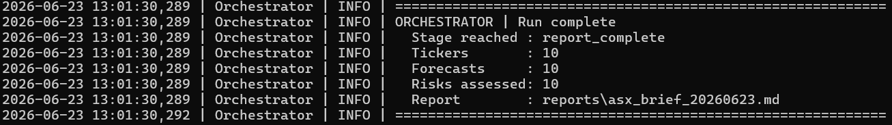
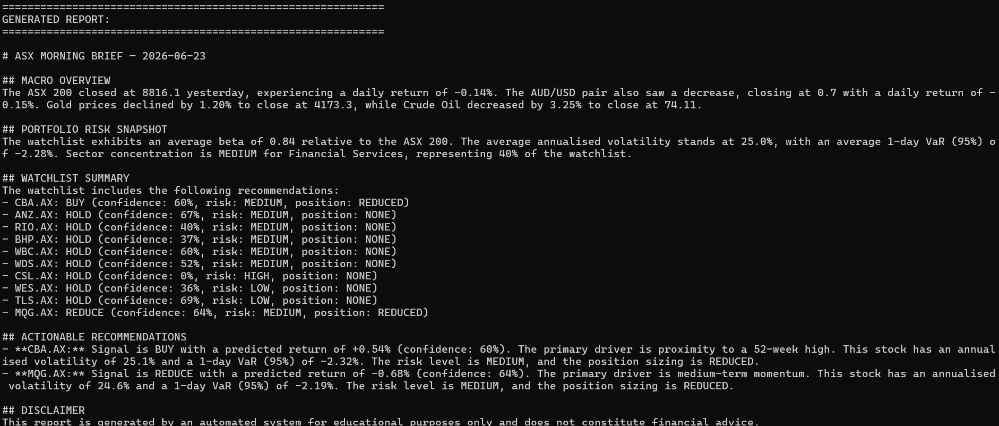
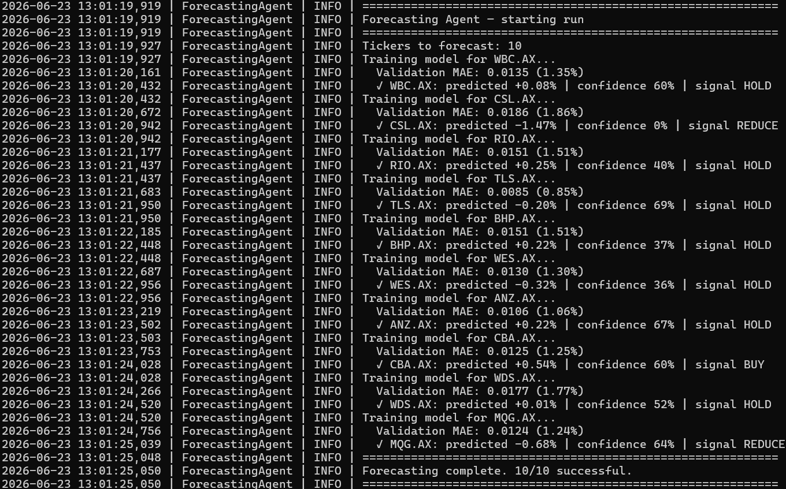
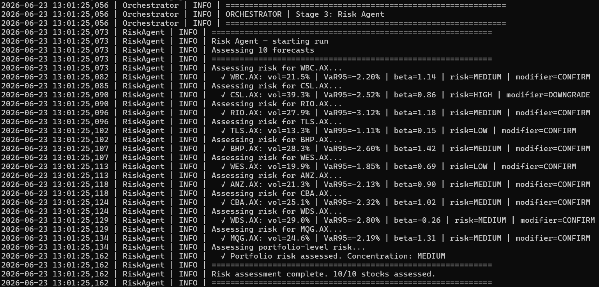
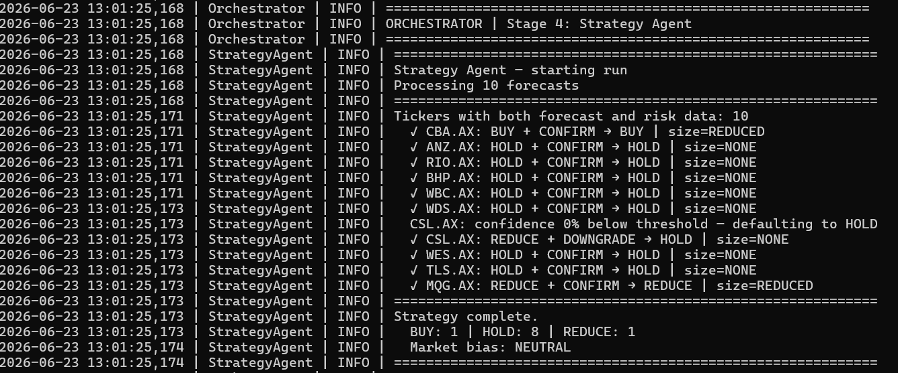

# ASX Equity Intelligence Agent

A multi-agent AI system that automates daily ASX equity analysis by collecting market data, forecasting next-day returns, assessing portfolio risk, generating trading recommendations and producing professional market briefings.

The project combines data engineering, machine learning, risk analytics, agent orchestration and LLM-based reporting into a single automated workflow.

---

## Business Problem

Market analysis often requires analysts to manually collect market data, build forecasts, evaluate risk, formulate recommendations and prepare reports for stakeholders.

This process is repetitive, time-consuming and difficult to scale.

This project explores how a multi-agent architecture can automate the end-to-end workflow while maintaining transparency, explainability and separation of responsibilities across analytical tasks.

---

## Why I Built This Project

I built this project to demonstrate how traditional analytics, machine learning and generative AI can be combined into a practical decision-support system.

Rather than building a simple stock prediction model, the goal was to create a complete analytical pipeline capable of:

* Collecting and storing market data
* Forecasting next-day returns
* Assessing stock and portfolio risk
* Generating trading recommendations
* Producing professional market commentary

The result is an automated market intelligence system that simulates the workflow used by quantitative analysts, research teams and investment professionals.

---

## Key Results

| Area                  | Result                               |
| --------------------- | ------------------------------------ |
| Market Coverage       | Australian Securities Exchange (ASX) |
| Watchlist Size        | 10 ASX-listed companies              |
| Market Data Source    | Yahoo Finance (yfinance)             |
| Database              | DuckDB                               |
| Forecasting Method    | Random Forest Models                 |
| Validation Method     | Walk-Forward Validation              |
| Risk Metrics          | VaR, Volatility, Beta, Drawdown      |
| Recommendation Engine | Rule-Based Strategy Layer            |
| LLM Model             | Gemini 2.5 Flash Lite                |
| Workflow Engine       | LangGraph                            |
| Output                | Daily ASX Morning Brief              |

---

## Real Pipeline Run

The system successfully completed a full end-to-end run on 23 June 2026.

### Pipeline Summary

| Stage                | Output                                  |
| -------------------- | --------------------------------------- |
| Market Data Agent    | 10 successful tickers, 0 failed tickers |
| OHLCV Records Loaded | 2,540                                   |
| Forecasting Agent    | 10 forecasts generated                  |
| Risk Agent           | 10 stocks assessed                      |
| Strategy Agent       | 1 BUY, 8 HOLD, 1 REDUCE                 |
| Market Bias          | NEUTRAL                                 |
| Report Writer Agent  | Report generated successfully           |

### Pipeline Execution



The pipeline successfully collected market data, generated forecasts, assessed portfolio risk, produced trading recommendations and generated a professional market briefing.

---

## Real Generated Report Example

The following output was generated automatically by the system on 23 June 2026.

### Macro Overview

| Market Indicator |   Close | Daily Return |
| ---------------- | ------: | -----------: |
| ASX 200          | 8,816.1 |       -0.14% |
| AUD/USD          |    0.70 |       -0.15% |
| Gold             | 4,173.3 |       -1.20% |
| Crude Oil        |   74.11 |       -3.25% |

### Portfolio Risk Snapshot

| Metric                        |                    Value |
| ----------------------------- | -----------------------: |
| Average Beta                  |                     0.84 |
| Average Annualised Volatility |                    25.0% |
| Average 1-Day VaR (95%)       |                   -2.28% |
| Largest Sector Exposure       | Financial Services (40%) |
| Concentration Risk            |                   MEDIUM |

### Actionable Recommendations

| Ticker | Signal | Predicted Return | Confidence | Risk Level | Position Size |
| ------ | ------ | ---------------: | ---------: | ---------- | ------------- |
| CBA.AX | BUY    |           +0.54% |        60% | MEDIUM     | REDUCED       |
| MQG.AX | REDUCE |           -0.68% |        64% | MEDIUM     | REDUCED       |

### Generated Market Brief



The Report Writer Agent uses Gemini 2.5 Flash Lite to convert structured analytical outputs into a professional market briefing.

---

## Skills Demonstrated

### Agentic AI Systems

* Multi-agent workflow design
* LangGraph orchestration
* Shared state management
* Conditional routing
* AI-assisted reporting

### Data Engineering

* Financial data ingestion
* Database design
* DuckDB analytics
* Data validation
* Automated data pipelines

### Machine Learning

* Time-series forecasting
* Feature engineering
* Random Forest modelling
* Walk-forward validation
* Confidence estimation

### Risk Analytics

* Historical Value at Risk (VaR)
* Annualised volatility analysis
* Beta estimation
* Maximum drawdown analysis
* Sector concentration assessment

### Reporting & Communication

* Automated report generation
* Financial commentary
* Executive-style reporting
* Prompt engineering
* Data storytelling

---

## Technology Stack

| Category               | Tools                 |
| ---------------------- | --------------------- |
| Programming            | Python                |
| Database               | DuckDB                |
| Data Processing        | Pandas, NumPy         |
| Machine Learning       | Scikit-Learn          |
| Workflow Orchestration | LangGraph             |
| Market Data            | yfinance              |
| LLM Reporting          | Gemini 2.5 Flash Lite |
| Scheduling             | schedule              |
| Configuration          | python-dotenv         |

---

## LLM Design Decisions

The project uses Google's Gemini 2.5 Flash Lite model as the report-generation layer.

The LLM is not responsible for forecasting, risk modelling or recommendation generation.

Instead, it receives structured outputs from the analytical pipeline and converts them into professional market commentary.

To reduce hallucination risk, the prompt explicitly instructs the model to:

* Use only supplied information
* Preserve numerical values exactly
* Avoid inventing market movements
* Avoid altering BUY, HOLD or REDUCE recommendations
* Avoid modifying confidence scores or risk metrics

This design improves explainability while maintaining analytical integrity.

---

## Solution Overview

The workflow consists of five specialised agents.

| Stage | Agent               | Responsibility                        |
| ----- | ------------------- | ------------------------------------- |
| 1     | Market Data Agent   | Collect market and macroeconomic data |
| 2     | Forecasting Agent   | Predict next-day stock returns        |
| 3     | Risk Agent          | Assess stock and portfolio risk       |
| 4     | Strategy Agent      | Generate final recommendations        |
| 5     | Report Writer Agent | Produce the market briefing           |

Each agent has a clearly defined responsibility and passes structured outputs to the next stage.

---

## Architecture

```text
Market Data Agent
        │
        ▼
Forecasting Agent
        │
        ▼
Risk Agent
        │
        ▼
Strategy Agent
        │
        ▼
Report Writer Agent
        │
        ▼
ASX Morning Brief
```

The workflow is orchestrated through LangGraph, enabling clear separation of concerns and extensibility.

---

## Repository Structure

```text
asx-equity-intelligence-agent/
│
├── README.md
├── requirements.txt
├── .env.example
├── orchestrator.py
├── asx_market_data.db
│
├── screenshots/
│   ├── pipeline_execution.png
│   ├── forecasting_agent.png
│   ├── risk_agent.png
│   ├── strategy_agent.png
│   └── final_report.png
│
├── agents/
│   ├── market_data_agent.py
│   ├── forecasting_agent.py
│   ├── risk_agent.py
│   ├── strategy_agent.py
│   └── report_writer_agent.py
│
└── reports/
    ├── asx_brief_20260623.md
    └── ...
```

---

## Agent Responsibilities

### Market Data Agent

Responsible for:

* Downloading ASX OHLCV data
* Collecting company fundamentals
* Collecting macroeconomic indicators
* Storing data in DuckDB

Market indicators include:

* ASX 200 Index
* AUD/USD Exchange Rate
* Gold Futures
* Crude Oil Futures

---

### Forecasting Agent

Responsible for:

* Feature engineering
* Training stock-specific models
* Generating next-day return forecasts
* Estimating prediction confidence

Key design decisions:

* One model per stock
* Walk-forward validation
* No look-ahead bias
* Confidence derived from model agreement

### Forecast Generation



The Forecasting Agent trains a separate Random Forest model for each stock and generates predicted returns, confidence scores and recommendation signals.

---

### Risk Agent

Responsible for:

* Historical VaR calculations
* Volatility analysis
* Beta estimation
* Maximum drawdown analysis
* Portfolio concentration assessment

The risk layer ensures recommendations are evaluated within a portfolio context.

### Risk Assessment



The Risk Agent evaluates volatility, Value at Risk (VaR), beta and portfolio concentration metrics to assess risk exposure.

---

### Strategy Agent

Combines:

* Forecast signals
* Confidence levels
* Risk assessments

to generate final recommendations.

Possible outputs:

* BUY
* HOLD
* REDUCE

The strategy layer is intentionally conservative and defaults to HOLD under elevated uncertainty.

### Recommendation Engine



Forecasts and risk metrics are combined to produce final BUY, HOLD and REDUCE recommendations.

---

### Report Writer Agent

The final stage of the pipeline.

Responsibilities include:

* Receiving structured analytical outputs
* Constructing the reporting prompt
* Generating market commentary with Gemini 2.5 Flash Lite
* Saving reports as Markdown files

The LLM performs communication tasks only and does not generate recommendations independently.

---

## Watchlist

| Ticker | Company                     | Sector                 |
| ------ | --------------------------- | ---------------------- |
| BHP.AX | BHP Group                   | Materials              |
| CBA.AX | Commonwealth Bank           | Financial Services     |
| CSL.AX | CSL Limited                 | Healthcare             |
| WDS.AX | Woodside Energy             | Energy                 |
| WES.AX | Wesfarmers                  | Consumer Discretionary |
| ANZ.AX | ANZ Banking Group           | Financial Services     |
| RIO.AX | Rio Tinto                   | Materials              |
| WBC.AX | Westpac Banking Corporation | Financial Services     |
| MQG.AX | Macquarie Group             | Financial Services     |
| TLS.AX | Telstra Corporation         | Telecommunications     |

---

## Setup

### 1. Install Dependencies

```bash
pip install -r requirements.txt
```

### 2. Configure Environment Variables

Create a `.env` file:

```env
GEMINI_API_KEY=your_api_key_here
```

### 3. Run the Full Pipeline

```bash
python orchestrator.py --mode run
```

### 4. Schedule Daily Execution

```bash
python orchestrator.py --mode schedule
```

The scheduler is configured to generate reports before the ASX market opens.

---

## Output Files

After a successful run, the project generates:

| Output          | Location                        |
| --------------- | ------------------------------- |
| DuckDB Database | `asx_market_data.db`            |
| Daily Report    | `reports/asx_brief_YYYYMMDD.md` |

---

## Why LangGraph?

LangGraph was selected because the project naturally consists of multiple dependent analytical agents.

| Traditional Script    | LangGraph Workflow      |
| --------------------- | ----------------------- |
| Sequential execution  | Explicit agent graph    |
| Basic error handling  | Conditional routing     |
| Limited state sharing | Shared state management |
| Harder to extend      | Modular architecture    |

---

## Limitations

Current limitations include:

* Uses yfinance rather than institutional market feeds
* Forecasting models are intentionally simple
* No transaction cost modelling
* No slippage modelling
* No live order execution
* No portfolio optimisation
* No historical backtesting framework

This project is intended as an educational analytics and AI portfolio project.

---

## Future Improvements

Potential future enhancements include:

* Portfolio optimisation
* Backtesting engine
* Streamlit dashboard
* Power BI reporting
* Benchmark comparison reporting
* Automated email delivery
* Model performance monitoring
* Feature importance visualisations

---

## License

This project is licensed under the MIT License, see [LICENSE](LICENSE) for details.
