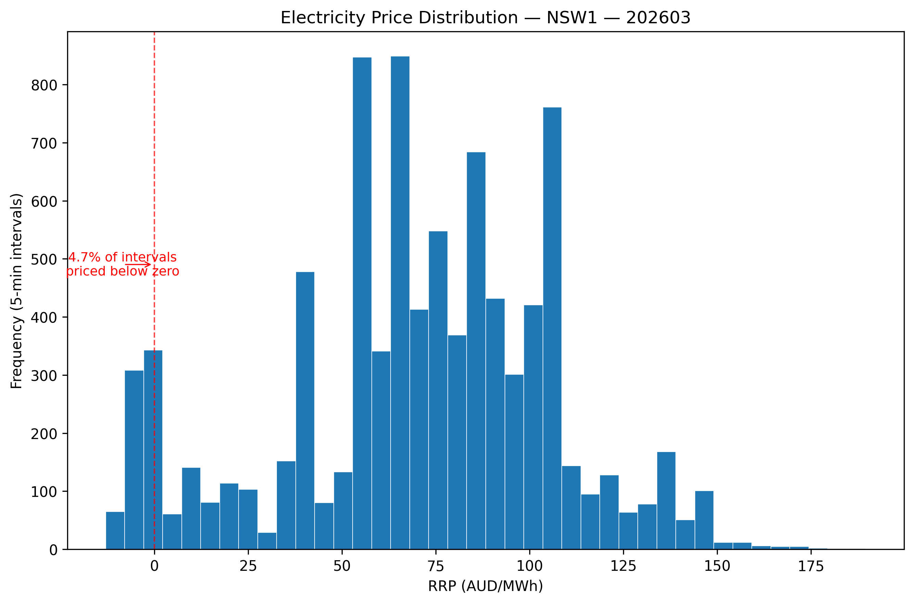
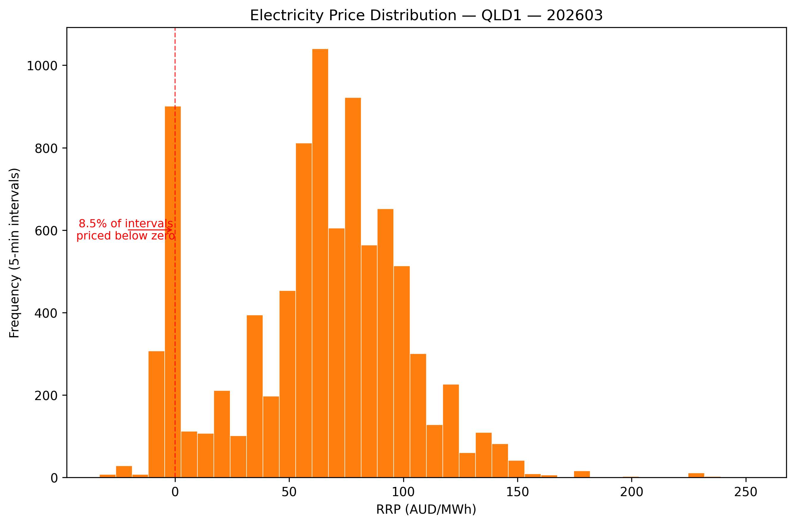

# Australian NEM Price and Demand Pipeline


A Python and MySQL analytics pipeline for downloading, cleaning, storing, aggregating, and visualising wholesale electricity price and demand data from Australia’s National Electricity Market.

The repository demonstrates a practical analytics engineering workflow:

1. download monthly AEMO price and demand files
2. standardise and combine regional data
3. load the processed records into MySQL
4. create reusable SQL reporting views
5. generate charts from database queries

The included March 2026 dataset covers New South Wales, Queensland, and Victoria at five-minute settlement intervals.


---

## Project Summary

| Item | Details |
|---|---|
| Problem | Convert raw electricity market files into structured, queryable, and repeatable analytical outputs |
| Data source | AEMO monthly Price and Demand CSV files |
| Included period | March 2026 |
| Regions | `NSW1`, `QLD1`, `VIC1` |
| Granularity | Five-minute settlement intervals |
| Processed rows | 26,784 |
| Rows per region | 8,928 |
| Database | MySQL |
| Main table | `fact_nem_price_demand` |
| Reporting views | 2 |
| Generated chart files | 6 across 4 chart types |
| Primary tools | Python, pandas, SQLAlchemy, PyMySQL, MySQL, Matplotlib |

---

## Why This Project Matters

Electricity market data is published at a level of detail that is useful for operational analysis but inconvenient for routine reporting. A single month contains thousands of interval-level records per region, with prices that can be negative or highly volatile.

This project converts those files into a consistent analytical dataset and database model. The resulting outputs can support questions such as:

- How do average wholesale prices differ by region?
- Which region experiences the greatest price volatility?
- How frequently do prices fall below zero?
- How do regional demand levels relate to daily prices?
- Which intervals contain unusually high or low prices?

The project is an analytics pipeline rather than a forecasting or machine learning system. It focuses on ingestion, transformation, relational modelling, aggregation, validation, and visual reporting.

---

## Verified March 2026 Results

The supplied processed dataset contains 26,784 records, with 8,928 five-minute intervals for each region. The records run continuously from `2026-03-01 00:05:00` to `2026-04-01 00:00:00`.

No missing values or duplicate region-timestamp combinations were found in the supplied processed file.

| Region | Average price (AUD/MWh) | Minimum price | Maximum price | Price standard deviation | Average demand (MW) | Negative-price intervals |
|---|---:|---:|---:|---:|---:|---:|
| NSW1 | 70.36 | -12.99 | 189.59 | 35.85 | 7,469.37 | 4.70% |
| QLD1 | 62.64 | -33.15 | 253.38 | 38.17 | 6,420.09 | 8.50% |
| VIC1 | 44.74 | -969.97 | 273.81 | 49.45 | 4,679.18 | 25.44% |

### Interpretation

- **NSW1 recorded the highest average wholesale price**, at AUD 70.36/MWh, while also having the highest average demand of the three regions.
- **VIC1 had the lowest average price but the widest price distribution.** Its minimum interval price was AUD -969.97/MWh, and more than one-quarter of its intervals were priced below zero.
- **VIC1 also had the highest interval-level price standard deviation**, at AUD 49.45/MWh.
- **QLD1 sat between NSW1 and VIC1 on average price and negative-price frequency**, but its maximum interval price, AUD 253.38/MWh, exceeded the NSW1 maximum.
- The data demonstrates that a lower monthly average price does not necessarily imply stable prices. VIC1 combined the lowest average with the greatest dispersion and most frequent negative pricing.

These results describe the supplied March 2026 dataset only. They should not be interpreted as long-term market conclusions.

---

## Pipeline Architecture

```text
AEMO monthly CSV endpoints
          |
          v
scripts/fetch_energy.py
Downloads one file per configured region
          |
          v
data/raw/
Original regional CSV files
          |
          v
scripts/clean_energy.py
Standardises columns, converts types,
removes invalid required values, and combines regions
          |
          v
data/processed/
Monthly combined CSV
          |
          v
scripts/load_energy.py
Creates the MySQL database and fact table,
loads the processed data, and creates reporting views
          |
          v
MySQL analytical layer
fact_nem_price_demand
vw_nem_daily_summary
vw_nem_regional_summary
          |
          v
scripts/analyse_energy.py
Queries MySQL and generates PNG charts
          |
          v
outputs/charts/
````

`scripts/run_pipeline.py` executes these stages sequentially and stops if any subprocess returns a non-zero exit code.

---

## Repository Structure

```text
aus_energy_automation/
├── README.md
├── LICENSE
├── requirements.txt
│
├── data/
│   ├── raw/
│   │   ├── PRICE_AND_DEMAND_202603_NSW1.csv
│   │   ├── PRICE_AND_DEMAND_202603_QLD1.csv
│   │   └── PRICE_AND_DEMAND_202603_VIC1.csv
│   └── processed/
│       └── nem_price_demand_202603_combined.csv
│
├── outputs/
│   └── charts/
│       ├── daily_avg_rrp_by_region_202603.png
│       ├── avg_daily_price_volatility_by_region_202603.png
│       ├── price_vs_demand_202603.png
│       ├── price_distribution_nsw1_202603.png
│       ├── price_distribution_qld1_202603.png
│       └── price_distribution_vic1_202603.png
│
├── scripts/
│   ├── config.py
│   ├── fetch_energy.py
│   ├── clean_energy.py
│   ├── load_energy.py
│   ├── analyse_energy.py
│   └── run_pipeline.py
│
└── sql/
    └── aus_energy.sql
```

| Component                   | Responsibility                                                                                |
| --------------------------- | --------------------------------------------------------------------------------------------- |
| `scripts/config.py`         | Stores region, directory, database, and chart configuration                                   |
| `scripts/fetch_energy.py`   | Downloads monthly AEMO CSV files for each configured region                                   |
| `scripts/clean_energy.py`   | Renames fields, converts data types, removes unusable records, and combines regional files    |
| `scripts/load_energy.py`    | Creates MySQL objects, truncates and reloads the fact table, and creates two analytical views |
| `scripts/analyse_energy.py` | Reads database results and generates price, demand, volatility, and distribution charts       |
| `scripts/run_pipeline.py`   | Prompts for a reporting month and runs the four pipeline stages in sequence                   |
| `sql/aus_energy.sql`        | Provides a readable reference implementation of the database schema and example queries       |

---

## Data Source and Schema

The pipeline downloads AEMO Price and Demand files using the following URL pattern:

```text
https://www.aemo.com.au/aemo/data/nem/priceanddemand/PRICE_AND_DEMAND_YYYYMM_REGION.csv
```

The configured regions are defined in `scripts/config.py`:

```python
REGIONS = ["NSW1", "QLD1", "VIC1"]
```

The cleaning stage converts the source fields into the following schema:

| Column                | Type or format | Description                                |
| --------------------- | -------------- | ------------------------------------------ |
| `region_code`         | string         | NEM region identifier                      |
| `settlement_datetime` | datetime       | Settlement interval timestamp              |
| `trading_date`        | date           | Date derived from the settlement timestamp |
| `rrp_aud_mwh`         | numeric        | Regional Reference Price in AUD per MWh    |
| `total_demand_mw`     | numeric        | Regional electricity demand in MW          |
| `period_type`         | string         | AEMO period classification                 |

Negative prices are retained. They are valid market observations and are required for analysing price distributions and negative-price frequency.

---

## Transformation and Validation Logic

`scripts/clean_energy.py` performs the following transformations:

1. checks that each expected regional file exists
2. normalises source column names to lowercase
3. renames AEMO fields to analysis-oriented names
4. checks for the required source columns
5. parses settlement timestamps
6. converts price and demand fields to numeric values
7. derives `trading_date`
8. removes rows with missing required analytical fields
9. selects a consistent output column order
10. sorts records by region and settlement timestamp
11. combines the configured regions into one monthly CSV

The supplied March 2026 output was additionally inspected and contains:

* 26,784 total records
* 8,928 records per region
* no null values
* no duplicate `region_code` and `settlement_datetime` pairs
* a consistent five-minute interval between consecutive records within each region

The current code does not explicitly fail on duplicate timestamps or missing intervals. Those checks were performed on the supplied dataset during repository review, not enforced as pipeline validation rules.

---

## Database Design

### Fact table

The runtime pipeline creates `fact_nem_price_demand`, with one record per region and settlement interval.

```text
fact_nem_price_demand
├── record_id
├── region_code
├── settlement_datetime
├── trading_date
├── rrp_aud_mwh
├── total_demand_mw
└── period_type
```

The table includes indexes supporting:

* region and trading-date filters
* settlement timestamp queries

### Daily summary view

`vw_nem_daily_summary` aggregates interval data by region and trading date.

It calculates:

* average price
* maximum price
* minimum price
* price standard deviation
* average demand
* interval count

This view supplies the daily price, demand, and volatility charts.

### Regional summary view

`vw_nem_regional_summary` aggregates the currently loaded fact-table records by region.

It calculates:

* dataset start and end dates
* interval count
* average, minimum, and maximum price
* price standard deviation
* average, minimum, and maximum demand
* negative-price interval count
* negative-price percentage

The runtime loader truncates the fact table before inserting a processed CSV. As a result, the regional view describes the most recently loaded dataset rather than an accumulated history.

---

## Generated Analysis

The analysis stage creates four types of visual output.

### 1. Daily average wholesale price

Shows daily average Regional Reference Price for NSW1, QLD1, and VIC1.


### 2. Average daily price volatility

Compares the mean of each region’s daily price standard deviations.

For March 2026:

| Region | Average daily price standard deviation (AUD/MWh) |
| ------ | -----------------------------------------------: |
| VIC1   |                                            34.76 |
| QLD1   |                                            30.38 |
| NSW1   |                                            27.08 |


### 3. Daily price and demand relationship

Plots each region’s daily average demand against its daily average price.

This is a descriptive comparison. The chart does not estimate causality, fit a statistical model, or control for other market factors.


### 4. Interval price distributions

Creates a separate histogram for each region and annotates the proportion of intervals with prices below zero.

#### NSW1



#### QLD1



#### VIC1


---

## Setup

### Prerequisites

* Python 3.9 or later
* MySQL server
* a MySQL account with permission to create a database, table, and views
* internet access to download AEMO files

### 1. Create and activate a virtual environment

```bash
python -m venv .venv
```

On Windows PowerShell:

```powershell
.venv\Scripts\Activate.ps1
```

On macOS or Linux:

```bash
source .venv/bin/activate
```

### 2. Install dependencies

```bash
pip install -r requirements.txt
```

The project uses:

* `pandas`
* `matplotlib`
* `SQLAlchemy`
* `PyMySQL`
* `requests`
* `certifi`

### 3. Configure MySQL credentials

The password must be provided through the `MYSQL_PASSWORD` environment variable. The remaining variables have defaults but can also be overridden.

#### Windows PowerShell

```powershell
$env:MYSQL_USER="root"
$env:MYSQL_PASSWORD="your_password"
$env:MYSQL_HOST="localhost"
$env:MYSQL_DATABASE="aus_energy_automation"
```

#### macOS or Linux

```bash
export MYSQL_USER="root"
export MYSQL_PASSWORD="your_password"
export MYSQL_HOST="localhost"
export MYSQL_DATABASE="aus_energy_automation"
```

Do not commit database credentials to the repository.

### 4. Run the complete pipeline

```bash
python scripts/run_pipeline.py
```

The command prompts for a year and month:

```text
Enter year (e.g. 2026): 2026
Enter month (e.g. 03): 03
```

The orchestrator then runs:

```text
fetch_energy.py
clean_energy.py
load_energy.py
analyse_energy.py
```

Each child script receives the reporting period in `YYYYMM` format. The pipeline stops if a stage fails.

---

## Running Individual Stages

Each pipeline stage can also be executed separately.

```bash
python scripts/fetch_energy.py 202603
python scripts/clean_energy.py 202603
python scripts/load_energy.py 202603
python scripts/analyse_energy.py 202603
```

This is useful when developing or troubleshooting one stage without repeating the full workflow.

The load and analysis stages require a working MySQL connection. The analysis stage also expects the relevant records and views to exist in the configured database.

---

## Example SQL Analysis

The repository includes sample analytical queries in `sql/aus_energy.sql`.

Examples include:

* daily regional price and volatility
* highest-price days
* regional summaries
* intervals above AUD 300/MWh
* negative-price intervals
* hourly price and demand profiles
* peak and off-peak comparisons

For example:

```sql
SELECT
    trading_date,
    region_code,
    avg_price_aud_mwh,
    max_price_aud_mwh,
    min_price_aud_mwh,
    price_volatility,
    avg_demand_mw,
    interval_count
FROM vw_nem_daily_summary
WHERE trading_date BETWEEN '2026-03-01' AND '2026-03-31'
ORDER BY trading_date, region_code;
```

---

## Design Decisions

### Configuration is centralised

File paths, regions, database settings, table names, chart settings, and the AEMO base URL are defined in `scripts/config.py`. This avoids duplicating operational settings across scripts.

### Sensitive configuration is environment-based

The MySQL password is not stored in source code. The load and analysis stages fail early when `MYSQL_PASSWORD` is unset or empty.

### The pipeline uses a processed-file boundary

The cleaning stage writes a combined CSV before the database load. This provides an inspectable intermediate artefact and separates source transformation from database operations.

### Database objects are created by the loader

The Python load stage creates the database, table, and reporting views when the pipeline runs. The SQL file is retained as documentation and for manual inspection.

### Charts are generated from MySQL

The visualisation stage reads from the database rather than directly from the processed CSV. This demonstrates that the SQL analytical layer is part of the reporting path.

### Negative prices are preserved

The project treats negative prices as valid observations. Removing them would distort averages, volatility measures, histograms, and negative-price frequency.

---

## Current Limitations

* Only NSW1, QLD1, and VIC1 are configured. SA1 and TAS1 are not included.
* The supplied analysis covers one month, March 2026.
* `load_energy.py` truncates the fact table before each load, so previously loaded months are removed.
* The pipeline is initiated manually and prompts for the reporting period.
* There is no scheduler, workflow service, alerting, retry strategy, or pipeline monitoring.
* Validation checks required columns and removes invalid required values, but it does not currently enforce uniqueness, interval continuity, row-count expectations, or accepted region values.
* The database load has not been designed as an incremental or upsert operation.
* There are no automated unit, integration, or data-quality tests.
* The Python-created database objects and `sql/aus_energy.sql` are not fully synchronised.
* Price versus demand analysis is descriptive and does not account for generation mix, interconnector flows, weather, outages, bidding behaviour, or other market drivers.
* The project does not include FCAS prices, dispatch data, renewable generation, or interconnector data.
* The pipeline has no forecasting or machine learning component.

---

## Potential Improvements

The most useful next steps would be:

1. replace table truncation with incremental loading and a uniqueness constraint on region and settlement timestamp
2. accept `YYYYMM` as a command-line argument in `run_pipeline.py` to support non-interactive execution
3. add explicit duplicate, interval-gap, schema, and row-count validation
4. add unit tests for transformations and integration tests for database loading
5. keep the SQL reference file generated from, or synchronised with, the runtime schema
6. add structured run metadata, logging, and failure reporting
7. schedule monthly execution through a workflow tool or CI service
8. extend coverage to SA1 and TAS1
9. support multi-month and year-on-year analysis
10. add relevant explanatory variables before attempting forecasting or causal analysis

---

## Skills Demonstrated

This repository provides evidence of:

* modular Python pipeline development
* HTTP file ingestion
* pandas-based data cleaning and schema standardisation
* relational fact-table design
* SQL aggregation and analytical views
* SQLAlchemy database connectivity
* environment-based credential handling
* sequential pipeline orchestration
* descriptive electricity market analysis
* automated Matplotlib chart generation
* documentation of technical limitations and design trade-offs

---

## Reproducibility Notes

The repository includes the raw March 2026 source files, processed combined data, and generated charts. These artefacts allow the supplied results to be inspected without downloading the data again.

A complete fresh run additionally depends on:

* the continued availability of the AEMO CSV endpoint
* a locally accessible MySQL server
* valid MySQL credentials
* permission to create and modify the configured database
* compatible dependency versions installed from `requirements.txt`

The supplied dependency constraints specify minimum versions rather than an exact lock file, so future package releases may affect reproducibility.

---

## Licence

This project is licensed under the MIT Licence. See [LICENSE](LICENSE) for details.
