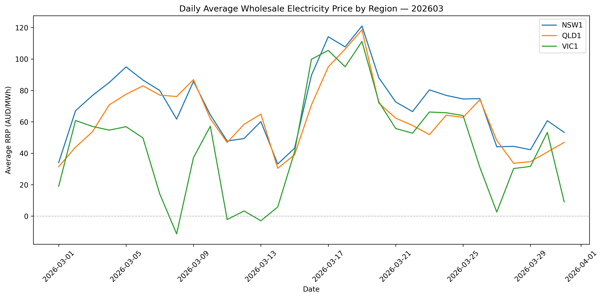
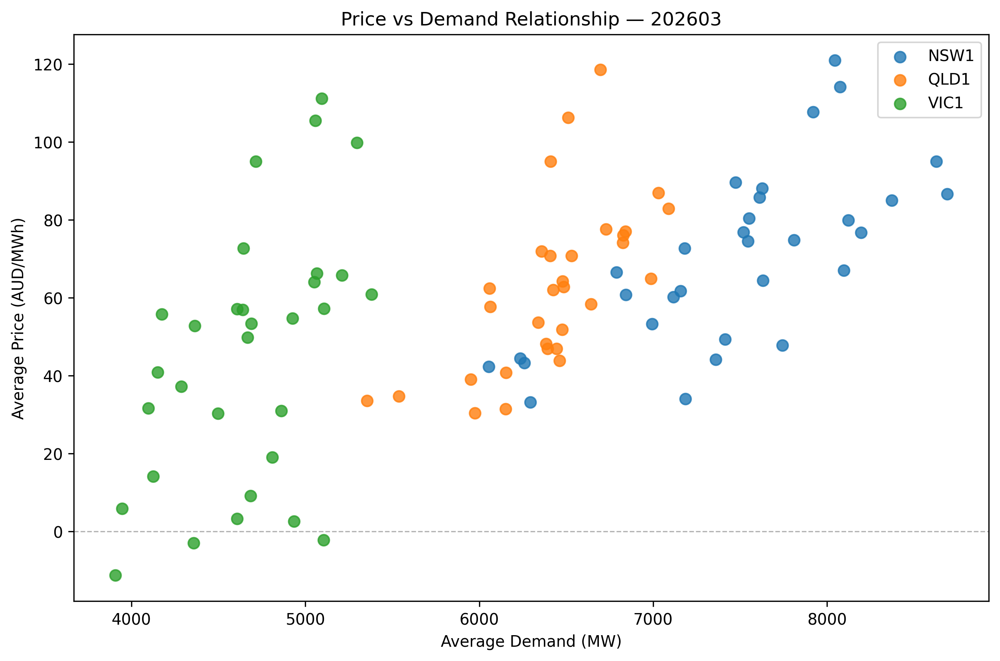
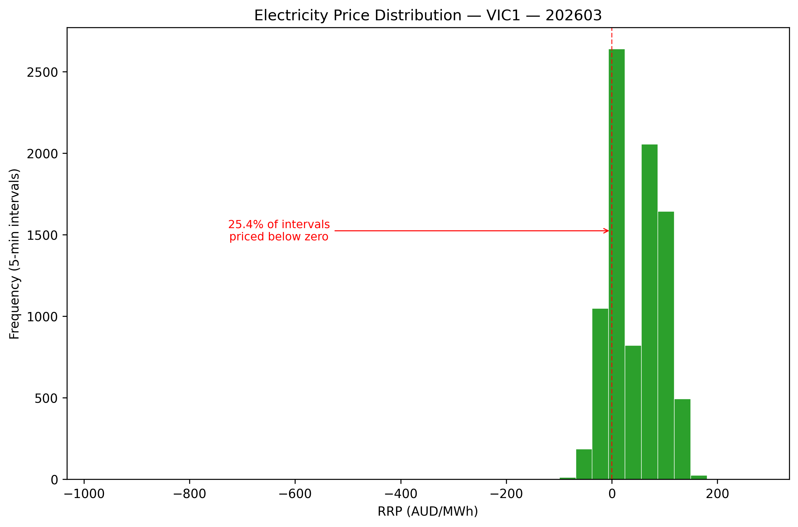
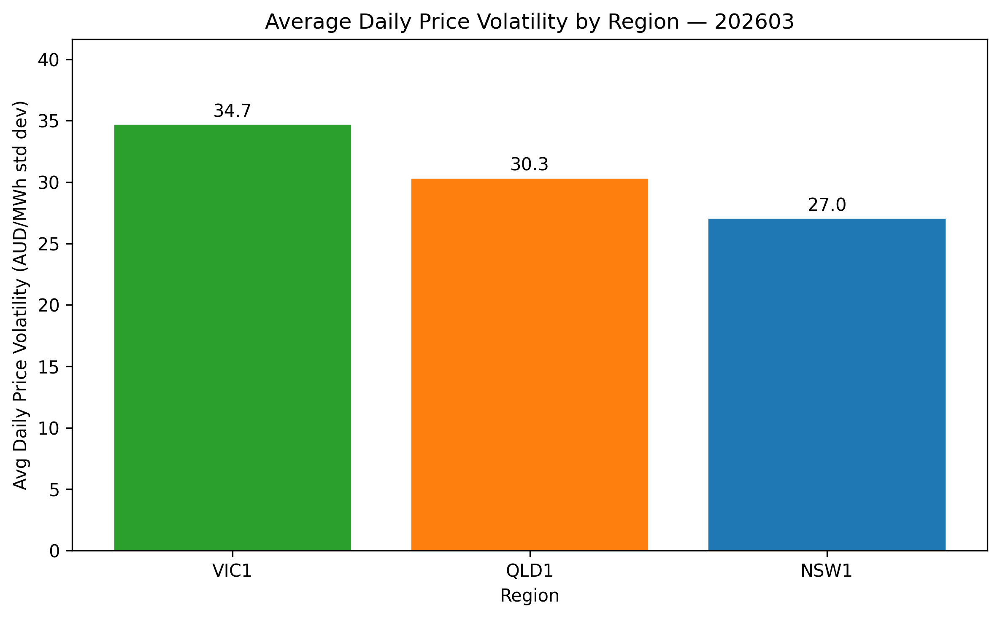

# Australian Energy Market Analysis Pipeline

An automated end-to-end data pipeline for collecting, processing, storing, and analysing wholesale electricity market data from the **Australian National Electricity Market (NEM)**.

The pipeline fetches 5-minute price and demand data from AEMO, standardises and loads it into MySQL, and generates reproducible analytical charts across multiple NEM regions.

---

## Sample Outputs — March 2026

### Daily Average Wholesale Price by Region



NSW1 consistently traded at a premium over QLD1 and VIC1 throughout the month. VIC1 recorded several days of **negative average prices** — a known NEM phenomenon driven by midday solar oversupply pushing dispatchable generators into negative bidding to avoid curtailment. The mid-month price spike (17–19 March) was correlated across all three regions, suggesting a supply-side event rather than a regional demand driver.

---

### Price vs Demand Relationship



NSW1 and QLD1 show a broadly positive price-demand relationship at higher demand levels (above 6,000 MW and 6,500 MW respectively). VIC1 exhibits significant price dispersion at low demand levels, consistent with the negative pricing periods visible in the time-series chart above. The weak overall correlation confirms that supply constraints, interconnector flows, and generation mix are material drivers alongside demand.

---

### Price Distribution — VIC1



VIC1's distribution is bimodal and wide-ranging, with a meaningful cluster of intervals at or below zero. This reflects Victoria's high rooftop solar penetration, which regularly pushes spot prices negative during daylight hours. The right tail extends to over $150/MWh, indicating genuine price volatility at both ends of the distribution.

---

### Average Daily Price Volatility by Region



VIC1 records the highest average daily price volatility of the three regions, consistent with its greater exposure to variable renewable generation. NSW1 is the most stable, likely reflecting its larger and more diverse generation mix.

---

## Pipeline Architecture

```
User Input (YYYYMM)
        │
        ▼
┌─────────────────┐
│  fetch_energy   │  Downloads raw CSVs from AEMO for each region
└────────┬────────┘
         │
         ▼
┌─────────────────┐
│  clean_energy   │  Renames columns, coerces types, drops bad rows
└────────┬────────┘
         │
         ▼
┌─────────────────┐
│  load_energy    │  Creates DB/table, loads data, builds summary view
└────────┬────────┘
         │
         ▼
┌─────────────────┐
│ analyse_energy  │  Generates and saves analytical charts
└─────────────────┘
```

---

## Project Structure

```
aus_energy_automation/
├── data/
│   ├── raw/                        # Downloaded AEMO CSV files
│   └── processed/                  # Cleaned combined CSVs
├── outputs/
│   └── charts/                     # Generated PNG charts
├── scripts/
│   ├── config.py                   # Centralised settings and paths
│   ├── fetch_energy.py             # AEMO data download
│   ├── clean_energy.py             # Data cleaning and standardisation
│   ├── load_energy.py              # MySQL loading and view creation
│   ├── analyse_energy.py           # Chart generation
│   └── run_pipeline.py             # Pipeline orchestrator
├── requirements.txt
└── README.md
```

---

## Data Source

Data is sourced from the **Australian Energy Market Operator (AEMO)** public data portal:

- **Regional Reference Price (RRP)** — wholesale spot price in AUD/MWh
- **Total demand** — operational demand in MW
- **Settlement interval** — 5-minute resolution
- **Regions covered** — NSW1, QLD1, VIC1

> **Note on negative prices:** Negative RRP values are a genuine feature of the NEM, not data errors. They occur when non-dispatchable generation (primarily rooftop solar) exceeds demand, forcing dispatchable generators to bid negatively to avoid curtailment. They are retained in all analysis.

---

## Database Design

### Fact table — `fact_nem_price_demand`

| Column               | Type          | Description                        |
|----------------------|---------------|------------------------------------|
| `record_id`          | BIGINT PK     | Auto-increment surrogate key       |
| `region_code`        | VARCHAR(10)   | NEM region (NSW1, QLD1, VIC1)      |
| `settlement_datetime`| DATETIME      | 5-minute interval timestamp        |
| `trading_date`       | DATE          | Calendar date                      |
| `rrp_aud_mwh`        | DECIMAL(12,4) | Wholesale spot price (AUD/MWh)     |
| `total_demand_mw`    | DECIMAL(12,4) | Operational demand (MW)            |
| `period_type`        | VARCHAR(20)   | Settlement period type             |

Indexed on `(region_code, trading_date)` and `settlement_datetime` for query performance.

### Analytical view — `vw_nem_daily_summary`

Aggregates 5-minute intervals to daily metrics per region:

| Metric               | Description                              |
|----------------------|------------------------------------------|
| `avg_price_aud_mwh`  | Daily average spot price                 |
| `max_price_aud_mwh`  | Daily peak price                         |
| `min_price_aud_mwh`  | Daily minimum price (can be negative)    |
| `price_volatility`   | Standard deviation of 5-minute prices    |
| `avg_demand_mw`      | Daily average demand                     |
| `interval_count`     | Number of 5-minute intervals in the day  |

---

## Technologies

| Layer       | Tool                          |
|-------------|-------------------------------|
| Language    | Python 3.11+                  |
| Data        | pandas                        |
| Database    | MySQL 8+, SQLAlchemy, PyMySQL |
| Charts      | matplotlib                    |
| HTTP        | requests, certifi             |
| Logging     | Python standard `logging`     |

---

## Installation

**1. Clone the repository**

```bash
git clone https://github.com/your-username/aus_energy_automation.git
cd aus_energy_automation
```

**2. Install dependencies**

```bash
pip install -r requirements.txt
```

**3. Set environment variables**

```bash
export MYSQL_USER=root
export MYSQL_PASSWORD=your_password
export MYSQL_HOST=localhost
export MYSQL_DATABASE=aus_energy_automation
```

> A MySQL instance must be running and accessible before running the pipeline. The pipeline will create the database and table automatically on first run.

---

## Usage

Run the full pipeline:

```bash
python scripts/run_pipeline.py
```

You will be prompted to enter a year and month:

```
── Australian Energy Market Pipeline ──

Enter year (e.g. 2026): 2026
Enter month (e.g. 03): 03
```

Charts are saved to `outputs/charts/`. To run individual steps manually:

```bash
python scripts/fetch_energy.py 202603
python scripts/clean_energy.py 202603
python scripts/load_energy.py 202603
python scripts/analyse_energy.py 202603
```

---

## Key Insights — March 2026

| Metric                        | NSW1   | QLD1   | VIC1   |
|-------------------------------|--------|--------|--------|
| Avg daily price volatility    | ~26    | ~29    | ~34    |
| Negative price intervals      | Rare   | Rare   | ~32%   |
| Price range (AUD/MWh)         | -5–150 | -5–230 | -75–200|
| Demand range (MW)             | 6k–9k  | 6k–7k  | 4k–5k  |

VIC1's high volatility and frequent negative prices make it the most strategically interesting region for storage and flexible demand assets such as BESS.

---

## Roadmap

- [ ] Extend to SA1 and TAS1 regions
- [ ] Add FCAS market data ingestion
- [ ] BESS revenue stack modelling (arbitrage + FCAS)
- [ ] Automated scheduling via cron or Airflow
- [ ] Unit tests for cleaning and validation logic
- [ ] Correlation analysis with ASX energy equities

---
