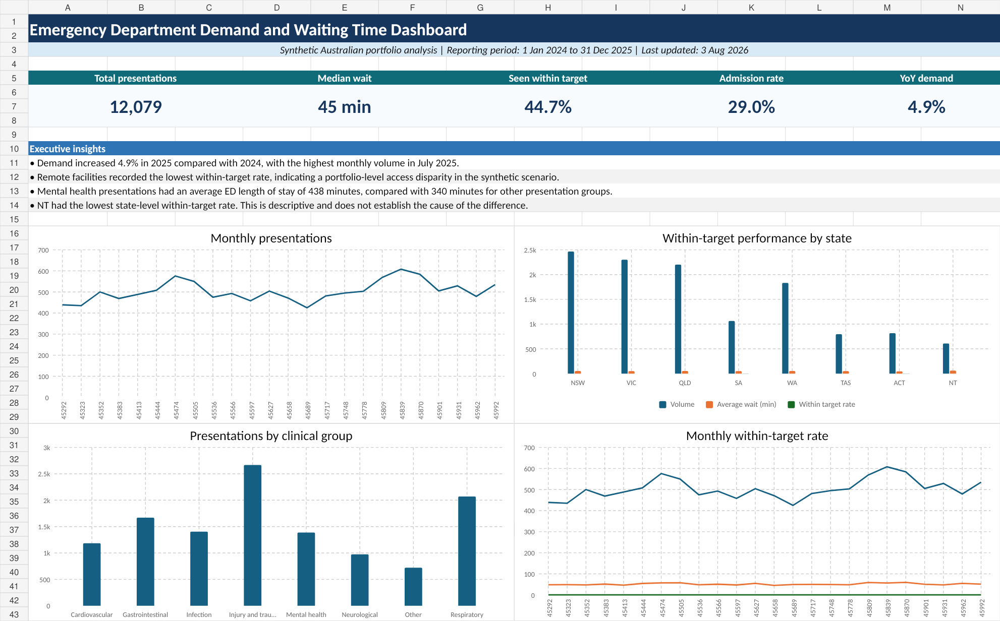

# Australian Emergency Department Demand and Waiting Time Analysis



## Project overview

This independent portfolio project analyses a realistic **synthetic** emergency department dataset using Microsoft Excel only. It demonstrates data cleaning, validation, KPI design, exploratory analysis, formula-based summary tables, charting, dashboard design, healthcare interpretation and reproducible GitHub documentation.

The project is framed for an Australian hospital operations manager or public-sector health performance analyst. It does not represent work performed for a health service, government agency or source organisation.

## Why this topic

Emergency department demand and waiting-time performance is commercially relevant to Australian health analytics roles because it combines operational volume, time-based performance, service targets, geography, case mix and data-quality controls. It offers stronger Excel portfolio value than a purely descriptive prevalence dataset because it supports encounter-level cleaning, operational KPIs, temporal trends and management-oriented decisions.

## Business and policy problem

The stakeholder needs to understand where and when ED pressure is greatest, whether patients are seen within category-specific time thresholds, how admission and length-of-stay patterns vary, and which service segments warrant closer operational review.

## Analytical questions

1. How did ED presentation volume change between 2024 and 2025?
2. Which months show the highest demand and waiting-time pressure?
3. Which states, facilities and region types have the lowest within-target performance?
4. How do waiting times vary by triage category?
5. Which clinical presentation groups have the longest waits and length of stay?
6. What proportion of presentations result in admission?
7. Where do data-quality issues affect interpretation?
8. Which operational areas should management investigate first?

## Dataset

- **Type:** Synthetic encounter-level emergency department data
- **Rows:** 12,079 cleaned encounters and 12,115 raw rows
- **Period:** 1 January 2024 to 31 December 2025
- **Coverage:** 12 fictional facilities across Australian states and territories
- **Privacy:** No real patient, facility or organisation information
- **Format:** CSV and XLSX

The synthetic generator introduces realistic seasonality, geographic variation, triage mix, missing values, category inconsistencies, outliers and duplicate rows. Findings are illustrative and must not be interpreted as actual Australian healthcare performance.

## Tools used

Microsoft Excel is the sole analytics platform. The workbook demonstrates Excel Tables, structured references, XLOOKUP, INDEX/MATCH, SUMIFS, COUNTIFS, AVERAGEIFS, IF, IFS, IFERROR, LET, TEXT, DATE functions, dynamic arrays, conditional formatting, data validation concepts, charts and dashboard design.

## Repository structure

```text
australian_health_excel_analysis/
├── README.md
├── LICENSE
├── .gitignore
├── data/
│   ├── raw/source_data.csv
│   ├── processed/cleaned_data.csv
│   └── reference/
│       ├── data_dictionary.xlsx
│       └── lookup_tables.xlsx
├── workbook/australian_health_analysis.xlsx
├── docs/
│   ├── methodology.md
│   ├── data_quality.md
│   ├── assumptions_and_limitations.md
│   ├── data_source_and_licence.md
│   └── project_summary.md
├── images/
│   ├── dashboard_preview.png
│   └── workbook_structure.png

```

## Data-cleaning process

The raw file intentionally contains exact duplicates, blank waiting-time values, invalid ages, unmatched facility codes, trailing whitespace and non-standard sex labels. Cleaning logic includes duplicate identification, type correction, category standardisation, TRIM-based whitespace removal, lookup reconciliation, date validation, range validation, outlier flagging and derived fields.

No record is silently removed. The difference between raw and cleaned row counts equals the documented duplicate count.

## KPI definitions

| KPI | Definition |
|---|---|
| Total presentations | Count of valid cleaned encounters |
| Average wait | Mean minutes from arrival to first clinician |
| Median wait | Median minutes from arrival to first clinician |
| Seen within target | Percentage meeting the triage-specific threshold |
| Admission rate | Percentage admitted after ED presentation |
| Average length of stay | Mean minutes from arrival to ED departure |
| Long stay rate | Percentage with ED length of stay above four hours |
| Year-on-year demand change | Change in 2025 volume relative to 2024 |
| Missing wait rate | Percentage of raw rows with no wait value |

## Dashboard

The Dashboard worksheet contains executive KPI cards, a monthly demand trend, state comparison, clinical group comparison, target-performance trend and concise insight annotations. Formula-based pivot-style tables in `Pivot_Analysis` support the charts.

### Native PivotTables, slicers and timeline

The generated workbook interface does not expose native PivotTable, slicer or timeline creation. The workbook therefore includes complete pivot-style summary tables and charts. To add the native interactive features in desktop Excel:

1. Select any cell in `CleanEDTable`.
2. Choose **Insert > PivotTable > From Table/Range**.
3. Place the PivotTable on `Pivot_Analysis`.
4. Add `month_start`, `state`, `region_type`, `triage_category`, `presentation_group` and `target_status` as required.
5. Use **PivotTable Analyse > Insert Slicer** for state, region type, triage category and target status.
6. Use **PivotTable Analyse > Insert Timeline** for month_start.
7. Connect slicers to all relevant PivotTables using **Report Connections**.
8. Replace the standard charts with PivotCharts only if native cross-filtering is required.

## Key findings

- Cleaned presentation volume increased **4.9%** in 2025 compared with 2024.
- The highest monthly presentation volume occurred in **July 2025**.
- **Remote** facilities had the lowest within-target rate in the synthetic scenario.
- **NT** recorded the lowest state-level within-target performance.
- Mental health presentations had an average ED length of stay of approximately **438 minutes**, compared with **340 minutes** for non-mental-health groups.
- The overall within-target rate was **44.7%**, and the admission rate was **29.0%**.

These are descriptive findings. They do not establish causation or reflect real health-service performance.

## Recommendations

1. Review high-wait months and shifts to assess whether roster, bed-flow or diagnostic capacity constraints coincide with peak demand.
2. Prioritise investigation of remote and regional performance gaps, while controlling for case mix and transfer pathways.
3. Examine mental health length-of-stay pathways separately because service availability and disposition options may differ from other presentations.
4. Strengthen source-system validation for category mapping, facility codes and missing timestamps.
5. Add population denominators, staffing data, bed occupancy and acuity-adjustment variables before making resource-allocation decisions.

## Limitations

The dataset is synthetic, facility names are fictional, thresholds are portfolio assumptions, only two calendar years are included, and results are not risk-adjusted. No causal conclusions, clinical judgements or real-world benchmarking should be made.

## Privacy and ethics

The project contains no personal identifiers, dates of birth, addresses or real facility identifiers. It is designed for skills demonstration and should not be represented as clinical evidence or organisational performance reporting.

## Downloading and viewing

Download `workbook/australian_health_analysis.xlsx` and open it in Microsoft Excel desktop. Start with the `README` worksheet, then review `Dashboard`, `Pivot_Analysis`, `Quality_Checks` and `Data_Dictionary`.

## Excel compatibility

Excel 365 or Excel 2021 is recommended. Dynamic-array formula examples may not work in older Excel versions, but the populated tables, reconciled KPI values and charts remain viewable.

## Reproducibility

The raw and cleaned CSV files, lookup workbooks, data dictionary, methodology and validation results are included. Replace the source data only with a file that follows the same schema, then update the cleaned table and refresh any native PivotTables added in Excel.

## Licence and acknowledgement

This project is licensed under the MIT License. See [`LICENSE`](LICENSE) for details. The synthetic dataset is supplied for portfolio reuse with attribution under Creative Commons Attribution 4.0. See `docs/data_source_and_licence.md`.

**Independent portfolio analysis. Not affiliated with, endorsed by or produced for any Australian healthcare organisation or government agency.**