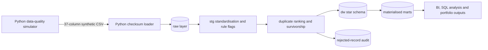
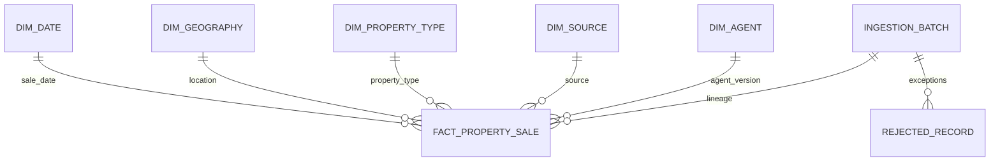
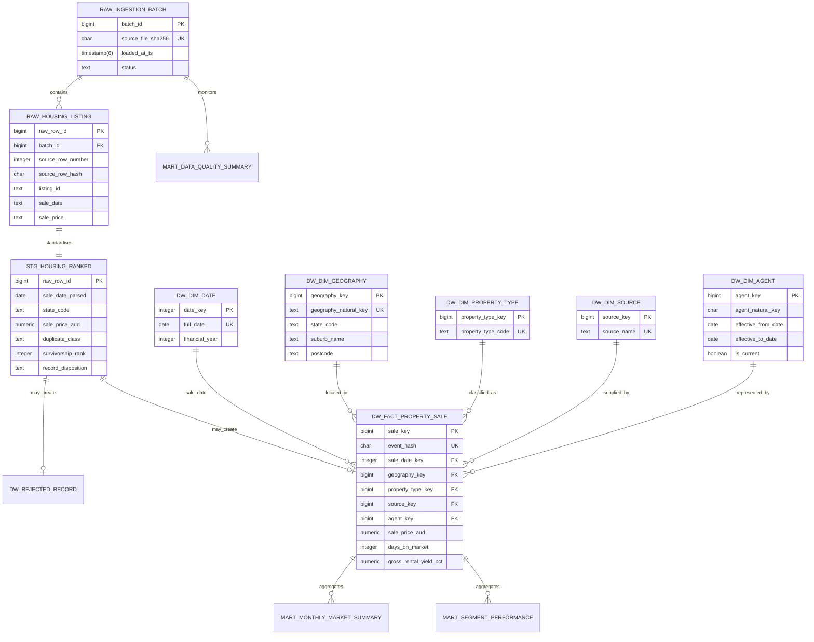
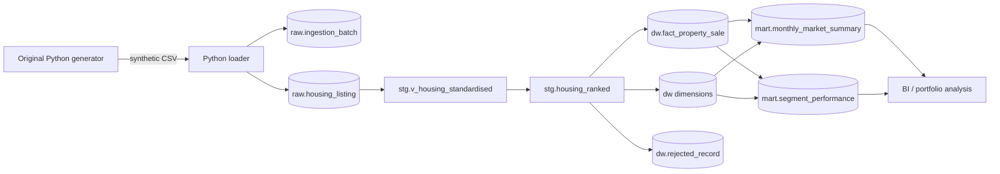

# Full project contents
This document reproduces every text-based repository file. The source CSV is a binary-sized data artefact and is referenced by path rather than embedded.

## `.env.example`
```text
MYSQL_HOST=localhost
MYSQL_PORT=3306
MYSQL_DATABASE=housing_analytics
MYSQL_USER=housing_user
MYSQL_PASSWORD=housing_password
SOURCE_CSV=data/raw/aus_housing_messy_2021-2023_jan-dec_nsw-qld-vic.csv
SOURCE_SYSTEM=australian_housing_data_quality_simulator
```

## `.gitignore`
```text
# Python
__pycache__/
*.py[cod]
.venv/
venv/
.env

# Local data and generated outputs
data/raw/*.csv
data/processed/*
!data/processed/.gitkeep
outputs/sample_results/*.csv
!outputs/sample_results/README.md

# Database and IDE
*.log
*.dump
.DS_Store
.vscode/
.idea/

# Secrets
.env.*
!.env.example
```

## `DELIVERY_REPORT.md`
```markdown
# Delivery Report: MySQL Conversion

The project has been converted from PostgreSQL to MySQL 8.0+. The conversion covers database setup, stored functions, raw ingestion, staging views, window-based survivorship, dimensional models, SCD Type 2 agent handling, fact loading, refreshable mart tables, reporting views, stored-procedure tests, optimisation examples, Python connectors, Docker Compose, Make targets and documentation.

## Key MySQL design decisions

- MySQL schemas are implemented as separate databases: `raw`, `stg`, `dw`, `mart` and `audit`.
- `AUTO_INCREMENT` replaces identity columns.
- `ON DUPLICATE KEY UPDATE` and `INSERT IGNORE` replace PostgreSQL conflict clauses.
- Refreshable physical mart tables replace materialised views.
- MySQL 8 window functions support deduplication, survivorship, rolling metrics and ranking.
- JSON stores rejection reasons because MySQL has no native array type.
- `mysql-connector-python` replaces `psycopg`.

## Validation performed

Python scripts were syntax checked. Repository references were scanned for PostgreSQL-specific runtime dependencies. SQL was reviewed for MySQL 8.0+ syntax and dependency order, but not executed against a live MySQL server in this environment.
```

## `LICENSE`
```text
MIT License

Copyright (c) 2026 Ali

Permission is hereby granted, free of charge, to any person obtaining a copy
of this software and associated documentation files (the "Software"), to deal
in the Software without restriction, including without limitation the rights
to use, copy, modify, merge, publish, distribute, sublicense, and/or sell
copies of the Software, and to permit persons to whom the Software is
furnished to do so, subject to the following conditions:

The above copyright notice and this permission notice shall be included in all
copies or substantial portions of the Software.

THE SOFTWARE IS PROVIDED "AS IS", WITHOUT WARRANTY OF ANY KIND, EXPRESS OR
IMPLIED, INCLUDING BUT NOT LIMITED TO THE WARRANTIES OF MERCHANTABILITY,
FITNESS FOR A PARTICULAR PURPOSE AND NONINFRINGEMENT. IN NO EVENT SHALL THE
AUTHORS OR COPYRIGHT HOLDERS BE LIABLE FOR ANY CLAIM, DAMAGES OR OTHER
LIABILITY, WHETHER IN AN ACTION OF CONTRACT, TORT OR OTHERWISE, ARISING FROM,
OUT OF OR IN CONNECTION WITH THE SOFTWARE OR THE USE OR OTHER DEALINGS IN THE
SOFTWARE.
```

## `Makefile`
```text
SHELL := /bin/bash
MYSQL ?= mysql
MYSQL_ARGS ?= -h localhost -P 3306 -u housing_user -phousing_password
.PHONY: setup load transform test analyse all
setup:
	$(MYSQL) $(MYSQL_ARGS) < sql/run_all.sql
load:
	python scripts/load_data.py
transform:
	$(MYSQL) $(MYSQL_ARGS) < sql/run_transform.sql
test:
	$(MYSQL) $(MYSQL_ARGS) < sql/08_tests/01_data_quality_tests.sql
analyse:
	$(MYSQL) $(MYSQL_ARGS) < sql/07_analysis/01_business_questions.sql
all: setup load transform test analyse
```

## `README.md`
```markdown
# Australian Housing SQL Quality and Market Analytics Warehouse

## Executive summary

This project is the second phase of the **Australian Housing Data Quality Simulator**. The original Python project generates synthetic Australian residential property-sale CSV files containing realistic data defects. This extension consumes those outputs and implements a governed MySQL analytics warehouse with raw ingestion, standardisation, duplicate survivorship, dimensional modelling, data-quality tests, reconciliation, reporting marts and advanced analytical SQL.

The project is designed for a professional portfolio. It demonstrates how an analyst or analytics engineer can convert an intentionally unreliable operational extract into transparent, reproducible and decision-ready data products.

> All records are synthetic. The project must not be used for property valuation, investment decisions, market forecasting or identification of real people or properties.

## Business problem

A property analytics team receives recurring extracts containing inconsistent categories, mixed date and numeric formats, malformed prices, missing values, geographic conflicts, exact duplicates and repeated-listing variants. Direct reporting would produce unstable KPIs and weak auditability. The team needs a repeatable warehouse process that protects raw lineage, applies documented business rules and exposes both analytical measures and data-quality evidence.

## Relationship to the original project

- **Original project:** `[Australian Housing Data Quality Simulator](ORIGINAL_PROJECT_URL)`
- **This SQL extension:** `[Australian Housing SQL Quality and Market Analytics Warehouse](NEW_PROJECT_URL)`

The original project is the upstream synthetic data producer. This repository does not duplicate its generation logic. It begins with the generated 37-column CSV and adds the downstream SQL engineering and analytical layer: ingestion control, cleaning, deduplication, conformed dimensions, a canonical sale fact, marts, tests and business analysis.

## Objectives

1. Preserve source data and batch lineage without premature coercion.
2. Standardise known malformed fields with reusable MySQL functions.
3. classify exact duplicates, repeated-listing variants, accepted rows and rejected rows.
4. Apply deterministic survivorship rules to create one canonical event.
5. Build a star schema suitable for BI and self-service analysis.
6. Quantify data-quality issues and reconcile every processing layer.
7. Demonstrate advanced SQL patterns relevant to Australian analyst and analytics engineering roles.

## Business questions

- How many rows are accepted, rejected or deduplicated in each batch?
- How do transaction volume, median sale price and days on market change over time?
- Which states, property types and bedroom segments drive those changes?
- What percentage of transactions sell within 30, 60 and 90 days?
- How does indicative gross rental yield vary by market segment?
- Which agencies and source systems have the strongest or weakest data-quality profiles?
- How sensitive are reports to unresolved dates, prices, states and duplicates?

## Dataset

The input is one CSV produced by the original generator. It contains 37 fields covering listing identity, geography, property characteristics, transaction details, agent details and synthetic market context. Source fields are loaded as text to retain malformed values for controlled parsing.

A verified example in the upstream README contained 11,190 rows, 37 columns, 128 fully duplicated rows and 360 rows with repeated `listing_id` values. Actual counts vary because the generator is stochastic.

## Architecture



## Repository structure

```text
.
├── README.md
├── LICENSE
├── .env.example
├── .gitignore
├── Makefile
├── docker-compose.yml
├── requirements.txt
├── docs/
├── data/
│   ├── raw/
│   ├── processed/
│   └── sample/
├── diagrams/
├── sql/
│   ├── 00_setup/
│   ├── 01_raw/
│   ├── 02_staging/
│   ├── 03_dimensions/
│   ├── 04_facts/
│   ├── 05_marts/
│   ├── 06_views/
│   ├── 07_analysis/
│   ├── 08_tests/
│   └── 09_optimisation/
├── scripts/
└── outputs/sample_results/
```

## Data model

The warehouse uses a star schema. `dw.fact_property_sale` has one accepted canonical listing/sale event per deterministic `event_hash`. It joins to date, geography, property type, source and SCD Type 2 agent dimensions. Rejected records and duplicate classifications remain auditable outside the fact.



See `diagrams/data_model.md`, `docs/data_dictionary.md` and `docs/source_to_target_mapping.md` for full definitions.

## SQL techniques demonstrated

- Transactional schema setup and reusable SQL functions
- Regular-expression parsing and defensive type conversion
- Multi-stage common table expressions
- Exact and variant duplicate classification
- Window functions for ranking, survivorship, shares, lags, rolling metrics and quartiles
- Conditional aggregation and filtered counts
- Date dimension, calendar periods and Australian financial years
- SCD Type 2 dimension handling
- Deterministic event hashes and incremental upserts
- Materialised views and reporting views
- Cohort analysis, segmentation, period-over-period comparisons and anomaly screening
- Stored procedure-based data-quality tests
- Reconciliation, indexes, statistics and `EXPLAIN ANALYZE`

## Data-quality approach

Each source row receives explicit rule flags and a weighted quality score. Critical failures prevent fact loading. Non-critical issues can be accepted with warnings. Exact duplicates and lower-ranked listing variants remain in staging but do not create extra fact rows. All rejected records retain reasons and raw lineage.

The quality framework covers completeness, validity, conformity, consistency, uniqueness and plausibility. Tests fail execution when required keys, foreign-key integrity, uniqueness or reconciliation are broken.

## Key metrics

- Accepted, rejected, exact-duplicate and variant-duplicate row counts
- Median and average sale price
- Month-over-month and year-over-year median price change
- Three-month rolling median price and sales volume
- Median days on market and 30/60/90-day sale rates
- Indicative gross rental yield
- Price-to-synthetic-suburb-reference ratio
- Data-quality score, warning rate and issue prevalence

## Findings

**Expected findings, not precomputed claims:** results depend on the selected generator run. The analytical scripts are designed to reveal changes in synthetic transaction volume, price, days on market, yield and defect rates by state, property type, cohort, source and agency. After execution, replace this section with observed values and retain the synthetic-data caveat.

## Setup

### Option A: Docker MySQL

```bash
docker compose up -d
python -m venv .venv
source .venv/bin/activate  # Windows: .venv\Scripts\activate
python -m pip install -r requirements.txt
cp .env.example .env
```

### Option B: Existing MySQL 8.0+

Create a database named `housing_analytics`, copy `.env.example` to `.env`, and update connection values.

## Input preparation

1. Run the original Python generator.
2. Copy its generated CSV to `data/raw/aus_housing_messy_2021-2023_jan-dec_nsw-qld-vic.csv`, or set `SOURCE_CSV` in `.env`.
3. Do not manually clean the CSV before loading.

## Execution order

```bash
# 1. Create schemas, functions and empty warehouse objects
mysql client "$DATABASE_URL" -v ON_ERROR_STOP=1 -f sql/run_all.sql

# 2. Load the generated CSV
python scripts/load_data.py

# 3. Standardise, model, test and optimise
mysql client "$DATABASE_URL" -v ON_ERROR_STOP=1 -f sql/run_transform.sql

# 4. Run analytical queries
mysql client "$DATABASE_URL" -v ON_ERROR_STOP=1 -f sql/07_analysis/01_business_questions.sql
mysql client "$DATABASE_URL" -v ON_ERROR_STOP=1 -f sql/07_analysis/02_advanced_patterns.sql

# 5. Export selected outputs
python scripts/export_sample_results.py
```

`make all` provides a convenience workflow after the database is running and the CSV is in place.

## Sample query

```sql
SELECT sale_month, state_code, property_type_code, sale_count,
       median_sale_price_aud, mom_median_price_change_pct,
       rolling_3m_median_price_aud, median_days_on_market
FROM mart.monthly_market_summary
ORDER BY state_code, property_type_code, sale_month;
```

## Sample output format

```text
sale_month,state_code,property_type_code,sale_count,median_sale_price_aud,mom_median_price_change_pct,rolling_3m_median_price_aud,median_days_on_market
2023-01-01,VIC,house,123,950000.00,1.42,941500.00,29.00
```

This row is illustrative only and is not a verified analytical finding.

## Performance optimisation

The implementation adds composite B-tree indexes for common date, geography, property-type, batch and business-key access paths. Refreshable marts reduce repeated percentile and window calculations. `ANALYSE` refreshes planner statistics after transformation. For substantially larger datasets, monthly range partitioning and range partitioning and covering indexes are documented as future options, but they are unnecessary at the upstream example scale.

## Assumptions and limitations

### Confirmed from the original project

- The source is a synthetic 37-column CSV.
- It contains mixed formats, missing markers, invalid values, geographic inconsistencies, exact duplicates and repeated-listing variants.
- Monthly market context is manually configured and is not an authoritative historical series.
- Coordinates are approximate and unsuitable for real geospatial analysis.
- Generator output is stochastic and currently lacks an issue-level ground-truth manifest.

### Design assumptions in this extension

- One CSV header uses the exact 37 field names documented upstream.
- `price_raw_aud` is preferred over a parsed display price when both are plausible.
- A canonical event is identified by listing ID, parsed sale date, normalised address and canonical price.
- Repeated listing IDs are treated as variants; the highest-quality row survives within a batch.
- Australian financial years begin on 1 July.
- Postcode/state validation is broad and intentionally not a substitute for an authoritative postcode reference table.

## Future improvements

- Consume a generator-produced run manifest and defect ground-truth file.
- Add authoritative synthetic reference tables for suburb/postcode validation.
- Implement dbt models and tests as an alternate transformation framework.
- Add CI with a deterministic sample CSV and ephemeral MySQL service.
- Publish a Power BI semantic model over the marts.
- Add orchestration, schema contracts and data-lineage metadata.
- Compare detected defects with injected defects when the upstream generator supports a manifest.

## Skills demonstrated

Advanced MySQL, analytical SQL, dimensional modelling, SCD Type 2 design, data-quality engineering, ETL/ELT, incremental loading, reconciliation, query optimisation, Python database loading, technical documentation, privacy-aware reporting and GitHub project organisation.

## Relevance to Australian data roles

The project reflects common selection criteria for Australian data analyst, BI analyst, analytics engineer and SQL developer roles: translating a business problem into tested data products, building reusable SQL transformations, defining trusted metrics, documenting assumptions, communicating limitations and supporting auditability.

## Author

**Ali**  
Data analytics portfolio  
LinkedIn: `[LINKEDIN_URL]`  
GitHub: `[GITHUB_PROFILE_URL]`

## Licence

MIT Licence. See `LICENSE`.
```

## `data/processed/.gitkeep`
```text

```

## `data/raw/README.md`
```markdown
# Raw input

This folder contains the supplied synthetic CSV generated by the original **Australian Housing Data Quality Simulator**:

```text
aus_housing_messy_2021-2023_jan-dec_nsw-qld-vic.csv
```

The file contains 11,190 rows and 37 source columns covering January 2021 to December 2023 for NSW, Queensland and Victoria. It is synthetic and safe for portfolio use, but it must not be represented as real property-market data.

The loader treats every source column as text so malformed values are preserved for controlled SQL parsing. The file checksum is recorded in `raw.ingestion_batch` to prevent accidental duplicate loading.
```

## `data/raw/aus_housing_messy_2021-2023_jan-dec_nsw-qld-vic.csv`
Included source data file, 3,539,157 bytes.

## `data/sample/README.md`
```markdown
# Sample data

Place a small, non-sensitive extract of the generator output here only when it is useful for demonstration. The full synthetic CSV should normally remain in `data/raw/` and is excluded from Git.
```

## `diagrams/data_model.md`
```markdown
# Entity relationship diagram


```

## `docker-compose.yml`
```yaml
services:
  mysql:
    image: mysql:8.4
    environment:
      MYSQL_ROOT_PASSWORD: root_password
      MYSQL_DATABASE: housing_analytics
      MYSQL_USER: housing_user
      MYSQL_PASSWORD: housing_password
    ports: ["3306:3306"]
    command: --local-infile=1
    volumes:
      - housing_mysql_data:/var/lib/mysql
volumes:
  housing_mysql_data:
```

## `docs/architecture.md`
```markdown
# Architecture

## Selected platform

MySQL 8.0+ is used because it is free, widely understood by Australian employers, strong for analytical SQL, and supports regular expressions, generated identity keys, refreshable aggregate tables, indexing, procedures and transactional DDL.

## Layers

1. **raw**: append-only source rows and batch metadata; all source fields remain text.
2. **stg**: standardised and typed records with parse flags, quality scores and duplicate classifications.
3. **dw**: conformed dimensions, rejected-record audit and the canonical sale fact.
4. **mart**: business-facing aggregate tables and views.
5. **audit**: test results and load reconciliation.

## Data flow



## Incremental strategy

The loader calculates a SHA-256 file checksum. A successful checksum is not loaded twice unless `--force` is used. Transformations upsert dimensions by natural key and insert fact rows using a deterministic `event_hash`. This makes reruns idempotent while allowing new batches.

## Privacy and governance

The source is synthetic. Agent and address fields are nevertheless treated as quasi-identifiers to demonstrate privacy-aware design. Reporting marts omit phone numbers and full addresses. The README warns against using outputs for valuation, investment or identification.
```

## `docs/business_requirements.md`
```markdown
# Business requirements

## Business context

A hypothetical Australian property analytics team receives monthly synthetic listing and sale extracts from multiple source systems. The extracts are structurally stable but operationally messy. Analysts need a governed warehouse layer before building BI reports.

## Stakeholders

| Stakeholder | Need |
|---|---|
| Head of Analytics | Trustworthy trend and KPI reporting with visible caveats |
| BI analyst | Stable dimensions, measures and reporting views |
| Data quality lead | Defect counts, severity, resolution status and reconciliation |
| Operations manager | Source, agency and days-on-market performance comparisons |
| Analytics engineer | Idempotent transformations, tests and incremental logic |

## Key questions

1. How many source rows are accepted, rejected, deduplicated or unresolved each load?
2. How do median price, transaction volume and days on market change month over month?
3. Which states, regions, property types and bedroom segments drive changes?
4. Which cohorts sell faster or slower than comparable listings?
5. What is the indicative gross rental yield, and how does it vary by segment?
6. Which source systems or agencies have the highest data-quality issue rates?
7. How sensitive are reported metrics to exclusions caused by invalid prices or dates?

## Functional requirements

- Retain immutable source records.
- Support repeatable batch loads with a unique batch identifier and file checksum.
- Normalise known missing markers before parsing.
- Store both parsed values and parse-status flags.
- Keep one canonical record per business event while preserving duplicate lineage.
- Publish marts at monthly geography and property-segment grains.
- Fail tests for broken keys, impossible dates, negative measures or reconciliation gaps.

## Non-functional requirements

- MySQL 8.0+ compatibility.
- SQL scripts runnable in documented order with `ON_ERROR_STOP`.
- Snake_case names, UTC ingestion timestamps and explicit numeric precision.
- No confidential or personally identifiable real-world data.
```

## `docs/data_dictionary.md`
```markdown
# Data dictionary

## `raw.ingestion_batch`

| Column | Type | Description |
|---|---|---|
| `batch_id` | bigint PK | Load identifier |
| `source_file_name` | text | Original CSV name |
| `source_file_sha256` | char(64) | Idempotency checksum |
| `source_system` | text | Generator/source label |
| `loaded_at_ts` | timestamp(6) | UTC load timestamp |
| `row_count` | integer | Rows read by loader |
| `status` | text | started, loaded or failed |
| `error_message` | text | Failure detail |

## `raw.housing_listing`

Grain: one physical CSV row. The 37 source columns are text, plus `raw_row_id`, `batch_id`, `source_row_number`, `source_row_hash` and `loaded_at_ts`.

## `stg.housing_ranked`

Grain: one raw row after standardisation and duplicate ranking. Important fields include parsed dates, numeric measures, canonical categories, rule flags, `quality_score`, `duplicate_class`, `survivorship_rank` and `record_disposition`.

## Dimensions

| Table | Grain | Key | Important attributes |
|---|---|---|---|
| `dw.dim_date` | one calendar date | `date_key` integer YYYYMMDD | month, quarter, financial year, month-end flags |
| `dw.dim_geography` | one canonical suburb/postcode/state combination | `geography_key` | suburb, postcode, council, region, state |
| `dw.dim_property_type` | one canonical type | `property_type_key` | code, display name, dwelling group |
| `dw.dim_source` | one source system label | `source_key` | source name |
| `dw.dim_agent` | one version of agent/agency attributes | `agent_key` | natural hash, name, agency, masked phone, SCD2 dates |

## `dw.fact_property_sale`

Grain: one accepted canonical property-sale/listing event after survivorship.

| Column | Type | Description |
|---|---|---|
| `sale_key` | bigint PK | Surrogate fact key |
| `event_hash` | char(32) unique | Idempotent event identifier |
| dimension keys | bigint/int FK | Date, geography, property type, source and agent |
| `listing_id` | text | Source listing identifier |
| `sale_price_aud` | numeric(14,2) | Preferred canonical sale price |
| `price_source` | text | Source used for price |
| `days_on_market` | integer | Listing duration |
| room/area fields | numeric/integer | Canonical property attributes |
| market context fields | numeric/text | Synthetic monthly settings from source |
| derived ratios | numeric | Rental yield and price-to-median ratio |
| quality fields | numeric/text | Score, warning count and duplicate lineage |
| `batch_id`, `raw_row_id` | bigint | Audit lineage |

## Marts

| Table | Grain | Measures |
|---|---|---|
| `mart.monthly_market_summary` | sale month × state × property type | sales, median/average price, median DOM, yield, MoM and rolling metrics |
| `mart.segment_performance` | sale month × state × bedroom segment × price band | sales, median price, fast-sale rate, above-median rate |
| `mart.data_quality_summary` | batch × disposition × duplicate class | rows, average score, issue counts and rates |

## Actual-file extension

| Table | Column | Type | Definition |
|---|---|---|---|
| `dw.fact_property_sale` | `sale_date_precision` | `ENUM('day','month','unknown')` | Indicates whether the source supplied a complete date or only month and year. Month precision values use day 1 solely for the date key. |
```

## `docs/data_quality_framework.md`
```markdown
# Data quality framework

## Dimensions and rules

| Dimension | Example rule | Severity | Handling |
|---|---|---:|---|
| Completeness | `listing_id` and parseable `sale_date` required for fact loading | Critical | Reject |
| Validity | `year_built` between 1800 and sale year | High | Set null and flag |
| Conformity | State mapped to an official abbreviation | High | Reject when unresolved |
| Consistency | Postcode first digit broadly consistent with state | Medium | Retain and flag |
| Uniqueness | Exact source-row hash unique within a batch | Medium | Keep first, classify duplicate |
| Plausibility | Sale price between $50,000 and $50,000,000 | High | Set null; reject if no usable price |
| Timeliness | Sale date not after batch load date | High | Reject |

## Quality score

Each standardised row starts at 100 and loses weighted points:

- 30: missing listing identifier;
- 25: unparseable sale date;
- 20: invalid or missing usable price;
- 15: unresolved state;
- 10: invalid postcode/state relationship;
- 10: invalid construction year;
- 5: unresolved property type;
- 5: malformed boolean or numeric fields.

The score supports prioritisation. It does not replace rule-level evidence.

## Disposition

- **accepted**: critical fields valid and row selected by survivorship.
- **duplicate_exact**: same canonical row hash as another row in the batch.
- **duplicate_variant**: repeated listing identity with changed attributes.
- **rejected**: critical fields cannot be resolved safely.
- **accepted_with_warning**: loaded with non-critical defects retained as flags.

## Test policy

Critical structural tests must return zero failures. Profiling tests may return observations but must be reviewed. Thresholds are explicit in SQL so reviewers can distinguish hard failures from monitored drift.
```

## `docs/github_publication_checklist.md`
```markdown
# GitHub publication checklist

- [ ] Replace original and extension repository URL placeholders.
- [ ] Add a small screenshot or exported sample result after running locally.
- [ ] Confirm no real property, agent, phone or address data has been added.
- [ ] Keep raw CSV files out of Git unless they are small, synthetic samples.
- [ ] Run all setup, load, transformation and test commands from a clean database.
- [ ] Review `git diff` for secrets, local paths and generated artefacts.
- [ ] Add repository topics listed in the README.
- [ ] Enable branch protection or use pull requests for future changes.
- [ ] Create a tagged release such as `v1.0.0` after validation.
- [ ] Link this extension from the original generator README.
```

## `docs/naming_conventions.md`
```markdown
# Naming conventions

- Schemas: `raw`, `stg`, `dw`, `mart`, `audit`.
- Tables and columns: lowercase `snake_case`.
- Surrogate keys: `<entity>_key` using `bigint generated always as identity`.
- Natural identifiers: source names such as `listing_id` or a `<entity>_code`.
- Boolean columns: `is_`, `has_` or `*_flag`.
- Timestamps: suffix `_ts`; dates: suffix `_date`; percentages: suffix `_pct`.
- Monetary values: suffix `_aud`, stored as `numeric(14,2)`.
- Distances and areas: include units, such as `_km` and `_sqm`.
- Views: prefix `v_`; refreshable aggregate tables: prefix `mv_`.
- SQL scripts: numeric execution prefix followed by a concise action name.
```

## `docs/observed_data_profile.md`
```markdown
# Observed source-data profile

This profile is based on the supplied file `aus_housing_messy_2021-2023_jan-dec_nsw-qld-vic.csv` rather than simulated expectations.

## File controls

| Measure | Observed value |
|---|---:|
| Rows | 11,190 |
| Columns | 37 |
| Unique listing IDs | 10,830 |
| Repeated listing IDs | 270 |
| Rows belonging to repeated listing IDs | 630 |
| Extra exact-duplicate rows | 128 |
| Exact-duplicate groups | 115 |
| SHA-256 | `ae7942a79e3d50ebe8276e14ac90bef7d8fd61e28d956531e33fc4be793ed3b0` |

## Important date finding

The file contains 1,184 rows (10.58%) where `sale_date` is supplied only as month and year, for example `Mar-21`. The warehouse parses these to the first day of the month for date-key compatibility and records `sale_date_precision = 'month'`. This is an explicit technical imputation, not a claim that the property sold on that day.

## Observed date representations

| Format | Rows | Percentage |
|---|---:|---:|
| Other | 3,387 | 30.27% |
| D Mon YYYY | 1,264 | 11.30% |
| DD/MM/YYYY or MM/DD/YYYY | 1,256 | 11.22% |
| Mon D, YYYY | 1,195 | 10.68% |
| Mon-YY (month precision) | 1,184 | 10.58% |
| DD-MM-YYYY | 1,179 | 10.54% |
| YYYY-MM-DD | 1,150 | 10.28% |
| Missing or marker | 575 | 5.14% |

## Reproducible outputs

The machine-readable profiles are stored in:

- `outputs/sample_results/source_column_profile.csv`
- `outputs/sample_results/date_format_profile.csv`
- `outputs/sample_results/duplicate_profile.csv`

These are source-level observations. Warehouse acceptance, warning and rejection counts are produced after running the MySQL transformations and tests.
```

## `docs/project_scope.md`
```markdown
# Project scope

## In scope

- Load one or more synthetic housing CSV files generated by the original project.
- Preserve source values and ingestion metadata in a raw schema.
- Standardise missing markers, states, property types, booleans, dates, prices, land area and numeric fields.
- Detect exact duplicates and repeated-listing variants.
- Apply transparent survivorship rules and retain rejected or unresolved rows.
- Build conformed dimensions, a transaction fact table and reporting marts.
- Calculate market, operational, rental-yield, cohort and data-quality measures.
- Provide incremental loading, tests, reconciliation and performance guidance.

## Out of scope

- Real property valuation, investment advice or market forecasting.
- Authoritative historical claims about Australian housing or RBA policy.
- Real geospatial analysis, because coordinates are synthetic and approximate.
- Identity resolution for real agents, properties or agencies.
- Replacing the original Python generator.

## Success criteria

The project succeeds when a generated CSV can be loaded reproducibly, transformed without manual edits, reconciled from raw to fact grain, tested with explicit thresholds and queried through documented marts.
```

## `docs/repository_linking_copy.md`
```markdown
# Repository linking copy

## New README relationship section

This repository is Phase 2 of the Australian Housing Data Quality portfolio series. It consumes the synthetic CSV generated by the upstream Python project and adds a MySQL warehouse, deterministic cleaning and deduplication, dimensional modelling, data-quality tests, reporting marts and advanced analysis. The generator remains the source-data project; this repository is the downstream analytics engineering extension.

## Original README update

### SQL analytics extension

A separate Phase 2 project now uses this generator's CSV output to build a production-style MySQL analytics warehouse. It includes SQL-based standardisation, duplicate survivorship, dimensional modelling, data-quality testing, reconciliation, reporting marts and advanced analytical queries.

Repository: `[Australian Housing SQL Quality and Market Analytics Warehouse](NEW_PROJECT_URL)`

## Repository description

MySQL analytics warehouse for synthetic Australian housing data, featuring data cleaning, deduplication, dimensional modelling, quality tests, marts and advanced SQL analysis.

## Suggested topics

`mysql`, `sql`, `data-analytics`, `analytics-engineering`, `data-quality`, `dimensional-modelling`, `etl`, `business-intelligence`, `australian-data`, `portfolio-project`

## Commit message

`feat: add MySQL housing quality and analytics warehouse extension`

## LinkedIn description

Built Phase 2 of my synthetic Australian housing data project: a MySQL analytics warehouse that consumes the generator's deliberately messy CSV output. The extension includes controlled raw ingestion, reusable cleaning functions, exact and near-duplicate survivorship, a star schema with an SCD Type 2 dimension, automated data-quality tests, reconciliation, refreshable reporting marts, cohort analysis, rolling metrics and query optimisation. All data is synthetic, and the project is designed to demonstrate practical SQL, BI and analytics engineering skills rather than make real housing-market claims.
```

## `docs/sample_outputs.md`
```markdown
# Sample outputs

The repository now includes fixed source-level profiles generated from the supplied 11,190-row CSV. Warehouse analytical outputs remain reproducible for this file after the MySQL pipeline is run. After a run, export these query outputs:

1. `monthly_market_summary.csv`: month, state, property type, sale count, median price, month-over-month change, three-month rolling median and median days on market.
2. `data_quality_summary.csv`: batch, disposition, duplicate class, row count, average quality score and critical issue count.
3. `agency_quality_ranking.csv`: agency, source rows, accepted events, issue rate and rank.
4. `cohort_days_on_market.csv`: listing-month cohort, property type, median days on market and percentage sold within 30/60/90 days.

Illustrative schema only:

```text
sale_month,state_code,property_type,sale_count,median_sale_price_aud,mom_median_price_change_pct,rolling_3m_median_price_aud,median_days_on_market
2023-01-01,VIC,house,123,950000.00,1.42,941500.00,29
```

Values above are examples of format, not findings from a verified run.

## Included source-level results

See `source_column_profile.csv`, `date_format_profile.csv` and `duplicate_profile.csv`, plus `docs/observed_data_profile.md`.
```

## `docs/source_to_target_mapping.md`
```markdown
# Source-to-target mapping

The raw table preserves all 37 generator fields as text. The principal mappings are below.

| Source column | Staging target | Rule | Warehouse target |
|---|---|---|---|
| `listing_id` | `listing_id_clean` | trim; known missing markers to null | `fact_property_sale.listing_id` |
| `source` | `source_clean` | trim and lower-case; default `unknown` | `dim_source.source_name` |
| `address` | `address_clean` | collapse whitespace; preserve for lineage | `dim_property.address` |
| `suburb` | `suburb_clean` | trim, collapse whitespace, title case | `dim_geography.suburb_name` |
| `state` | `state_code` | remove punctuation; map full names and abbreviations | `dim_geography.state_code` |
| `postcode` | `postcode_clean` | retain four digits only | `dim_geography.postcode` |
| `council_area` | `council_area_clean` | trim and title case | `dim_geography.council_area` |
| `region` | `region_clean` | trim and title case | `dim_geography.region_name` |
| `distance_to_cbd_km` | `distance_to_cbd_km_num` | strip non-numeric characters; valid 0 to 500 | fact |
| `lat`, `lon` | `latitude`, `longitude` | parse decimals; Australian bounding-box plausibility only | fact |
| `property_type` | `property_type_code` | synonym mapping | `dim_property_type` |
| `bedrooms` | `bedrooms_num` | map words and extract integer; valid 0 to 20 | fact |
| `bathrooms`, `car_spaces`, `toilets` | numeric equivalents | safe numeric parse; valid 0 to 20 | fact |
| `land_size` | `land_size_sqm` | hectares × 10,000; otherwise numeric square metres | fact |
| `building_area` | `building_area_sqm` | safe numeric parse; valid 0 to 5,000 | fact |
| `year_built` | `year_built_num` | integer between 1800 and sale year | fact |
| `has_pool`, `has_garage` | booleans | map yes/no, true/false, y/n, 1/0 | fact |
| `sale_price` | `sale_price_display_aud` | parse dollars and M suffix; retain phrase category | fact fallback price |
| `price_raw_aud` | `price_raw_aud_num` | preferred numeric source when plausible | fact sale price |
| `sale_date` | `sale_date_parsed` | parse supported ISO, slash and abbreviated month formats | `dim_date`, fact |
| `sale_method` | `sale_method_clean` | normalise labels | fact |
| `days_on_market` | `days_on_market_num` | integer, 0 to 730 | fact |
| `inspection_note` | `inspection_note_clean` | trim; known missing markers to null | fact lineage only |
| `agent_name`, `agency_name` | cleaned text | trim/title case; natural-key hash | `dim_agent` |
| `agent_phone` | `agent_phone_clean` | digits and leading plus only; valid length flag | `dim_agent` restricted attribute |
| market fields | typed staging fields | safe numeric/date-context parsing | fact and monthly mart |

## Derived warehouse fields

- `event_hash`: SHA-256-style MD5 composite in MySQL over listing ID, canonical date, address and sale price.
- `price_source`: `price_raw_aud`, `sale_price_display` or `unresolved`.
- `gross_rental_yield_pct`: `(weekly_rent_aud * 52 / sale_price_aud) * 100`.
- `price_to_suburb_median_ratio`: `sale_price_aud / suburb_median_price_aud`.
- `duplicate_class`: unique, exact duplicate or variant duplicate.
- `quality_score`: weighted score from documented rule failures.
```

## `docs/validation_checklist.md`
```markdown
# Validation checklist

- [ ] The input CSV has exactly the expected 37 named source columns.
- [ ] A successful file checksum is not loaded twice unless forced.
- [ ] Raw row count equals loader row count.
- [ ] Every raw row appears once in `stg.housing_ranked`.
- [ ] Accepted fact rows have non-null listing, date, state and sale price.
- [ ] Every fact foreign key resolves to a dimension row.
- [ ] `event_hash` is unique.
- [ ] Exact duplicates do not become multiple fact rows.
- [ ] Rejected rows are retained with at least one reason.
- [ ] Fact plus rejected/duplicate dispositions reconcile to staged rows.
- [ ] Monthly mart totals reconcile to fact totals for the same filters.
- [ ] No negative sale prices, rents, areas or days-on-market values exist.
- [ ] Reporting views omit full phone numbers.
- [ ] README execution order matches SQL dependencies.
```

## `outputs/sample_results/README.md`
```markdown
# Sample analytical outputs

Run the analytical SQL and export selected result sets here. Expected output schemas are documented in `docs/sample_outputs.md`. Generated CSV files are excluded from Git by default to avoid presenting stochastic example values as fixed findings.
```

## `outputs/sample_results/date_format_profile.csv`
```csv
observed_format,row_count,row_pct
Other,3387,30.27
D Mon YYYY,1264,11.3
DD/MM/YYYY or MM/DD/YYYY,1256,11.22
"Mon D, YYYY",1195,10.68
Mon-YY (month precision),1184,10.58
DD-MM-YYYY,1179,10.54
YYYY-MM-DD,1150,10.28
Missing or marker,575,5.14
```

## `outputs/sample_results/duplicate_profile.csv`
```csv
metric,observed_value
source_rows,11190
source_columns,37
exact_duplicate_extra_rows,128
exact_duplicate_groups,115
rows_with_repeated_listing_id,630
repeated_listing_ids,270
unique_listing_ids,10830
sha256,ae7942a79e3d50ebe8276e14ac90bef7d8fd61e28d956531e33fc4be793ed3b0
```

## `outputs/sample_results/source_column_profile.csv`
```csv
column_name,distinct_raw_values,missing_or_marker_rows,missing_or_marker_pct
listing_id,10830,0,0.0
source,19,112,1.0
address,8775,881,7.87
suburb,258,213,1.9
state,20,374,3.34
postcode,661,468,4.18
council_area,126,971,8.68
region,17,1352,12.08
distance_to_cbd_km,69,1161,10.38
lat,8044,2837,25.35
lon,8082,2828,25.27
property_type,40,0,0.0
bedrooms,62,914,8.17
bathrooms,21,1148,10.26
car_spaces,21,1205,10.77
toilets,6,2173,19.42
land_size,5280,1623,14.5
building_area,806,4096,36.6
year_built,128,3328,29.74
has_pool,13,2020,18.05
has_garage,13,1693,15.13
sale_price,3913,0,0.0
price_raw_aud,2432,1627,14.54
sale_date,5639,575,5.14
sale_method,19,649,5.8
days_on_market,95,3336,29.81
inspection_note,11,6265,55.99
agent_name,40,872,7.79
agency_name,41,676,6.04
agent_phone,9497,1495,13.36
rba_cash_rate_pct,14,0,0.0
market_sentiment,17,0,0.0
market_context,37,1668,14.91
suburb_median_price,924,2012,17.98
auction_clearance_rate_pct,484,3327,29.73
weekly_rent_aud,367,5227,46.71
property_count_suburb,6786,1784,15.94
```

## `requirements.txt`
```text
mysql-connector-python==9.3.0
python-dotenv==1.1.1
```

## `scripts/export_sample_results.py`
```python
#!/usr/bin/env python3
"""Export selected MySQL portfolio result sets to CSV."""
from __future__ import annotations

import csv
import os
from pathlib import Path

import mysql.connector
from dotenv import load_dotenv

QUERIES = {
    "monthly_market_summary.csv": "SELECT * FROM mart.monthly_market_summary ORDER BY state_code, property_type_code, sale_month",
    "data_quality_summary.csv": "SELECT * FROM mart.data_quality_summary ORDER BY batch_id, record_disposition, duplicate_class",
    "executive_monthly_kpis.csv": "SELECT * FROM mart.v_executive_monthly_kpis ORDER BY state_code, sale_month",
}


def connection_config() -> dict[str, object]:
    return {
        "host": os.getenv("MYSQL_HOST", "localhost"),
        "port": int(os.getenv("MYSQL_PORT", "3306")),
        "database": os.getenv("MYSQL_DATABASE", "housing_analytics"),
        "user": os.getenv("MYSQL_USER", "housing_user"),
        "password": os.getenv("MYSQL_PASSWORD", "housing_password"),
    }


def main() -> None:
    load_dotenv()
    output_dir = Path("outputs/sample_results")
    output_dir.mkdir(parents=True, exist_ok=True)

    with mysql.connector.connect(**connection_config()) as connection:
        for file_name, query in QUERIES.items():
            cursor = connection.cursor()
            try:
                cursor.execute(query)
                output_path = output_dir / file_name
                with output_path.open("w", newline="", encoding="utf-8") as handle:
                    writer = csv.writer(handle)
                    writer.writerow([column[0] for column in cursor.description])
                    writer.writerows(cursor.fetchall())
                print(f"Exported {output_path}")
            finally:
                cursor.close()


if __name__ == "__main__":
    main()
```

## `scripts/load_data.py`
```python
#!/usr/bin/env python3
"""Load the simulator CSV into MySQL without coercing source fields."""
from __future__ import annotations

import argparse
import csv
import hashlib
import os
from pathlib import Path
from typing import Iterable

import mysql.connector
from dotenv import load_dotenv

EXPECTED_COLUMNS = ['listing_id', 'source', 'address', 'suburb', 'state', 'postcode', 'council_area', 'region', 'distance_to_cbd_km', 'lat', 'lon', 'property_type', 'bedrooms', 'bathrooms', 'car_spaces', 'toilets', 'land_size', 'building_area', 'year_built', 'has_pool', 'has_garage', 'sale_price', 'price_raw_aud', 'sale_date', 'sale_method', 'days_on_market', 'inspection_note', 'agent_name', 'agency_name', 'agent_phone', 'rba_cash_rate_pct', 'market_sentiment', 'market_context', 'suburb_median_price', 'auction_clearance_rate_pct', 'weekly_rent_aud', 'property_count_suburb']


def sha256_file(path: Path) -> str:
    digest = hashlib.sha256()
    with path.open("rb") as handle:
        for chunk in iter(lambda: handle.read(1024 * 1024), b""):
            digest.update(chunk)
    return digest.hexdigest()


def row_hash(values: Iterable[str | None]) -> str:
    canonical = "|".join("" if value is None else value for value in values)
    return hashlib.md5(canonical.encode("utf-8"), usedforsecurity=False).hexdigest()


def connection_config() -> dict[str, object]:
    return {"host": os.getenv("MYSQL_HOST", "localhost"), "port": int(os.getenv("MYSQL_PORT", "3306")), "database": os.getenv("MYSQL_DATABASE", "housing_analytics"), "user": os.getenv("MYSQL_USER", "housing_user"), "password": os.getenv("MYSQL_PASSWORD", "housing_password"), "autocommit": False}


def main() -> None:
    load_dotenv()
    parser = argparse.ArgumentParser()
    parser.add_argument("--csv", default=os.getenv("SOURCE_CSV", "data/raw/aus_housing_messy_2021-2023_jan-dec_nsw-qld-vic.csv"))
    parser.add_argument("--source-system", default=os.getenv("SOURCE_SYSTEM", "australian_housing_data_quality_simulator"))
    parser.add_argument("--force", action="store_true", help="Reload a checksum already marked loaded")
    args = parser.parse_args()

    csv_path = Path(args.csv)
    if not csv_path.exists():
        raise FileNotFoundError(f"CSV not found: {csv_path}")
    checksum = sha256_file(csv_path)

    with csv_path.open("r", encoding="utf-8-sig", newline="") as handle:
        reader = csv.DictReader(handle)
        if reader.fieldnames != EXPECTED_COLUMNS:
            missing = sorted(set(EXPECTED_COLUMNS) - set(reader.fieldnames or []))
            unexpected = sorted(set(reader.fieldnames or []) - set(EXPECTED_COLUMNS))
            raise ValueError(f"Schema mismatch. Missing={missing} unexpected={unexpected} order={reader.fieldnames}")
        rows = list(reader)

    insert_columns = ["batch_id", "source_row_number", "source_row_hash", *EXPECTED_COLUMNS]
    placeholders = ",".join(["%s"] * len(insert_columns))
    insert_sql = f"INSERT INTO raw.housing_listing ({','.join(insert_columns)}) VALUES ({placeholders})"

    with mysql.connector.connect(**connection_config()) as conn:
        with conn.cursor() as cur:
            cur.execute("SELECT batch_id FROM raw.ingestion_batch WHERE source_file_sha256=%s AND status='loaded'", (checksum,))
            existing = cur.fetchone()
            if existing and not args.force:
                print(f"Skipped: checksum already loaded as batch {existing[0]}")
                return
            cur.execute(
                "INSERT INTO raw.ingestion_batch(source_file_name,source_file_sha256,source_system,status) VALUES(%s,%s,%s,'started')",
                (csv_path.name, checksum, args.source_system),
            )
            batch_id = cur.lastrowid
            try:
                payload = []
                for number, row in enumerate(rows, start=2):
                    values = [row.get(column) for column in EXPECTED_COLUMNS]
                    payload.append((batch_id, number, row_hash(values), *values))
                cur.executemany(insert_sql, payload)
                cur.execute("UPDATE raw.ingestion_batch SET row_count=%s,status='loaded' WHERE batch_id=%s", (len(rows), batch_id))
            except Exception as exc:
                cur.execute("UPDATE raw.ingestion_batch SET status='failed',error_message=%s WHERE batch_id=%s", (str(exc), batch_id))
                conn.rollback()
                raise
            else:
                conn.commit()
    print(f"Loaded {len(rows):,} rows into batch {batch_id} from {csv_path}")


if __name__ == "__main__":
    main()
```

## `sql/00_setup/01_create_database.sql`
```sql
CREATE DATABASE IF NOT EXISTS housing_analytics CHARACTER SET utf8mb4 COLLATE utf8mb4_0900_ai_ci;
CREATE DATABASE IF NOT EXISTS raw CHARACTER SET utf8mb4 COLLATE utf8mb4_0900_ai_ci;
CREATE DATABASE IF NOT EXISTS stg CHARACTER SET utf8mb4 COLLATE utf8mb4_0900_ai_ci;
CREATE DATABASE IF NOT EXISTS dw CHARACTER SET utf8mb4 COLLATE utf8mb4_0900_ai_ci;
CREATE DATABASE IF NOT EXISTS mart CHARACTER SET utf8mb4 COLLATE utf8mb4_0900_ai_ci;
CREATE DATABASE IF NOT EXISTS audit CHARACTER SET utf8mb4 COLLATE utf8mb4_0900_ai_ci;
```

## `sql/00_setup/02_create_schemas.sql`
```sql
-- In MySQL, schemas and databases are synonymous.
SOURCE sql/00_setup/01_create_database.sql;
```

## `sql/00_setup/03_create_functions.sql`
```sql
DELIMITER $$
DROP FUNCTION IF EXISTS stg.nullify_marker$$
CREATE FUNCTION stg.nullify_marker(p_value TEXT) RETURNS TEXT DETERMINISTIC
BEGIN
  DECLARE v TEXT;
  IF p_value IS NULL THEN RETURN NULL; END IF;
  SET v=TRIM(p_value);
  IF v='' OR LOWER(v) IN ('n/a','na','-','unknown','?','<blank>','null','none') THEN RETURN NULL; END IF;
  RETURN v;
END$$
DROP FUNCTION IF EXISTS stg.safe_numeric$$
CREATE FUNCTION stg.safe_numeric(p_value TEXT) RETURNS DECIMAL(18,4) DETERMINISTIC
BEGIN
  DECLARE v TEXT;
  SET v=stg.nullify_marker(p_value);
  IF v IS NULL THEN RETURN NULL; END IF;
  SET v=REGEXP_REPLACE(v,'[^0-9.\\-]','');
  IF v IN ('','-','.','-.') OR v NOT REGEXP '^-?[0-9]+(\\.[0-9]+)?$' THEN RETURN NULL; END IF;
  RETURN CAST(v AS DECIMAL(18,4));
END$$
DROP FUNCTION IF EXISTS stg.safe_integer$$
CREATE FUNCTION stg.safe_integer(p_value TEXT) RETURNS BIGINT DETERMINISTIC
BEGIN
  DECLARE n DECIMAL(18,4);
  SET n=stg.safe_numeric(p_value);
  IF n IS NULL OR n<>TRUNCATE(n,0) THEN RETURN NULL; END IF;
  RETURN CAST(n AS SIGNED);
END$$
DROP FUNCTION IF EXISTS stg.parse_boolean$$
CREATE FUNCTION stg.parse_boolean(p_value TEXT) RETURNS TINYINT DETERMINISTIC
BEGIN
  DECLARE v TEXT;
  SET v=LOWER(REGEXP_REPLACE(COALESCE(stg.nullify_marker(p_value),''),'[^a-z0-9]',''));
  RETURN CASE WHEN v IN ('yes','y','true','1') THEN 1 WHEN v IN ('no','n','false','0') THEN 0 ELSE NULL END;
END$$
DROP FUNCTION IF EXISTS stg.normalise_state$$
CREATE FUNCTION stg.normalise_state(p_value TEXT) RETURNS VARCHAR(3) DETERMINISTIC
BEGIN
  DECLARE v TEXT;
  SET v=UPPER(REGEXP_REPLACE(COALESCE(stg.nullify_marker(p_value),''),'[^A-Z]',''));
  RETURN CASE v WHEN 'NSW' THEN 'NSW' WHEN 'NEWSOUTHWALES' THEN 'NSW' WHEN 'VIC' THEN 'VIC' WHEN 'VICTORIA' THEN 'VIC' WHEN 'QLD' THEN 'QLD' WHEN 'QUEENSLAND' THEN 'QLD' WHEN 'SA' THEN 'SA' WHEN 'SOUTHAUSTRALIA' THEN 'SA' WHEN 'WA' THEN 'WA' WHEN 'WESTERNAUSTRALIA' THEN 'WA' WHEN 'TAS' THEN 'TAS' WHEN 'TASMANIA' THEN 'TAS' WHEN 'NT' THEN 'NT' WHEN 'NORTHERNTERRITORY' THEN 'NT' WHEN 'ACT' THEN 'ACT' WHEN 'AUSTRALIANCAPITALTERRITORY' THEN 'ACT' ELSE NULL END;
END$$
DROP FUNCTION IF EXISTS stg.normalise_property_type$$
CREATE FUNCTION stg.normalise_property_type(p_value TEXT) RETURNS VARCHAR(30) DETERMINISTIC
BEGIN
  DECLARE v TEXT; SET v=LOWER(COALESCE(p_value,''));
  RETURN CASE WHEN v REGEXP 'house|detached' THEN 'house' WHEN v REGEXP 'unit|apartment|flat' THEN 'unit_apartment' WHEN v REGEXP 'town' THEN 'townhouse' WHEN v REGEXP 'villa' THEN 'villa' WHEN v REGEXP 'duplex|semi' THEN 'duplex' WHEN v REGEXP 'land|vacant' THEN 'land' ELSE 'unknown' END;
END$$
DROP FUNCTION IF EXISTS stg.parse_sale_date$$
CREATE FUNCTION stg.parse_sale_date(p_value TEXT) RETURNS DATE DETERMINISTIC
BEGIN
  DECLARE v TEXT; DECLARE d DATE;
  SET v=stg.nullify_marker(p_value); IF v IS NULL THEN RETURN NULL; END IF;
  SET d=STR_TO_DATE(v,'%Y-%m-%d'); IF d IS NOT NULL AND DATE_FORMAT(d,'%Y-%m-%d')=v THEN RETURN d; END IF;
  SET d=STR_TO_DATE(v,'%d/%m/%Y'); IF d IS NOT NULL AND DATE_FORMAT(d,'%d/%m/%Y')=v THEN RETURN d; END IF;
  SET d=STR_TO_DATE(v,'%d-%m-%Y'); IF d IS NOT NULL AND DATE_FORMAT(d,'%d-%m-%Y')=v THEN RETURN d; END IF;
  SET d=STR_TO_DATE(v,'%m/%d/%Y'); IF d IS NOT NULL AND DATE_FORMAT(d,'%m/%d/%Y')=v THEN RETURN d; END IF;
  SET d=STR_TO_DATE(v,'%d %b %Y'); IF d IS NOT NULL THEN RETURN d; END IF;
  SET d=STR_TO_DATE(v,'%b %d, %Y'); IF d IS NOT NULL THEN RETURN d; END IF;
  SET d=STR_TO_DATE(CONCAT('01-',v),'%d-%b-%y'); RETURN d;
END$$
DROP FUNCTION IF EXISTS stg.parse_price_aud$$
CREATE FUNCTION stg.parse_price_aud(p_value TEXT) RETURNS DECIMAL(14,2) DETERMINISTIC
BEGIN
  DECLARE v TEXT; DECLARE n DECIMAL(18,4);
  SET v=LOWER(COALESCE(stg.nullify_marker(p_value),''));
  IF v='' OR v REGEXP 'poa|contact' THEN RETURN NULL; END IF;
  SET n=stg.safe_numeric(v); IF n IS NULL THEN RETURN NULL; END IF;
  IF v REGEXP '[0-9](\\.[0-9]+)?[[:space:]]*m' THEN SET n=n*1000000; END IF;
  RETURN ROUND(n,2);
END$$
DROP FUNCTION IF EXISTS stg.parse_land_sqm$$
CREATE FUNCTION stg.parse_land_sqm(p_value TEXT) RETURNS DECIMAL(14,2) DETERMINISTIC
BEGIN
  DECLARE v TEXT; DECLARE n DECIMAL(18,4);
  SET v=LOWER(COALESCE(stg.nullify_marker(p_value),'')); SET n=stg.safe_numeric(v);
  IF n IS NULL THEN RETURN NULL; END IF; IF v REGEXP 'ha|hectare' THEN SET n=n*10000; END IF;
  IF n<0 OR n>10000000 THEN RETURN NULL; END IF; RETURN ROUND(n,2);
END$$
DELIMITER ;
```

## `sql/01_raw/01_create_raw_tables.sql`
```sql
CREATE TABLE IF NOT EXISTS raw.ingestion_batch (
 batch_id BIGINT UNSIGNED AUTO_INCREMENT PRIMARY KEY, source_file_name VARCHAR(255) NOT NULL,
 source_file_sha256 CHAR(64) NOT NULL, source_system VARCHAR(255) NOT NULL,
 loaded_at_ts TIMESTAMP(6) NOT NULL DEFAULT CURRENT_TIMESTAMP(6), row_count INT,
 status ENUM('started','loaded','failed') NOT NULL, error_message TEXT,
 INDEX idx_batch_checksum_status(source_file_sha256,status)
) ENGINE=InnoDB;
CREATE TABLE IF NOT EXISTS raw.housing_listing (
 raw_row_id BIGINT UNSIGNED AUTO_INCREMENT PRIMARY KEY, batch_id BIGINT UNSIGNED NOT NULL,
 source_row_number INT NOT NULL, source_row_hash CHAR(32) NOT NULL,
 loaded_at_ts TIMESTAMP(6) NOT NULL DEFAULT CURRENT_TIMESTAMP(6),
    `listing_id` TEXT,
    `source` TEXT,
    `address` TEXT,
    `suburb` TEXT,
    `state` TEXT,
    `postcode` TEXT,
    `council_area` TEXT,
    `region` TEXT,
    `distance_to_cbd_km` TEXT,
    `lat` TEXT,
    `lon` TEXT,
    `property_type` TEXT,
    `bedrooms` TEXT,
    `bathrooms` TEXT,
    `car_spaces` TEXT,
    `toilets` TEXT,
    `land_size` TEXT,
    `building_area` TEXT,
    `year_built` TEXT,
    `has_pool` TEXT,
    `has_garage` TEXT,
    `sale_price` TEXT,
    `price_raw_aud` TEXT,
    `sale_date` TEXT,
    `sale_method` TEXT,
    `days_on_market` TEXT,
    `inspection_note` TEXT,
    `agent_name` TEXT,
    `agency_name` TEXT,
    `agent_phone` TEXT,
    `rba_cash_rate_pct` TEXT,
    `market_sentiment` TEXT,
    `market_context` TEXT,
    `suburb_median_price` TEXT,
    `auction_clearance_rate_pct` TEXT,
    `weekly_rent_aud` TEXT,
    `property_count_suburb` TEXT,
 UNIQUE KEY uq_raw_batch_row(batch_id,source_row_number),
 CONSTRAINT fk_raw_batch FOREIGN KEY(batch_id) REFERENCES raw.ingestion_batch(batch_id)
) ENGINE=InnoDB;
```

## `sql/02_staging/01_create_standardised_view.sql`
```sql
CREATE OR REPLACE VIEW stg.v_housing_standardised AS
WITH base AS (
 SELECT r.*, stg.nullify_marker(r.listing_id) listing_id_clean,
 LOWER(COALESCE(stg.nullify_marker(r.source),'unknown')) source_clean,
 REGEXP_REPLACE(stg.nullify_marker(r.address),'[[:space:]]+',' ') address_clean,
 REGEXP_REPLACE(stg.nullify_marker(r.suburb),'[[:space:]]+',' ') suburb_clean,
 stg.normalise_state(r.state) state_code,
 CASE WHEN REGEXP_REPLACE(COALESCE(r.postcode,''),'[^0-9]','') REGEXP '^[0-9]{4}$' THEN REGEXP_REPLACE(r.postcode,'[^0-9]','') END postcode_clean,
 REGEXP_REPLACE(stg.nullify_marker(r.council_area),'[[:space:]]+',' ') council_area_clean,
 REGEXP_REPLACE(stg.nullify_marker(r.region),'[[:space:]]+',' ') region_clean,
 stg.safe_numeric(r.distance_to_cbd_km) distance_to_cbd_km_num, stg.safe_numeric(r.lat) latitude, stg.safe_numeric(r.lon) longitude,
 stg.normalise_property_type(r.property_type) property_type_code,
 CASE LOWER(COALESCE(stg.nullify_marker(r.bedrooms),'')) WHEN 'one' THEN 1 WHEN 'two' THEN 2 WHEN 'three' THEN 3 WHEN 'four' THEN 4 WHEN 'five' THEN 5 WHEN 'six' THEN 6 ELSE stg.safe_integer(r.bedrooms) END bedrooms_num,
 stg.safe_integer(r.bathrooms) bathrooms_num, stg.safe_integer(r.car_spaces) car_spaces_num, stg.safe_integer(r.toilets) toilets_num,
 stg.parse_land_sqm(r.land_size) land_size_sqm, stg.safe_numeric(r.building_area) building_area_sqm, stg.safe_integer(r.year_built) year_built_num_raw,
 stg.parse_boolean(r.has_pool) has_pool_bool, stg.parse_boolean(r.has_garage) has_garage_bool,
 stg.parse_price_aud(r.sale_price) sale_price_display_aud, stg.safe_numeric(r.price_raw_aud) price_raw_aud_num,
 stg.parse_sale_date(r.sale_date) sale_date_parsed, CASE WHEN stg.nullify_marker(r.sale_date) REGEXP '^[A-Za-z]{3}-[0-9]{2}$' THEN 'month' WHEN stg.nullify_marker(r.sale_date) IS NULL THEN 'unknown' ELSE 'day' END sale_date_precision, stg.nullify_marker(r.sale_method) sale_method_clean, stg.safe_integer(r.days_on_market) days_on_market_num,
 stg.nullify_marker(r.inspection_note) inspection_note_clean, stg.nullify_marker(r.agent_name) agent_name_clean, stg.nullify_marker(r.agency_name) agency_name_clean,
 REGEXP_REPLACE(COALESCE(stg.nullify_marker(r.agent_phone),''),'[^0-9+]','') agent_phone_clean,
 stg.safe_numeric(r.rba_cash_rate_pct) rba_cash_rate_pct_num, stg.nullify_marker(r.market_sentiment) market_sentiment_clean,
 stg.nullify_marker(r.market_context) market_context_clean, stg.safe_numeric(r.suburb_median_price) suburb_median_price_aud,
 stg.safe_numeric(r.auction_clearance_rate_pct) auction_clearance_rate_pct_num, stg.safe_numeric(r.weekly_rent_aud) weekly_rent_aud_num,
 stg.safe_integer(r.property_count_suburb) property_count_suburb_num
 FROM raw.housing_listing r
), typed AS (
 SELECT b.*, CASE WHEN price_raw_aud_num BETWEEN 50000 AND 50000000 THEN ROUND(price_raw_aud_num,2) WHEN sale_price_display_aud BETWEEN 50000 AND 50000000 THEN sale_price_display_aud END sale_price_aud,
 CASE WHEN price_raw_aud_num BETWEEN 50000 AND 50000000 THEN 'price_raw_aud' WHEN sale_price_display_aud BETWEEN 50000 AND 50000000 THEN 'sale_price_display' ELSE 'unresolved' END price_source,
 CASE WHEN year_built_num_raw BETWEEN 1800 AND YEAR(COALESCE(sale_date_parsed,CURRENT_DATE)) THEN year_built_num_raw END year_built_num,
 CASE WHEN distance_to_cbd_km_num BETWEEN 0 AND 500 THEN distance_to_cbd_km_num END distance_to_cbd_km_valid,
 IF(latitude BETWEEN -44 AND -10 AND longitude BETWEEN 112 AND 154,1,0) is_coordinate_plausible,
 IF(CHAR_LENGTH(agent_phone_clean) BETWEEN 8 AND 13,1,0) is_phone_plausible FROM base b
), flags AS (
 SELECT t.*, listing_id_clean IS NULL issue_missing_listing_id,
 (sale_date_parsed IS NULL OR sale_date_parsed>DATE(loaded_at_ts)) issue_invalid_sale_date,
 sale_price_aud IS NULL issue_invalid_sale_price, state_code IS NULL issue_invalid_state,
 (postcode_clean IS NULL OR NOT ((state_code='NSW' AND LEFT(postcode_clean,1) IN ('1','2')) OR (state_code='VIC' AND LEFT(postcode_clean,1)='3') OR (state_code='QLD' AND LEFT(postcode_clean,1)='4') OR (state_code='SA' AND LEFT(postcode_clean,1)='5') OR (state_code='WA' AND LEFT(postcode_clean,1)='6') OR (state_code='TAS' AND LEFT(postcode_clean,1)='7') OR (state_code='NT' AND LEFT(postcode_clean,1)='0') OR (state_code='ACT' AND LEFT(postcode_clean,1)='2'))) issue_postcode_state_mismatch,
 (year_built_num_raw IS NOT NULL AND year_built_num IS NULL) issue_invalid_year_built,
 sale_date_precision='month' issue_imputed_sale_day,
 property_type_code='unknown' issue_unknown_property_type,
 ((has_pool IS NOT NULL AND has_pool_bool IS NULL) OR (has_garage IS NOT NULL AND has_garage_bool IS NULL)) issue_invalid_boolean,
 ((bedrooms IS NOT NULL AND bedrooms_num IS NULL) OR (bathrooms IS NOT NULL AND bathrooms_num IS NULL) OR (days_on_market IS NOT NULL AND days_on_market_num IS NULL)) issue_invalid_numeric
 FROM typed t
)
SELECT f.*, GREATEST(0,100-30*issue_missing_listing_id-25*issue_invalid_sale_date-20*issue_invalid_sale_price-15*issue_invalid_state-10*issue_postcode_state_mismatch-10*issue_invalid_year_built-3*issue_imputed_sale_day-5*issue_unknown_property_type-5*issue_invalid_boolean-5*issue_invalid_numeric) quality_score,
 MD5(CONCAT_WS('|',listing_id_clean,CAST(sale_date_parsed AS CHAR),LOWER(COALESCE(address_clean,'')),COALESCE(CAST(sale_price_aud AS CHAR),''))) event_hash,
 MD5(CONCAT_WS('|',LOWER(COALESCE(agent_name_clean,'')),LOWER(COALESCE(agency_name_clean,'')))) agent_natural_key,
 MD5(CONCAT_WS('|',LOWER(COALESCE(suburb_clean,'')),COALESCE(postcode_clean,''),COALESCE(state_code,''),LOWER(COALESCE(council_area_clean,'')))) geography_natural_key
FROM flags f;
```

## `sql/02_staging/02_build_ranked_staging.sql`
```sql
DROP TABLE IF EXISTS stg.housing_ranked;
CREATE TABLE stg.housing_ranked AS
WITH ranked AS (
 SELECT s.*, ROW_NUMBER() OVER(PARTITION BY batch_id,source_row_hash ORDER BY raw_row_id) exact_duplicate_rank,
 COUNT(*) OVER(PARTITION BY batch_id,source_row_hash) exact_duplicate_count,
 COUNT(*) OVER(PARTITION BY batch_id,listing_id_clean) listing_id_count,
 ROW_NUMBER() OVER(PARTITION BY batch_id,listing_id_clean ORDER BY quality_score DESC, sale_date_parsed DESC, raw_row_id) survivorship_rank
 FROM stg.v_housing_standardised s
)
SELECT r.*, CASE WHEN exact_duplicate_rank>1 THEN 'duplicate_exact' WHEN listing_id_clean IS NOT NULL AND listing_id_count>1 AND survivorship_rank>1 THEN 'duplicate_variant' ELSE 'unique' END duplicate_class,
 CASE WHEN issue_missing_listing_id OR issue_invalid_sale_date OR issue_invalid_sale_price OR issue_invalid_state THEN 'rejected' WHEN exact_duplicate_rank>1 THEN 'duplicate_exact' WHEN listing_id_clean IS NOT NULL AND listing_id_count>1 AND survivorship_rank>1 THEN 'duplicate_variant' WHEN quality_score<100 THEN 'accepted_with_warning' ELSE 'accepted' END record_disposition
FROM ranked r;
ALTER TABLE stg.housing_ranked ADD PRIMARY KEY(raw_row_id), ADD INDEX idx_stg_ranked_batch(batch_id), ADD INDEX idx_stg_ranked_event_hash(event_hash), ADD INDEX idx_stg_ranked_disposition(record_disposition);
```

## `sql/03_dimensions/01_create_dimensions.sql`
```sql
CREATE TABLE IF NOT EXISTS dw.dim_date(date_key INT PRIMARY KEY,full_date DATE NOT NULL UNIQUE,day_of_month TINYINT NOT NULL,day_name VARCHAR(10) NOT NULL,week_of_year TINYINT NOT NULL,month_number TINYINT NOT NULL,month_name VARCHAR(10) NOT NULL,quarter_number TINYINT NOT NULL,calendar_year SMALLINT NOT NULL,financial_year SMALLINT NOT NULL,financial_quarter TINYINT NOT NULL,month_start_date DATE NOT NULL,month_end_date DATE NOT NULL,is_month_end TINYINT(1) NOT NULL,is_weekend TINYINT(1) NOT NULL) ENGINE=InnoDB;
CREATE TABLE IF NOT EXISTS dw.dim_geography(geography_key BIGINT UNSIGNED AUTO_INCREMENT PRIMARY KEY,geography_natural_key CHAR(32) NOT NULL UNIQUE,suburb_name VARCHAR(255),postcode CHAR(4),council_area VARCHAR(255),region_name VARCHAR(255),state_code CHAR(3) NOT NULL,state_name VARCHAR(40) NOT NULL,created_at_ts TIMESTAMP(6) DEFAULT CURRENT_TIMESTAMP(6),updated_at_ts TIMESTAMP(6) DEFAULT CURRENT_TIMESTAMP(6) ON UPDATE CURRENT_TIMESTAMP(6)) ENGINE=InnoDB;
CREATE TABLE IF NOT EXISTS dw.dim_property_type(property_type_key BIGINT UNSIGNED AUTO_INCREMENT PRIMARY KEY,property_type_code VARCHAR(30) NOT NULL UNIQUE,property_type_name VARCHAR(60) NOT NULL,dwelling_group VARCHAR(60) NOT NULL) ENGINE=InnoDB;
CREATE TABLE IF NOT EXISTS dw.dim_source(source_key BIGINT UNSIGNED AUTO_INCREMENT PRIMARY KEY,source_name VARCHAR(255) NOT NULL UNIQUE,created_at_ts TIMESTAMP(6) DEFAULT CURRENT_TIMESTAMP(6)) ENGINE=InnoDB;
CREATE TABLE IF NOT EXISTS dw.dim_agent(agent_key BIGINT UNSIGNED AUTO_INCREMENT PRIMARY KEY,agent_natural_key CHAR(32) NOT NULL,agent_name VARCHAR(255),agency_name VARCHAR(255),agent_phone_masked VARCHAR(32),is_phone_plausible TINYINT(1) NOT NULL,effective_from_date DATE NOT NULL,effective_to_date DATE NOT NULL DEFAULT '9999-12-31',is_current TINYINT(1) NOT NULL DEFAULT 1,source_attribute_hash CHAR(32) NOT NULL,created_at_ts TIMESTAMP(6) DEFAULT CURRENT_TIMESTAMP(6),UNIQUE KEY uq_agent_version(agent_natural_key,effective_from_date),INDEX idx_agent_current(agent_natural_key,is_current)) ENGINE=InnoDB;
```

## `sql/03_dimensions/02_load_date_dimension.sql`
```sql
SET SESSION cte_max_recursion_depth=10000;
WITH RECURSIVE dates AS (SELECT DATE('2020-01-01') d UNION ALL SELECT DATE_ADD(d,INTERVAL 1 DAY) FROM dates WHERE d<'2026-12-31')
INSERT INTO dw.dim_date(date_key,full_date,day_of_month,day_name,week_of_year,month_number,month_name,quarter_number,calendar_year,financial_year,financial_quarter,month_start_date,month_end_date,is_month_end,is_weekend)
SELECT CAST(DATE_FORMAT(d,'%Y%m%d') AS UNSIGNED),d,DAY(d),DAYNAME(d),WEEK(d,3),MONTH(d),MONTHNAME(d),QUARTER(d),YEAR(d),YEAR(d)+IF(MONTH(d)>=7,1,0),FLOOR(MOD(MONTH(d)+5,12)/3)+1,DATE_SUB(d,INTERVAL DAY(d)-1 DAY),LAST_DAY(d),d=LAST_DAY(d),WEEKDAY(d)>=5 FROM dates
ON DUPLICATE KEY UPDATE full_date=VALUES(full_date);
```

## `sql/03_dimensions/03_load_dimensions.sql`
```sql
INSERT INTO dw.dim_property_type(property_type_code,property_type_name,dwelling_group) VALUES ('house','House','Detached dwelling'),('unit_apartment','Unit / Apartment','Attached dwelling'),('townhouse','Townhouse','Attached dwelling'),('villa','Villa','Attached dwelling'),('duplex','Duplex','Semi-attached dwelling'),('land','Land','Vacant land'),('unknown','Unknown','Unknown') ON DUPLICATE KEY UPDATE property_type_name=VALUES(property_type_name),dwelling_group=VALUES(dwelling_group);
INSERT IGNORE INTO dw.dim_source(source_name) SELECT DISTINCT source_clean FROM stg.housing_ranked;
INSERT INTO dw.dim_geography(geography_natural_key,suburb_name,postcode,council_area,region_name,state_code,state_name)
SELECT geography_natural_key,MAX(suburb_clean),MAX(postcode_clean),MAX(council_area_clean),MAX(region_clean),state_code,CASE state_code WHEN 'NSW' THEN 'New South Wales' WHEN 'VIC' THEN 'Victoria' WHEN 'QLD' THEN 'Queensland' WHEN 'SA' THEN 'South Australia' WHEN 'WA' THEN 'Western Australia' WHEN 'TAS' THEN 'Tasmania' WHEN 'NT' THEN 'Northern Territory' WHEN 'ACT' THEN 'Australian Capital Territory' END FROM stg.housing_ranked WHERE state_code IS NOT NULL GROUP BY geography_natural_key,state_code
ON DUPLICATE KEY UPDATE suburb_name=VALUES(suburb_name),postcode=VALUES(postcode),council_area=VALUES(council_area),region_name=VALUES(region_name),state_code=VALUES(state_code),state_name=VALUES(state_name),updated_at_ts=CURRENT_TIMESTAMP(6);
DROP TEMPORARY TABLE IF EXISTS tmp_latest_agent;
CREATE TEMPORARY TABLE tmp_latest_agent AS SELECT * FROM (SELECT agent_natural_key,agent_name_clean,agency_name_clean,IF(is_phone_plausible AND CHAR_LENGTH(agent_phone_clean)>=4,CONCAT(REPEAT('*',GREATEST(CHAR_LENGTH(agent_phone_clean)-4,0)),RIGHT(agent_phone_clean,4)),NULL) agent_phone_masked,is_phone_plausible,sale_date_parsed effective_from_date,MD5(CONCAT_WS('|',COALESCE(agent_name_clean,''),COALESCE(agency_name_clean,''),COALESCE(agent_phone_clean,''))) source_attribute_hash,ROW_NUMBER() OVER(PARTITION BY agent_natural_key ORDER BY sale_date_parsed DESC,quality_score DESC,raw_row_id DESC) rn FROM stg.housing_ranked WHERE agent_natural_key IS NOT NULL AND sale_date_parsed IS NOT NULL) x WHERE rn=1;
UPDATE dw.dim_agent d JOIN tmp_latest_agent l ON l.agent_natural_key=d.agent_natural_key AND d.is_current=1 SET d.effective_to_date=DATE_SUB(l.effective_from_date,INTERVAL 1 DAY),d.is_current=0 WHERE d.source_attribute_hash<>l.source_attribute_hash;
INSERT IGNORE INTO dw.dim_agent(agent_natural_key,agent_name,agency_name,agent_phone_masked,is_phone_plausible,effective_from_date,source_attribute_hash)
SELECT l.agent_natural_key,l.agent_name_clean,l.agency_name_clean,l.agent_phone_masked,l.is_phone_plausible,l.effective_from_date,l.source_attribute_hash FROM tmp_latest_agent l LEFT JOIN dw.dim_agent d ON d.agent_natural_key=l.agent_natural_key AND d.is_current=1 WHERE d.agent_key IS NULL;
```

## `sql/04_facts/01_create_fact_tables.sql`
```sql
CREATE TABLE IF NOT EXISTS dw.fact_property_sale(sale_key BIGINT UNSIGNED AUTO_INCREMENT PRIMARY KEY,event_hash CHAR(32) NOT NULL UNIQUE,sale_date_key INT NOT NULL,sale_date_precision ENUM('day','month','unknown') NOT NULL,geography_key BIGINT UNSIGNED NOT NULL,property_type_key BIGINT UNSIGNED NOT NULL,source_key BIGINT UNSIGNED NOT NULL,agent_key BIGINT UNSIGNED NULL,listing_id VARCHAR(255) NOT NULL,address TEXT,sale_method VARCHAR(100),sale_price_aud DECIMAL(14,2) NOT NULL,price_source VARCHAR(30) NOT NULL,bedrooms SMALLINT,bathrooms SMALLINT,car_spaces SMALLINT,toilets SMALLINT,land_size_sqm DECIMAL(14,2),building_area_sqm DECIMAL(14,2),year_built SMALLINT,has_pool TINYINT(1),has_garage TINYINT(1),days_on_market INT,distance_to_cbd_km DECIMAL(8,2),latitude DECIMAL(10,6),longitude DECIMAL(10,6),rba_cash_rate_pct DECIMAL(6,3),market_sentiment VARCHAR(100),market_context TEXT,suburb_median_price_aud DECIMAL(14,2),auction_clearance_rate_pct DECIMAL(6,2),weekly_rent_aud DECIMAL(12,2),property_count_suburb INT,gross_rental_yield_pct DECIMAL(8,3),price_to_suburb_median_ratio DECIMAL(10,4),quality_score SMALLINT NOT NULL,warning_count SMALLINT NOT NULL,duplicate_class VARCHAR(30) NOT NULL,batch_id BIGINT UNSIGNED NOT NULL,raw_row_id BIGINT UNSIGNED NOT NULL,loaded_at_ts TIMESTAMP(6) DEFAULT CURRENT_TIMESTAMP(6),CONSTRAINT fk_fact_date FOREIGN KEY(sale_date_key) REFERENCES dw.dim_date(date_key),CONSTRAINT fk_fact_geo FOREIGN KEY(geography_key) REFERENCES dw.dim_geography(geography_key),CONSTRAINT fk_fact_property FOREIGN KEY(property_type_key) REFERENCES dw.dim_property_type(property_type_key),CONSTRAINT fk_fact_source FOREIGN KEY(source_key) REFERENCES dw.dim_source(source_key),CONSTRAINT fk_fact_agent FOREIGN KEY(agent_key) REFERENCES dw.dim_agent(agent_key),CONSTRAINT fk_fact_batch FOREIGN KEY(batch_id) REFERENCES raw.ingestion_batch(batch_id),CONSTRAINT fk_fact_raw FOREIGN KEY(raw_row_id) REFERENCES raw.housing_listing(raw_row_id),CHECK(sale_price_aud>0),CHECK(days_on_market IS NULL OR days_on_market BETWEEN 0 AND 730)) ENGINE=InnoDB;
CREATE TABLE IF NOT EXISTS dw.rejected_record(rejection_key BIGINT UNSIGNED AUTO_INCREMENT PRIMARY KEY,batch_id BIGINT UNSIGNED NOT NULL,raw_row_id BIGINT UNSIGNED NOT NULL UNIQUE,listing_id VARCHAR(255),rejection_reasons JSON NOT NULL,duplicate_class VARCHAR(30) NOT NULL,quality_score SMALLINT NOT NULL,rejected_at_ts TIMESTAMP(6) DEFAULT CURRENT_TIMESTAMP(6) ON UPDATE CURRENT_TIMESTAMP(6),FOREIGN KEY(batch_id) REFERENCES raw.ingestion_batch(batch_id),FOREIGN KEY(raw_row_id) REFERENCES raw.housing_listing(raw_row_id)) ENGINE=InnoDB;
```

## `sql/04_facts/02_load_facts.sql`
```sql
INSERT INTO dw.rejected_record(batch_id,raw_row_id,listing_id,rejection_reasons,duplicate_class,quality_score)
SELECT batch_id,raw_row_id,listing_id_clean,JSON_ARRAY(IF(issue_missing_listing_id,'missing_listing_id',NULL),IF(issue_invalid_sale_date,'invalid_sale_date',NULL),IF(issue_invalid_sale_price,'invalid_sale_price',NULL),IF(issue_invalid_state,'invalid_state',NULL)),duplicate_class,quality_score FROM stg.housing_ranked WHERE record_disposition='rejected'
ON DUPLICATE KEY UPDATE rejection_reasons=VALUES(rejection_reasons),duplicate_class=VALUES(duplicate_class),quality_score=VALUES(quality_score),rejected_at_ts=CURRENT_TIMESTAMP(6);
INSERT INTO dw.fact_property_sale(event_hash,sale_date_key,sale_date_precision,geography_key,property_type_key,source_key,agent_key,listing_id,address,sale_method,sale_price_aud,price_source,bedrooms,bathrooms,car_spaces,toilets,land_size_sqm,building_area_sqm,year_built,has_pool,has_garage,days_on_market,distance_to_cbd_km,latitude,longitude,rba_cash_rate_pct,market_sentiment,market_context,suburb_median_price_aud,auction_clearance_rate_pct,weekly_rent_aud,property_count_suburb,gross_rental_yield_pct,price_to_suburb_median_ratio,quality_score,warning_count,duplicate_class,batch_id,raw_row_id)
SELECT s.event_hash,CAST(DATE_FORMAT(s.sale_date_parsed,'%Y%m%d') AS UNSIGNED),s.sale_date_precision,g.geography_key,p.property_type_key,src.source_key,(SELECT da.agent_key FROM dw.dim_agent da WHERE da.agent_natural_key=s.agent_natural_key AND s.sale_date_parsed BETWEEN da.effective_from_date AND da.effective_to_date ORDER BY da.effective_from_date DESC LIMIT 1),s.listing_id_clean,s.address_clean,s.sale_method_clean,s.sale_price_aud,s.price_source,IF(s.bedrooms_num BETWEEN 0 AND 20,s.bedrooms_num,NULL),IF(s.bathrooms_num BETWEEN 0 AND 20,s.bathrooms_num,NULL),IF(s.car_spaces_num BETWEEN 0 AND 20,s.car_spaces_num,NULL),IF(s.toilets_num BETWEEN 0 AND 20,s.toilets_num,NULL),s.land_size_sqm,IF(s.building_area_sqm BETWEEN 0 AND 5000,s.building_area_sqm,NULL),s.year_built_num,s.has_pool_bool,s.has_garage_bool,IF(s.days_on_market_num BETWEEN 0 AND 730,s.days_on_market_num,NULL),s.distance_to_cbd_km_valid,IF(s.is_coordinate_plausible,s.latitude,NULL),IF(s.is_coordinate_plausible,s.longitude,NULL),s.rba_cash_rate_pct_num,s.market_sentiment_clean,s.market_context_clean,s.suburb_median_price_aud,s.auction_clearance_rate_pct_num,s.weekly_rent_aud_num,s.property_count_suburb_num,IF(s.weekly_rent_aud_num>0 AND s.sale_price_aud>0,ROUND(s.weekly_rent_aud_num*52/s.sale_price_aud*100,3),NULL),IF(s.suburb_median_price_aud>0,ROUND(s.sale_price_aud/s.suburb_median_price_aud,4),NULL),s.quality_score,(s.issue_postcode_state_mismatch+s.issue_invalid_year_built+s.issue_imputed_sale_day+s.issue_unknown_property_type+s.issue_invalid_boolean+s.issue_invalid_numeric),s.duplicate_class,s.batch_id,s.raw_row_id
FROM stg.housing_ranked s JOIN dw.dim_geography g ON g.geography_natural_key=s.geography_natural_key JOIN dw.dim_property_type p ON p.property_type_code=s.property_type_code JOIN dw.dim_source src ON src.source_name=s.source_clean WHERE s.record_disposition IN('accepted','accepted_with_warning') AND s.survivorship_rank=1
ON DUPLICATE KEY UPDATE quality_score=GREATEST(quality_score,VALUES(quality_score)),warning_count=LEAST(warning_count,VALUES(warning_count)),batch_id=VALUES(batch_id),raw_row_id=VALUES(raw_row_id),loaded_at_ts=CURRENT_TIMESTAMP(6);
```

## `sql/05_marts/01_create_marts.sql`
```sql
DROP TABLE IF EXISTS mart.monthly_market_summary;
CREATE TABLE mart.monthly_market_summary AS
WITH ranked AS (SELECT d.month_start_date sale_month,g.state_code,p.property_type_code,f.sale_price_aud,f.days_on_market,f.gross_rental_yield_pct,f.quality_score,ROW_NUMBER() OVER(PARTITION BY d.month_start_date,g.state_code,p.property_type_code ORDER BY f.sale_price_aud) rn_price,ROW_NUMBER() OVER(PARTITION BY d.month_start_date,g.state_code,p.property_type_code ORDER BY f.days_on_market) rn_dom,COUNT(*) OVER(PARTITION BY d.month_start_date,g.state_code,p.property_type_code) cnt FROM dw.fact_property_sale f JOIN dw.dim_date d ON d.date_key=f.sale_date_key JOIN dw.dim_geography g ON g.geography_key=f.geography_key JOIN dw.dim_property_type p ON p.property_type_key=f.property_type_key),
base AS (SELECT sale_month,state_code,property_type_code,MAX(cnt) sale_count,AVG(CASE WHEN rn_price IN(FLOOR((cnt+1)/2),FLOOR((cnt+2)/2)) THEN sale_price_aud END) median_sale_price_aud,AVG(sale_price_aud) average_sale_price_aud,AVG(CASE WHEN rn_dom IN(FLOOR((cnt+1)/2),FLOOR((cnt+2)/2)) THEN days_on_market END) median_days_on_market,AVG(gross_rental_yield_pct) average_gross_rental_yield_pct,AVG(quality_score) average_quality_score FROM ranked GROUP BY sale_month,state_code,property_type_code),
metrics AS (SELECT b.*,LAG(median_sale_price_aud) OVER(PARTITION BY state_code,property_type_code ORDER BY sale_month) prior_month_median_price,AVG(median_sale_price_aud) OVER(PARTITION BY state_code,property_type_code ORDER BY sale_month ROWS BETWEEN 2 PRECEDING AND CURRENT ROW) rolling_3m_median_price_aud,SUM(sale_count) OVER(PARTITION BY state_code,property_type_code ORDER BY sale_month ROWS BETWEEN 2 PRECEDING AND CURRENT ROW) rolling_3m_sales FROM base b)
SELECT *,IF(prior_month_median_price>0,ROUND((median_sale_price_aud-prior_month_median_price)/prior_month_median_price*100,2),NULL) mom_median_price_change_pct FROM metrics;
ALTER TABLE mart.monthly_market_summary ADD PRIMARY KEY(sale_month,state_code,property_type_code);
DROP TABLE IF EXISTS mart.segment_performance;
CREATE TABLE mart.segment_performance AS SELECT d.month_start_date sale_month,g.state_code,CASE WHEN f.bedrooms IS NULL THEN 'unknown' WHEN f.bedrooms<=2 THEN '0-2' WHEN f.bedrooms=3 THEN '3' WHEN f.bedrooms=4 THEN '4' ELSE '5+' END bedroom_segment,CASE WHEN f.sale_price_aud<500000 THEN 'under_500k' WHEN f.sale_price_aud<1000000 THEN '500k_to_999k' WHEN f.sale_price_aud<2000000 THEN '1m_to_1_999m' ELSE '2m_plus' END price_band,COUNT(*) sale_count,AVG(f.sale_price_aud) average_sale_price_aud,AVG(f.days_on_market) average_days_on_market,AVG(f.days_on_market<=30) sold_within_30_days_rate,AVG(f.price_to_suburb_median_ratio>1) above_suburb_median_rate FROM dw.fact_property_sale f JOIN dw.dim_date d ON d.date_key=f.sale_date_key JOIN dw.dim_geography g ON g.geography_key=f.geography_key GROUP BY 1,2,3,4;
ALTER TABLE mart.segment_performance ADD PRIMARY KEY(sale_month,state_code,bedroom_segment,price_band);
DROP TABLE IF EXISTS mart.data_quality_summary;
CREATE TABLE mart.data_quality_summary AS SELECT batch_id,record_disposition,duplicate_class,COUNT(*) row_count,AVG(quality_score) average_quality_score,SUM(issue_missing_listing_id+issue_invalid_sale_date+issue_invalid_sale_price+issue_invalid_state) critical_issue_count,AVG(issue_postcode_state_mismatch) postcode_state_issue_rate,AVG(issue_invalid_year_built) invalid_year_issue_rate FROM stg.housing_ranked GROUP BY 1,2,3;
ALTER TABLE mart.data_quality_summary ADD PRIMARY KEY(batch_id,record_disposition,duplicate_class);
```

## `sql/05_marts/02_refresh_marts.sql`
```sql
SOURCE sql/05_marts/01_create_marts.sql;
```

## `sql/06_views/01_reporting_views.sql`
```sql
CREATE OR REPLACE VIEW mart.v_executive_monthly_kpis AS
SELECT sale_month, state_code,
 sum(sale_count) AS sale_count,
 round(sum(median_sale_price_aud*sale_count)/nullif(sum(sale_count),0),2) AS weighted_segment_median_price_aud,
 round(avg(median_days_on_market),2) AS average_segment_median_days_on_market,
 round(avg(mom_median_price_change_pct),2) AS average_segment_mom_price_change_pct,
 round(avg(average_quality_score),2) AS average_quality_score
FROM mart.monthly_market_summary
GROUP BY sale_month,state_code;

CREATE OR REPLACE VIEW mart.v_property_sale_detail AS
SELECT f.sale_key, d.full_date AS sale_date, d.financial_year,
 g.state_code, g.suburb_name, g.postcode, g.region_name,
 p.property_type_name, src.source_name,
 a.agent_name, a.agency_name,
 f.listing_id, f.sale_price_aud, f.bedrooms, f.bathrooms,
 f.land_size_sqm, f.days_on_market, f.gross_rental_yield_pct,
 f.price_to_suburb_median_ratio, f.quality_score, f.warning_count
FROM dw.fact_property_sale f
JOIN dw.dim_date d ON d.date_key=f.sale_date_key
JOIN dw.dim_geography g ON g.geography_key=f.geography_key
JOIN dw.dim_property_type p ON p.property_type_key=f.property_type_key
JOIN dw.dim_source src ON src.source_key=f.source_key
LEFT JOIN dw.dim_agent a ON a.agent_key=f.agent_key;

CREATE OR REPLACE VIEW mart.v_data_quality_batch_reconciliation AS
SELECT b.batch_id, b.source_file_name, b.row_count AS raw_file_rows,
 count(s.raw_row_id) AS staged_rows,
 SUM(s.record_disposition IN ('accepted','accepted_with_warning') AND s.survivorship_rank=1) AS candidate_fact_rows,
 SUM(s.record_disposition='rejected') AS rejected_rows,
 SUM(s.record_disposition='duplicate_exact') AS exact_duplicate_rows,
 SUM(s.record_disposition='duplicate_variant') AS variant_duplicate_rows
FROM raw.ingestion_batch b
LEFT JOIN stg.housing_ranked s ON s.batch_id=b.batch_id
GROUP BY b.batch_id,b.source_file_name,b.row_count;
```

## `sql/07_analysis/01_business_questions.sql`
```sql
-- 1. Monthly performance with period-over-period and rolling metrics.
SELECT * FROM mart.monthly_market_summary
ORDER BY state_code, property_type_code, sale_month;

-- 2. State contribution to national monthly sales using window functions.
WITH monthly AS (
 SELECT d.month_start_date sale_month, g.state_code, count(*) sale_count,
        sum(f.sale_price_aud) gross_sales_value_aud
 FROM dw.fact_property_sale f
 JOIN dw.dim_date d ON d.date_key=f.sale_date_key
 JOIN dw.dim_geography g ON g.geography_key=f.geography_key
 GROUP BY 1,2
)
SELECT *, round(sale_count/nullif(sum(sale_count) OVER(PARTITION BY sale_month),0)*100,2) AS national_volume_share_pct
FROM monthly ORDER BY sale_month,state_code;

-- 3. Listing-month cohorts and speed-to-sale distribution.
WITH cohorts AS (
 SELECT d.month_start_date cohort_month, p.property_type_name,
        count(*) listings,
        percentile_cont(0.5) WITHIN GROUP (ORDER BY f.days_on_market) median_days_on_market,
        avg((f.days_on_market<=30)) sold_30,
        avg((f.days_on_market<=60)) sold_60,
        avg((f.days_on_market<=90)) sold_90
 FROM dw.fact_property_sale f
 JOIN dw.dim_date d ON d.date_key=f.sale_date_key
 JOIN dw.dim_property_type p ON p.property_type_key=f.property_type_key
 WHERE f.days_on_market IS NOT NULL
 GROUP BY 1,2
)
SELECT cohort_month,property_type_name,listings,median_days_on_market,
 round(sold_30*100,2) sold_within_30_days_pct,
 round(sold_60*100,2) sold_within_60_days_pct,
 round(sold_90*100,2) sold_within_90_days_pct
FROM cohorts ORDER BY cohort_month,property_type_name;

-- 4. Agency data-quality ranking with minimum-volume protection.
WITH agency AS (
 SELECT coalesce(a.agency_name,'Unknown') agency_name,
        count(*) accepted_sales,
        avg(f.quality_score) avg_quality_score,
        avg((f.warning_count>0)) warning_rate
 FROM dw.fact_property_sale f LEFT JOIN dw.dim_agent a ON a.agent_key=f.agent_key
 GROUP BY 1
)
SELECT *, dense_rank() OVER(ORDER BY warning_rate, avg_quality_score DESC) quality_rank
FROM agency WHERE accepted_sales>=10 ORDER BY quality_rank,accepted_sales DESC;

-- 5. Price segmentation and conditional aggregation.
SELECT g.state_code,
 count(*) FILTER(WHERE f.sale_price_aud<500000) under_500k_sales,
 count(*) FILTER(WHERE f.sale_price_aud BETWEEN 500000 AND 999999.99) mid_market_sales,
 count(*) FILTER(WHERE f.sale_price_aud>=1000000) million_plus_sales,
 round(avg(f.gross_rental_yield_pct),2) average_gross_yield_pct
FROM dw.fact_property_sale f JOIN dw.dim_geography g ON g.geography_key=f.geography_key
GROUP BY g.state_code ORDER BY g.state_code;

-- 6. Potential under/over-performance relative to synthetic suburb reference price.
SELECT g.state_code,g.suburb_name,p.property_type_name,count(*) sale_count,
 percentile_cont(0.5) WITHIN GROUP(ORDER BY f.price_to_suburb_median_ratio) median_price_to_reference_ratio,
 avg((f.price_to_suburb_median_ratio>1.10)) materially_above_reference_rate
FROM dw.fact_property_sale f
JOIN dw.dim_geography g ON g.geography_key=f.geography_key
JOIN dw.dim_property_type p ON p.property_type_key=f.property_type_key
WHERE f.price_to_suburb_median_ratio IS NOT NULL
GROUP BY 1,2,3 HAVING count(*)>=5 ORDER BY median_price_to_reference_ratio DESC;

-- 7. Reconciliation summary.
SELECT * FROM mart.v_data_quality_batch_reconciliation ORDER BY batch_id;
```

## `sql/07_analysis/02_advanced_patterns.sql`
```sql
-- Year-over-year comparison using a self-join on month number and prior year.
WITH monthly AS (
 SELECT d.calendar_year,d.month_number,g.state_code,
        percentile_cont(0.5) WITHIN GROUP(ORDER BY f.sale_price_aud) median_price
 FROM dw.fact_property_sale f JOIN dw.dim_date d ON d.date_key=f.sale_date_key
 JOIN dw.dim_geography g ON g.geography_key=f.geography_key
 GROUP BY 1,2,3
)
SELECT cur.calendar_year,cur.month_number,cur.state_code,cur.median_price,
 prev.median_price prior_year_median_price,
 round((cur.median_price-prev.median_price)/nullif(prev.median_price,0)*100,2) yoy_change_pct
FROM monthly cur LEFT JOIN monthly prev
 ON prev.calendar_year=cur.calendar_year-1 AND prev.month_number=cur.month_number AND prev.state_code=cur.state_code
ORDER BY cur.state_code,cur.calendar_year,cur.month_number;

-- Quartile segmentation within state and property type.
WITH ranked AS (
 SELECT f.sale_key,g.state_code,p.property_type_name,f.sale_price_aud,
 ntile(4) OVER(PARTITION BY g.state_code,p.property_type_name ORDER BY f.sale_price_aud) price_quartile
 FROM dw.fact_property_sale f
 JOIN dw.dim_geography g ON g.geography_key=f.geography_key
 JOIN dw.dim_property_type p ON p.property_type_key=f.property_type_key
)
SELECT state_code,property_type_name,price_quartile,count(*) sales,
 min(sale_price_aud) min_price_aud,max(sale_price_aud) max_price_aud
FROM ranked GROUP BY 1,2,3 ORDER BY 1,2,3;

-- Month-level anomaly candidates based on z-score of sales volume.
WITH counts AS (
 SELECT d.month_start_date,g.state_code,count(*) sale_count
 FROM dw.fact_property_sale f JOIN dw.dim_date d ON d.date_key=f.sale_date_key
 JOIN dw.dim_geography g ON g.geography_key=f.geography_key GROUP BY 1,2
), scored AS (
 SELECT *, avg(sale_count) OVER(PARTITION BY state_code) mean_sales,
 stddev_samp(sale_count) OVER(PARTITION BY state_code) sd_sales
 FROM counts
)
SELECT *, round((sale_count-mean_sales)/nullif(sd_sales,0),2) volume_z_score
FROM scored WHERE abs((sale_count-mean_sales)/nullif(sd_sales,0))>=2 ORDER BY abs((sale_count-mean_sales)/nullif(sd_sales,0)) DESC;
```

## `sql/08_tests/01_data_quality_tests.sql`
```sql
CREATE TABLE IF NOT EXISTS audit.test_result(test_run_id BIGINT UNSIGNED AUTO_INCREMENT PRIMARY KEY,tested_at_ts TIMESTAMP(6) DEFAULT CURRENT_TIMESTAMP(6),test_name VARCHAR(255) NOT NULL,severity ENUM('critical','warning') NOT NULL,failure_count BIGINT NOT NULL,passed TINYINT(1) NOT NULL,details TEXT) ENGINE=InnoDB;
DELIMITER $$
DROP PROCEDURE IF EXISTS audit.run_data_quality_tests$$
CREATE PROCEDURE audit.run_data_quality_tests()
BEGIN
 DECLARE failures BIGINT DEFAULT 0; DECLARE critical_total BIGINT DEFAULT 0;
 DELETE FROM audit.test_result WHERE tested_at_ts<DATE_SUB(NOW(),INTERVAL 90 DAY);
 SELECT COUNT(*) INTO failures FROM dw.fact_property_sale WHERE listing_id IS NULL OR sale_price_aud<=0; INSERT INTO audit.test_result(test_name,severity,failure_count,passed,details) VALUES('fact_required_values','critical',failures,failures=0,'Listing ID and positive price are required'); SET critical_total=critical_total+failures;
 SELECT COUNT(*)-COUNT(DISTINCT event_hash) INTO failures FROM dw.fact_property_sale; INSERT INTO audit.test_result(test_name,severity,failure_count,passed,details) VALUES('fact_event_hash_unique','critical',failures,failures=0,'Event hash must be unique'); SET critical_total=critical_total+failures;
 SELECT COUNT(*) INTO failures FROM dw.fact_property_sale f LEFT JOIN dw.dim_date d ON d.date_key=f.sale_date_key LEFT JOIN dw.dim_geography g ON g.geography_key=f.geography_key LEFT JOIN dw.dim_property_type p ON p.property_type_key=f.property_type_key LEFT JOIN dw.dim_source s ON s.source_key=f.source_key WHERE d.date_key IS NULL OR g.geography_key IS NULL OR p.property_type_key IS NULL OR s.source_key IS NULL; INSERT INTO audit.test_result(test_name,severity,failure_count,passed,details) VALUES('fact_foreign_keys_resolve','critical',failures,failures=0,'All mandatory foreign keys must resolve'); SET critical_total=critical_total+failures;
 SELECT ABS((SELECT COUNT(*) FROM raw.housing_listing)-(SELECT COUNT(*) FROM stg.housing_ranked)) INTO failures; INSERT INTO audit.test_result(test_name,severity,failure_count,passed,details) VALUES('raw_to_staging_reconciliation','critical',failures,failures=0,'Every raw row must reach staging'); SET critical_total=critical_total+failures;
 SELECT COUNT(*) INTO failures FROM dw.fact_property_sale WHERE quality_score<40; INSERT INTO audit.test_result(test_name,severity,failure_count,passed,details) VALUES('low_quality_fact_rows','warning',failures,1,'Monitored only');
 IF critical_total>0 THEN SIGNAL SQLSTATE '45000' SET MESSAGE_TEXT='Critical data quality tests failed'; END IF;
END$$
DELIMITER ;
CALL audit.run_data_quality_tests();
SELECT * FROM audit.test_result ORDER BY test_run_id DESC;
```

## `sql/08_tests/02_reconciliation_queries.sql`
```sql
-- Batch-level reconciliation.
SELECT * FROM mart.v_data_quality_batch_reconciliation ORDER BY batch_id;

-- Accepted candidates should equal distinct fact lineage rows for loaded batches.
SELECT
 (SELECT count(*) FROM stg.housing_ranked WHERE record_disposition IN('accepted','accepted_with_warning') AND survivorship_rank=1) AS accepted_candidates,
 (SELECT count(*) FROM dw.fact_property_sale) AS fact_rows;

-- Issue prevalence profile.
SELECT
 count(*) total_rows,
 avg(issue_missing_listing_id) missing_listing_id_rate,
 avg(issue_invalid_sale_date) invalid_sale_date_rate,
 avg(issue_invalid_sale_price) invalid_sale_price_rate,
 avg(issue_invalid_state) invalid_state_rate,
 avg(issue_postcode_state_mismatch) postcode_state_mismatch_rate
FROM stg.housing_ranked;
```

## `sql/09_optimisation/01_indexes_and_explain.sql`
```sql
CREATE INDEX idx_raw_housing_batch_hash ON raw.housing_listing(batch_id,source_row_hash);
CREATE INDEX idx_raw_housing_listing_id ON raw.housing_listing(listing_id(100));
CREATE INDEX idx_fact_sale_date_geo ON dw.fact_property_sale(sale_date_key,geography_key);
CREATE INDEX idx_fact_property_type_date ON dw.fact_property_sale(property_type_key,sale_date_key);
CREATE INDEX idx_fact_batch ON dw.fact_property_sale(batch_id);
CREATE INDEX idx_dim_geo_state_suburb ON dw.dim_geography(state_code,suburb_name);
ANALYZE TABLE raw.housing_listing,stg.housing_ranked,dw.fact_property_sale;
EXPLAIN ANALYZE SELECT d.month_start_date,g.state_code,COUNT(*),AVG(f.sale_price_aud) FROM dw.fact_property_sale f JOIN dw.dim_date d ON d.date_key=f.sale_date_key JOIN dw.dim_geography g ON g.geography_key=f.geography_key WHERE d.full_date BETWEEN '2022-01-01' AND '2023-12-31' AND g.state_code IN('NSW','VIC','QLD') GROUP BY 1,2;
```

## `sql/run_all.sql`
```sql
SOURCE sql/00_setup/01_create_database.sql;
SOURCE sql/00_setup/03_create_functions.sql;
SOURCE sql/01_raw/01_create_raw_tables.sql;
SOURCE sql/03_dimensions/01_create_dimensions.sql;
SOURCE sql/04_facts/01_create_fact_tables.sql;
```

## `sql/run_transform.sql`
```sql
SOURCE sql/02_staging/01_create_standardised_view.sql;
SOURCE sql/02_staging/02_build_ranked_staging.sql;
SOURCE sql/03_dimensions/02_load_date_dimension.sql;
SOURCE sql/03_dimensions/03_load_dimensions.sql;
SOURCE sql/04_facts/02_load_facts.sql;
SOURCE sql/05_marts/01_create_marts.sql;
SOURCE sql/06_views/01_reporting_views.sql;
SOURCE sql/08_tests/01_data_quality_tests.sql;
```
