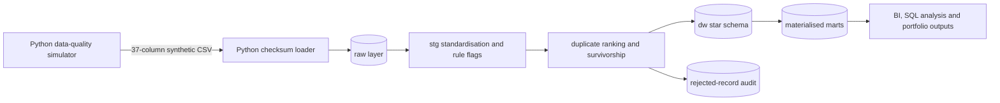
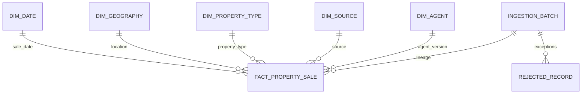

# Australian Housing SQL Quality and Market Analytics Warehouse

## Executive summary

This project is the second phase of the **Australian Housing Data Quality Simulator**. The original Python project generates synthetic Australian residential property-sale CSV files containing realistic data defects. This extension consumes those outputs and implements a governed MySQL analytics warehouse with raw ingestion, standardisation, duplicate survivorship, dimensional modelling, data-quality tests, reconciliation, reporting marts and advanced analytical SQL.

The project is designed for a professional portfolio. It demonstrates how an analyst or analytics engineer can convert an intentionally unreliable operational extract into transparent, reproducible and decision-ready data products.

> All records are synthetic. The project must not be used for property valuation, investment decisions, market forecasting or identification of real people or properties.

## Business problem

A property analytics team receives recurring extracts containing inconsistent categories, mixed date and numeric formats, malformed prices, missing values, geographic conflicts, exact duplicates and repeated-listing variants. Direct reporting would produce unstable KPIs and weak auditability. The team needs a repeatable warehouse process that protects raw lineage, applies documented business rules and exposes both analytical measures and data-quality evidence.

## Relationship to the original project

- **Original project:** `[Australian Housing Data Quality Simulator](https://github.com/khalili-samani/projects/tree/main/messy_data_generator_Aus_housing)`

The original project is the upstream synthetic data producer. This repository does not duplicate its generation logic. It begins with the generated 37-column CSV and adds the downstream SQL engineering and analytical layer: ingestion control, cleaning, deduplication, conformed dimensions, a canonical sale fact, marts, tests and business analysis.

## Objectives

1. Preserve source data and batch lineage without premature coercion.
2. Standardise known malformed fields with reusable MySQL functions.
3. classify exact duplicates, repeated-listing variants, accepted rows and rejected rows.
4. Apply deterministic survivorship rules to create one canonical event.
5. Build a star schema suitable for BI and self-service analysis.
6. Quantify data-quality issues and reconcile every processing layer.
7. Demonstrate advanced SQL patterns relevant to Australian analyst and analytics engineering roles.

## Business questions

- How many rows are accepted, rejected or deduplicated in each batch?
- How do transaction volume, median sale price and days on market change over time?
- Which states, property types and bedroom segments drive those changes?
- What percentage of transactions sell within 30, 60 and 90 days?
- How does indicative gross rental yield vary by market segment?
- Which agencies and source systems have the strongest or weakest data-quality profiles?
- How sensitive are reports to unresolved dates, prices, states and duplicates?

## Dataset

The input is one CSV produced by the original generator. It contains 37 fields covering listing identity, geography, property characteristics, transaction details, agent details and synthetic market context. Source fields are loaded as text to retain malformed values for controlled parsing.

A verified example in the upstream README contained 11,190 rows, 37 columns, 128 fully duplicated rows and 360 rows with repeated `listing_id` values. Actual counts vary because the generator is stochastic.

## Architecture



## Repository structure

```text
.
├── README.md
├── LICENSE
├── .env.example
├── .gitignore
├── Makefile
├── docker-compose.yml
├── requirements.txt
├── docs/
├── data/
│   ├── raw/
│   ├── processed/
│   └── sample/
├── diagrams/
├── sql/
│   ├── 00_setup/
│   ├── 01_raw/
│   ├── 02_staging/
│   ├── 03_dimensions/
│   ├── 04_facts/
│   ├── 05_marts/
│   ├── 06_views/
│   ├── 07_analysis/
│   ├── 08_tests/
│   └── 09_optimisation/
├── scripts/
└── outputs/sample_results/
```

## Data model

The warehouse uses a star schema. `dw.fact_property_sale` has one accepted canonical listing/sale event per deterministic `event_hash`. It joins to date, geography, property type, source and SCD Type 2 agent dimensions. Rejected records and duplicate classifications remain auditable outside the fact.



See `diagrams/data_model.md`, `docs/data_dictionary.md` and `docs/source_to_target_mapping.md` for full definitions.

## SQL techniques demonstrated

- Transactional schema setup and reusable SQL functions
- Regular-expression parsing and defensive type conversion
- Multi-stage common table expressions
- Exact and variant duplicate classification
- Window functions for ranking, survivorship, shares, lags, rolling metrics and quartiles
- Conditional aggregation and filtered counts
- Date dimension, calendar periods and Australian financial years
- SCD Type 2 dimension handling
- Deterministic event hashes and incremental upserts
- Materialised views and reporting views
- Cohort analysis, segmentation, period-over-period comparisons and anomaly screening
- Stored procedure-based data-quality tests
- Reconciliation, indexes, statistics and `EXPLAIN ANALYZE`

## Data-quality approach

Each source row receives explicit rule flags and a weighted quality score. Critical failures prevent fact loading. Non-critical issues can be accepted with warnings. Exact duplicates and lower-ranked listing variants remain in staging but do not create extra fact rows. All rejected records retain reasons and raw lineage.

The quality framework covers completeness, validity, conformity, consistency, uniqueness and plausibility. Tests fail execution when required keys, foreign-key integrity, uniqueness or reconciliation are broken.

## Key metrics

- Accepted, rejected, exact-duplicate and variant-duplicate row counts
- Median and average sale price
- Month-over-month and year-over-year median price change
- Three-month rolling median price and sales volume
- Median days on market and 30/60/90-day sale rates
- Indicative gross rental yield
- Price-to-synthetic-suburb-reference ratio
- Data-quality score, warning rate and issue prevalence

## Findings

**Expected findings, not precomputed claims:** results depend on the selected generator run. The analytical scripts are designed to reveal changes in synthetic transaction volume, price, days on market, yield and defect rates by state, property type, cohort, source and agency. After execution, replace this section with observed values and retain the synthetic-data caveat.

## Setup

### Option A: Docker MySQL

```bash
docker compose up -d
python -m venv .venv
source .venv/bin/activate  # Windows: .venv\Scripts\activate
python -m pip install -r requirements.txt
cp .env.example .env
```

### Option B: Existing MySQL 8.0+

Create a database named `housing_analytics`, copy `.env.example` to `.env`, and update connection values.

## Input preparation

1. Run the original Python generator.
2. Copy its generated CSV to `data/raw/aus_housing_messy_2021-2023_jan-dec_nsw-qld-vic.csv`, or set `SOURCE_CSV` in `.env`.
3. Do not manually clean the CSV before loading.

## Execution order

```bash
# 1. Create schemas, functions and empty warehouse objects
mysql client "$DATABASE_URL" -v ON_ERROR_STOP=1 -f sql/run_all.sql

# 2. Load the generated CSV
python scripts/load_data.py

# 3. Standardise, model, test and optimise
mysql client "$DATABASE_URL" -v ON_ERROR_STOP=1 -f sql/run_transform.sql

# 4. Run analytical queries
mysql client "$DATABASE_URL" -v ON_ERROR_STOP=1 -f sql/07_analysis/01_business_questions.sql
mysql client "$DATABASE_URL" -v ON_ERROR_STOP=1 -f sql/07_analysis/02_advanced_patterns.sql

# 5. Export selected outputs
python scripts/export_sample_results.py
```

`make all` provides a convenience workflow after the database is running and the CSV is in place.

## Sample query

```sql
SELECT sale_month, state_code, property_type_code, sale_count,
       median_sale_price_aud, mom_median_price_change_pct,
       rolling_3m_median_price_aud, median_days_on_market
FROM mart.monthly_market_summary
ORDER BY state_code, property_type_code, sale_month;
```

## Sample output format

```text
sale_month,state_code,property_type_code,sale_count,median_sale_price_aud,mom_median_price_change_pct,rolling_3m_median_price_aud,median_days_on_market
2023-01-01,VIC,house,123,950000.00,1.42,941500.00,29.00
```

This row is illustrative only and is not a verified analytical finding.

## Performance optimisation

The implementation adds composite B-tree indexes for common date, geography, property-type, batch and business-key access paths. Refreshable marts reduce repeated percentile and window calculations. `ANALYSE` refreshes planner statistics after transformation. For substantially larger datasets, monthly range partitioning and range partitioning and covering indexes are documented as future options, but they are unnecessary at the upstream example scale.

## Assumptions and limitations

### Confirmed from the original project

- The source is a synthetic 37-column CSV.
- It contains mixed formats, missing markers, invalid values, geographic inconsistencies, exact duplicates and repeated-listing variants.
- Monthly market context is manually configured and is not an authoritative historical series.
- Coordinates are approximate and unsuitable for real geospatial analysis.
- Generator output is stochastic and currently lacks an issue-level ground-truth manifest.

### Design assumptions in this extension

- One CSV header uses the exact 37 field names documented upstream.
- `price_raw_aud` is preferred over a parsed display price when both are plausible.
- A canonical event is identified by listing ID, parsed sale date, normalised address and canonical price.
- Repeated listing IDs are treated as variants; the highest-quality row survives within a batch.
- Australian financial years begin on 1 July.
- Postcode/state validation is broad and intentionally not a substitute for an authoritative postcode reference table.

## Future improvements

- Consume a generator-produced run manifest and defect ground-truth file.
- Add authoritative synthetic reference tables for suburb/postcode validation.
- Implement dbt models and tests as an alternate transformation framework.
- Add CI with a deterministic sample CSV and ephemeral MySQL service.
- Publish a Power BI semantic model over the marts.
- Add orchestration, schema contracts and data-lineage metadata.
- Compare detected defects with injected defects when the upstream generator supports a manifest.

## Skills demonstrated

Advanced MySQL, analytical SQL, dimensional modelling, data-quality engineering, ETL/ELT, incremental loading, reconciliation, query optimisation, Python database loading, technical documentation, privacy-aware reporting and GitHub project organisation.

## Relevance to Australian data roles

The project reflects common selection criteria for Australian data analyst, BI analyst, analytics engineer and SQL developer roles: translating a business problem into tested data products, building reusable SQL transformations, defining trusted metrics, documenting assumptions, communicating limitations and supporting auditability.

## Licence

MIT Licence. See `LICENSE`.