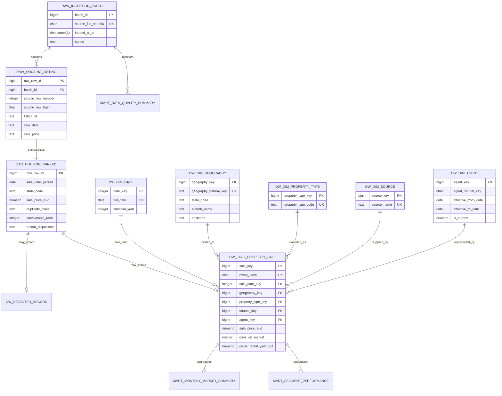

# Entity relationship diagram

```mermaid
erDiagram
    RAW_INGESTION_BATCH ||--o{ RAW_HOUSING_LISTING : contains
    RAW_HOUSING_LISTING ||--|| STG_HOUSING_RANKED : standardises
    STG_HOUSING_RANKED ||--o| DW_REJECTED_RECORD : may_create
    STG_HOUSING_RANKED ||--o| DW_FACT_PROPERTY_SALE : may_create

    DW_DIM_DATE ||--o{ DW_FACT_PROPERTY_SALE : sale_date
    DW_DIM_GEOGRAPHY ||--o{ DW_FACT_PROPERTY_SALE : located_in
    DW_DIM_PROPERTY_TYPE ||--o{ DW_FACT_PROPERTY_SALE : classified_as
    DW_DIM_SOURCE ||--o{ DW_FACT_PROPERTY_SALE : supplied_by
    DW_DIM_AGENT ||--o{ DW_FACT_PROPERTY_SALE : represented_by

    DW_FACT_PROPERTY_SALE ||--o{ MART_MONTHLY_MARKET_SUMMARY : aggregates
    DW_FACT_PROPERTY_SALE ||--o{ MART_SEGMENT_PERFORMANCE : aggregates
    RAW_INGESTION_BATCH ||--o{ MART_DATA_QUALITY_SUMMARY : monitors

    RAW_INGESTION_BATCH {
      bigint batch_id PK
      char source_file_sha256 UK
      timestamp(6) loaded_at_ts
      text status
    }
    RAW_HOUSING_LISTING {
      bigint raw_row_id PK
      bigint batch_id FK
      integer source_row_number
      char source_row_hash
      text listing_id
      text sale_date
      text sale_price
    }
    STG_HOUSING_RANKED {
      bigint raw_row_id PK
      date sale_date_parsed
      text state_code
      numeric sale_price_aud
      text duplicate_class
      integer survivorship_rank
      text record_disposition
    }
    DW_DIM_DATE {
      integer date_key PK
      date full_date UK
      integer financial_year
    }
    DW_DIM_GEOGRAPHY {
      bigint geography_key PK
      text geography_natural_key UK
      text state_code
      text suburb_name
      text postcode
    }
    DW_DIM_PROPERTY_TYPE {
      bigint property_type_key PK
      text property_type_code UK
    }
    DW_DIM_SOURCE {
      bigint source_key PK
      text source_name UK
    }
    DW_DIM_AGENT {
      bigint agent_key PK
      char agent_natural_key
      date effective_from_date
      date effective_to_date
      boolean is_current
    }
    DW_FACT_PROPERTY_SALE {
      bigint sale_key PK
      char event_hash UK
      integer sale_date_key FK
      bigint geography_key FK
      bigint property_type_key FK
      bigint source_key FK
      bigint agent_key FK
      numeric sale_price_aud
      integer days_on_market
      numeric gross_rental_yield_pct
    }
```
