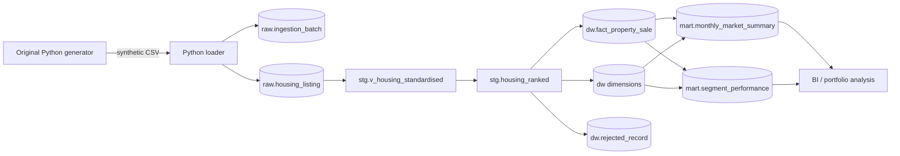

# Architecture

## Selected platform

MySQL 8.0+ is used because it is free, strong for analytical SQL, and supports regular expressions, generated identity keys, refreshable aggregate tables, indexing, procedures and transactional DDL.

## Layers

1. **raw**: append-only source rows and batch metadata; all source fields remain text.
2. **stg**: standardised and typed records with parse flags, quality scores and duplicate classifications.
3. **dw**: conformed dimensions, rejected-record audit and the canonical sale fact.
4. **mart**: business-facing aggregate tables and views.
5. **audit**: test results and load reconciliation.

## Data flow

## Incremental strategy

The loader calculates a SHA-256 file checksum. A successful checksum is not loaded twice unless `--force` is used. Transformations upsert dimensions by natural key and insert fact rows using a deterministic `event_hash`. This makes reruns idempotent while allowing new batches.

## Privacy and governance

The source is synthetic. Agent and address fields are nevertheless treated as quasi-identifiers to demonstrate privacy-aware design. Reporting marts omit phone numbers and full addresses. The README warns against using outputs for valuation, investment or identification.
