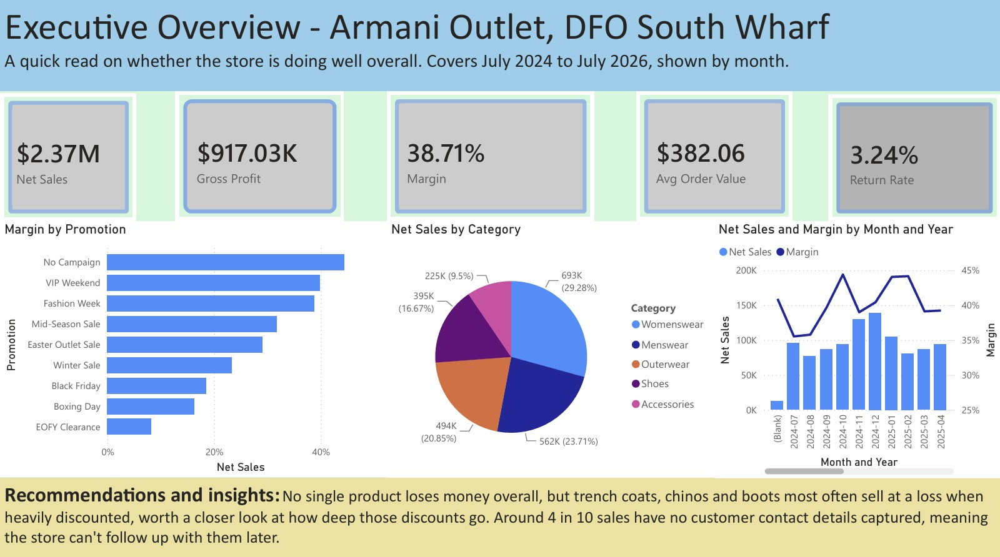
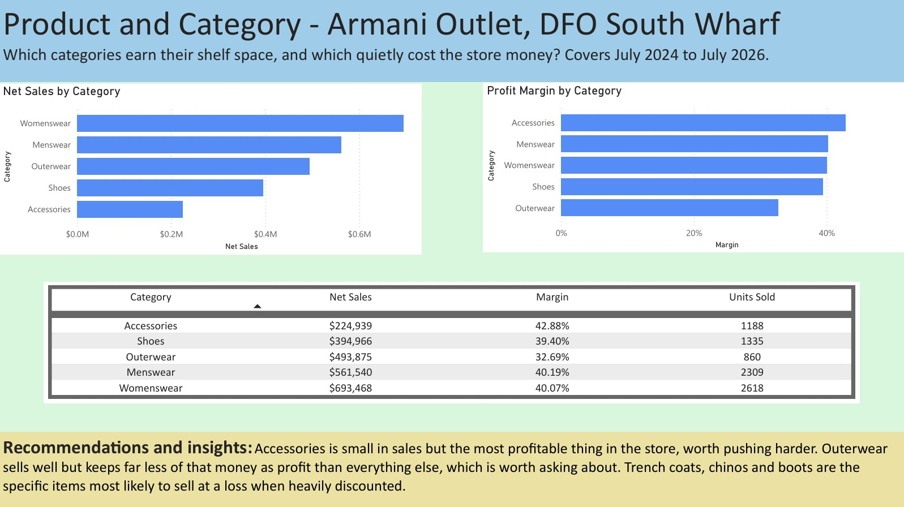
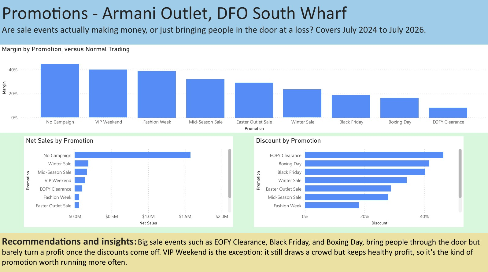
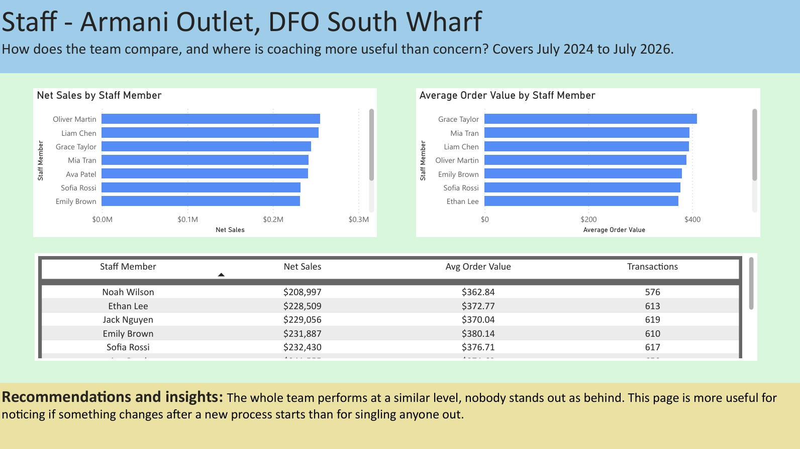
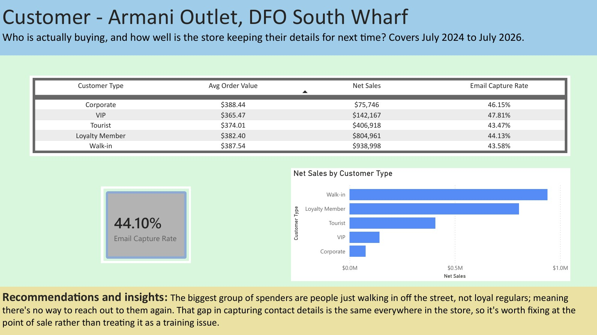

# Luxury Fashion Outlet Sales Analysis | Power BI


A five-page Power BI dashboard analysing 6,200 retail transactions to answer the questions a store or regional manager actually asks: is revenue quality improving, which categories are worth the shelf space, and where are the margin leaks. Built end-to-end from a messy raw CSV, including full data cleaning, star-schema modelling and custom DAX measures.

**Dataset:** Synthetic transaction-level data created for portfolio purposes. Not sourced from, endorsed by, or connected with any real retailer; staff names and scenarios are fictional.

---

## Business Problem

Retail managers need a fast, reliable view of revenue quality and margin performance, not just top-line sales. This dashboard was built to answer five specific management questions:

1. Are sales and gross profit trending in the same direction over time?
2. Which product categories are efficient revenue generators, and which need margin review?
3. How does promotional trading compare with normal trading on sales, discounting and margin?
4. Is staff performance materially different across sales volume and average order value?
5. Which customer segments drive revenue, and how consistently is contact data being captured?

The dashboard supports investigation and prioritisation. Because the underlying data is synthetic and observational, it is not used to claim causal business impact.

## Skills Demonstrated

- **Data cleaning & quality control** (Power Query / M): missing-value handling, ID normalisation and deduplication, mixed currency and date parsing, lookup-based recovery of missing product/category fields
- **Dimensional modelling**: star schema with a dedicated measures table
- **DAX**: custom measures for margin, return rate, capture rate and average order value, organised into display folders
- **Dashboard design**: five-page executive dashboard built for a non-technical business audience
- **Data documentation**: full data dictionary and transformation log with reconciliation checks

## Headline Results

| Metric | Result |
|---|---:|
| Net Sales | $2.37M |
| Gross Profit | $917.03K |
| Gross Margin | 38.71% |
| Average Order Value | $382.06 |
| Return Rate | 3.24% |
| Email Capture Rate | 44.10% |

**Analysis period:** 1 July 2024 – 10 July 2026 (25 months inclusive; the final month is partial).

## Key Insights

- Walk-in customers generated the highest net sales ($938,998), followed by loyalty members ($804,961).
- Email capture sat at 44.10% overall, with a relatively narrow spread across segments (43.47% for tourists to 47.81% for VIP customers).
- Womenswear was the top revenue category ($693,468). Accessories had the lowest sales ($224,939) but the best margin (42.88%).
- Outerwear generated solid revenue ($493,875) but the lowest category margin (32.69%), flagging it for pricing and discount review.
- No-campaign trading held the strongest margins; VIP Weekend and Fashion Week outperformed the deepest-discount promotional events on margin retention.
- Staff performance was tightly clustered, with no extreme outliers in sales volume or average order value.

### Recommendations from the analysis

- Review outerwear pricing, cost base and discount depth given its revenue-margin mismatch.
- Test whether accessories warrant more shelf visibility or attachment-selling support.
- Compare VIP-style targeted promotions against broad discounting on incremental profit, not just observed margin.
- Improve POS email-capture workflows, pending confirmation of consent and privacy requirements.
- Use staff results as a monitoring baseline rather than a standalone performance metric.

## Data & Methodology

**Scope:** 6,287 raw rows → 6,200 unique transactions after cleaning (1 removed for missing ID, 86 removed after ID normalisation/deduplication, 42 exact duplicate rows identified). Fact table grain is one row per normalised transaction ID.

**Cleaning steps (Power Query):**

| Issue | Treatment |
|---|---|
| Missing transaction IDs | Row removed (not reliably linkable) |
| Duplicate/manually adjusted IDs | Uppercased, `-MANUAL` suffix stripped, then deduplicated |
| Mixed currency formats | Symbols and thousands separators stripped before numeric conversion |
| Mixed date formats | Parsed against two expected formats; 19 unresolved dates left null |
| Missing net sales | Recalculated as gross sales less discount |
| Missing product codes | Recovered via style-name lookup (keeps first match; not collision-tested) |
| Missing categories | Recovered from product-code prefix |
| Return quantity sign errors | Reversed where flagged as a return (`Is Return` treated as source of truth) |
| Staff name variants | Resolved via canonical staff-ID lookup (10 staff IDs) |
| Missing customer IDs | Retained as a genuine data gap, not imputed |

**Data model:** Star schema — `Fact_Sales`, `Date`, `Product`, `Staff`, `Promotion`, `Customer Type`, plus a dedicated measures table. Dimension tables are generated in Power Query, as no independent master-data source was supplied.

**Core DAX measures:** Transactions, Net Sales, Gross Profit, Gross Margin, Average Order Value, Return Rate, Email Capture Rate, Discount %.

**Validation:** Recalculating headline KPIs directly from the cleaned dataset matched the dashboard output (e.g. net sales $2,368,788.63 vs. dashboard $2.37M; gross margin 38.713% vs. 38.71%), confirming the model logic reconciles with the source data.

## Repo Structure

```
/data
  /raw/raw_sales.csv
  /cleaned/clean_sales.csv
  data_dictionary.md
/power_bi
  dfo_sales.pbix
  dax_measures.md
  power_query_steps.md
/screenshots
  executive_overview.jpeg
  product_and_category.jpeg
  promotions.jpeg
  staff.jpeg
  customer.jpeg
README.md
```

## How to Explore This Project

1. Clone the repo and open `power_bi/dfo_sales.pbix` in **Power BI Desktop**.
2. Review `power_query_steps.md` for the full transformation log, or `dax_measures.md` for measure logic.
3. See screenshots below for a quick preview without opening the file.

## Dashboard Preview

**Executive Overview** — headline KPIs plus monthly category and promotion context


**Product & Category** — revenue, margin and units sold by category


**Promotions** — margin, net sales and discount by promotional event


**Staff** — net sales, average order value and transaction counts by staff member


**Customer** — segment sales, average order value and email capture


## Future Improvements

- Extend the cost model beyond estimated cost to support true landed-margin analysis
- Add a collision check to the product-code lookup recovery step
- Build a row-level reconciliation report for the currency-conversion and net-sales-recovery steps

## License

Licensed under the MIT License; see [LICENSE](LICENSE) for details.