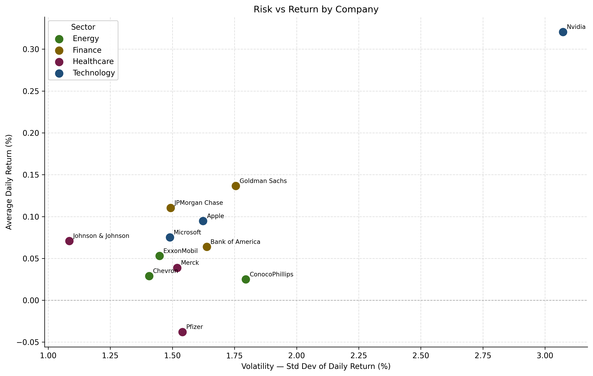

# Sector-Based Stock Market Analysis

A data analysis project examining historical stock performance across four US market sectors — Technology, Finance, Energy, and Healthcare — using MySQL for storage and aggregation, and Python for cleaning and visualisation.

Data covers **752 trading days from March 2023 to February 2026** across 12 companies sourced from [Stooq](https://stooq.com).

---

## Sample Outputs

### Risk vs Return by Company



Nvidia stands out with the highest average daily return and the highest volatility — consistent with its position as a high-growth AI-driven stock over this period. Healthcare stocks cluster at the lower-risk, lower-return end of the spectrum. Finance stocks show moderate volatility with positive returns, while energy companies sit in the mid-range on both axes.

---

### Average Daily Return by Company


Nvidia leads significantly, followed by JPM and GS. PFE is the only company with a negative average daily return over the analysis period, reflecting its post-COVID earnings headwinds. The spread across companies highlights meaningful differentiation in performance even within the same sector.

---

## Project Structure

```
market_analysis/
├── data_raw/                       # Raw CSVs downloaded from Stooq
├── data_cleaned/                   # Cleaned CSVs ready for MySQL load
├── outputs/
│   └── charts/                     # Generated PNG charts
├── scripts/
│   ├── config.py                   # Centralised settings and paths
│   ├── clean_data.py               # Cleans all 12 companies in one run
│   ├── load_data.py                # Creates database schema and loads data
│   ├── avg_daily_return.py         # Bar chart — average daily return
│   └── risk_vs_return.py           # Scatter chart — risk vs return
├── sql/
│   └── market.sql                  # Database schema reference document
├── requirements.txt
└── README.md
```

---

## Database Design

A simple star schema with two dimension tables and one fact table.

### Schema

```
dim_sector ──< dim_company ──< fact_stock_prices
```

### Tables

**`dim_sector`** — four sectors: Technology, Finance, Energy, Healthcare

**`dim_company`** — 12 companies with ticker and sector FK

| Company           | Ticker | Sector       |
|-------------------|--------|--------------|
| Apple             | AAPL   | Technology   |
| Microsoft         | MSFT   | Technology   |
| Nvidia            | NVDA   | Technology   |
| JPMorgan Chase    | JPM    | Finance      |
| Goldman Sachs     | GS     | Finance      |
| Bank of America   | BAC    | Finance      |
| ExxonMobil        | XOM    | Energy       |
| Chevron           | CVX    | Energy       |
| ConocoPhillips    | COP    | Energy       |
| Johnson & Johnson | JNJ    | Healthcare   |
| Pfizer            | PFE    | Healthcare   |
| Merck             | MRK    | Healthcare   |

**`fact_stock_prices`** — daily OHLCV data, one row per company per trading day

| Column        | Type          | Description              |
|---------------|---------------|--------------------------|
| `company_id`  | INT FK        | Links to dim_company     |
| `date`        | DATE          | Trading date             |
| `open_price`  | DECIMAL(10,4) | Opening price (USD)      |
| `high_price`  | DECIMAL(10,4) | Daily high (USD)         |
| `low_price`   | DECIMAL(10,4) | Daily low (USD)          |
| `close_price` | DECIMAL(10,4) | Closing price (USD)      |
| `volume`      | BIGINT        | Shares traded            |

### Analytical Views

**`vw_daily_returns`** — calculates daily return % per company using `LAG()` window function

**`vw_company_summary`** — aggregates to company level: avg return, volatility, total return, trading days

**`vw_sector_summary`** — rolls up to sector level for cross-sector comparison

---

## Methodology

**Data cleaning** (`clean_data.py`) loops all 12 companies in a single run — renaming columns, coercing types, attaching company IDs, and dropping unparseable rows.

**Daily return** is calculated in SQL as the percentage change in closing price between consecutive trading days using the `LAG()` window function partitioned by company.

**Volatility** is the standard deviation of daily returns — a standard measure of price risk.

**Total return** is calculated as `(max_close - min_close) / min_close × 100` over the full period, giving a simple price appreciation measure.

---

## Setup

**1. Clone the repository**

```bash
git clone https://github.com/your-username/market_analysis.git
cd market_analysis
```

**2. Install dependencies**

```bash
pip install -r requirements.txt
```

**3. Set environment variables**

```bash
export MYSQL_USER=root
export MYSQL_PASSWORD=your_password
export MYSQL_HOST=localhost
export MYSQL_DATABASE=market_analysis
```

**4. Download raw data from Stooq**

Go to [https://stooq.com](https://stooq.com), search each ticker, and download the daily CSV to `data_raw/`. Files must be named in the format `{ticker}_us.csv` (e.g. `aapl_us.csv`).

**5. Clean the data**

```bash
python scripts/clean_data.py
```

**6. Create the database and load data**

```bash
python scripts/load_data.py
```

This creates the database, tables, and views automatically, then loads all 12 companies in one run. The full database schema is also available as a reference in `sql/market.sql`.

**7. Generate charts**

```bash
python scripts/avg_daily_return.py
python scripts/risk_vs_return.py
```

---

## Key Findings

| Metric                   | Result                                      |
|--------------------------|---------------------------------------------|
| Highest avg daily return | NVDA (+0.21%/day)                           |
| Lowest avg daily return  | PFE (negative)                              |
| Highest volatility       | NVDA                                        |
| Lowest volatility        | JNJ, MRK (Healthcare)                       |
| Best sector (return)     | Technology                                  |
| Most stable sector       | Healthcare                                  |

---

## Limitations

- Analysis uses closing prices only — dividend-adjusted returns are not included
- Total return metric captures price range, not a buy-and-hold return from a fixed start date
- Transaction costs and taxes are not considered
- 12 companies is a limited sample within each sector

---

## Roadmap

- [ ] Rolling 30-day return and volatility charts
- [ ] Correlation heatmap across all 12 companies
- [ ] Sector-level summary chart
- [ ] Dividend-adjusted return calculation
- [ ] Interactive dashboard (Plotly or Streamlit)

---
