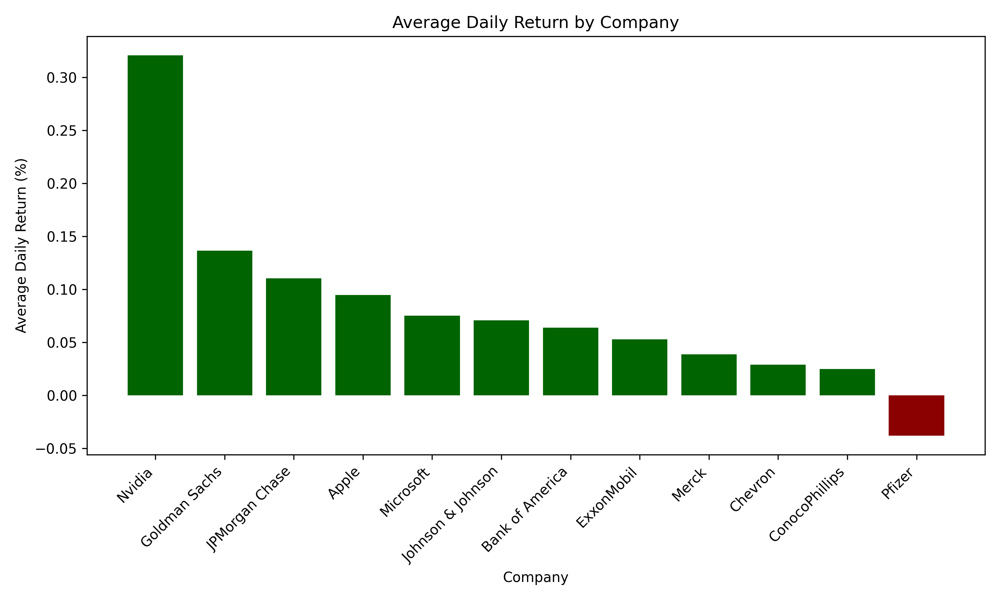

# Sector-Based Stock Market Analysis (MySQL + Python)

## Overview

This project analyses historical stock market data across multiple sectors to evaluate company performance and risk. Using MySQL and Python, key financial metrics such as daily returns and volatility are computed and visualised to explore the relationship between risk and return.


## Objective

The objective of this project is to:

* Compare stock performance across companies
* Measure risk using volatility
* Analyse the relationship between risk and return


## Data Source

* Historical stock data obtained from **Stooq**
* Data includes:

  * Date
  * Open, High, Low, Close prices
  * Volume


## Methodology

### 1. Data Cleaning (Python)

* Renamed columns for consistency
* Converted date formats
* Added `company_id`
* Removed missing values

### 2. Database Design (MySQL)

A relational schema was used:

* `fact_stock_prices` → daily stock data
* `dim_company` → company details
* `dim_sector` → sector classification

### 3. Data Analysis (SQL)

* Daily returns calculated using window functions (`LAG`)
* Volatility calculated using standard deviation
* Summary views created for company-level comparison

### 4. Visualisation (Python)

* Data retrieved using SQLAlchemy
* Visualised using `matplotlib`


## Key Metrics

* **Daily Return (%)** → percentage change in price
* **Average Daily Return (%)** → overall performance
* **Volatility (%)** → measure of risk


## Visualisations

### Average Daily Return by Company



### Risk vs Return (Volatility vs Return)


## Key Findings

* Companies with higher returns often exhibit higher volatility
* There is a clear trade-off between risk and return
* Some companies offer more balanced performance with moderate returns and lower volatility


## Limitations

* Analysis is based only on closing prices (no dividends included)
* Transaction costs and external market factors are not considered
* Historical data does not guarantee future performance


## Project Structure

```
market_analysis/
│
├── data_raw/
├── data_cleaned/
├── sql/
├── scripts/
├── outputs/
│   └── charts/
│       ├── avg_daily_return.png
│       └── risk_vs_return.png
├── requirements.txt
└── README.md
```


## Tools & Technologies

* MySQL
* Python
* pandas
* matplotlib
* SQLAlchemy


## Conclusion

This project demonstrates how SQL and Python can be combined to analyse financial data and evaluate the relationship between risk and return. The findings highlight the importance of considering both performance and volatility when analysing investment opportunities.
