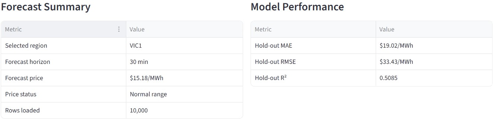
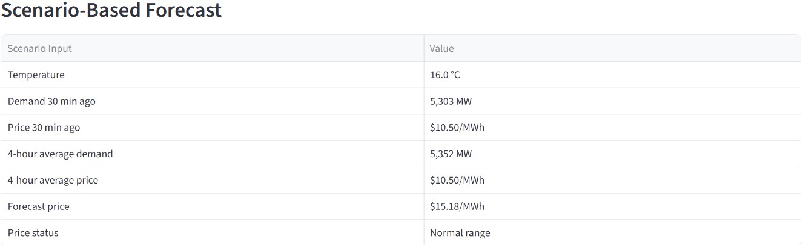
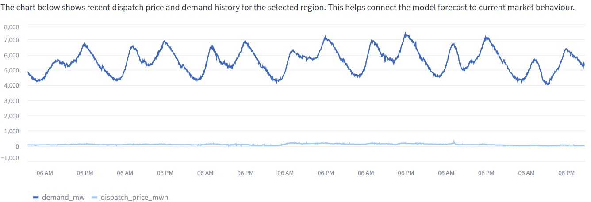
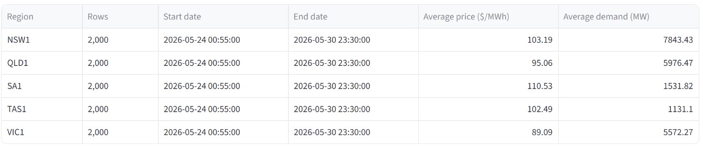

# Australian NEM Price Forecasting Platform


An end-to-end analytics platform that forecasts Australian National Electricity Market (NEM) dispatch prices 30 minutes ahead, combining a MySQL-backed ETL pipeline, engineered time-series features, an XGBoost regression model, and an interactive Streamlit dashboard.



---

## Business Problem

Electricity prices in the NEM are highly volatile, moving sharply within short windows due to demand shifts, weather, generation availability, and market dynamics. Forecasting them is difficult because of non-linear relationships, seasonality, and rare but extreme price spikes.

This project builds a reproducible pipeline that turns raw AEMO market data and weather observations into short-term price forecasts, intended to support risk monitoring and operational planning for market participants.

The goal wasn't just a predictive model. It's a full analytics workflow: ingest and store real operational data, clean and validate it, engineer predictive features, train and evaluate a forecasting model, and deliver results through a dashboard, the kind of end-to-end pipeline you'd find on an analytics, data engineering, or market intelligence team.

---

## Key Results

| Metric | Result |
|---|---|
| Forecast Horizon | 30 minutes ahead |
| Historical Period | March 2026 – May 2026 |
| Raw AEMO Records Processed | 129,495 |
| Engineered Feature Records | 129,225 |
| Train / Validation / Test Split | 90,457 / 19,384 / 19,384 rows |
| Model | XGBoost Regressor |
| Hold-Out MAE | $19.02/MWh |
| Hold-Out RMSE | $33.43/MWh |
| Hold-Out R² | 0.5085 |

The model explains roughly half the variance in 30-minute-ahead prices on the hold-out set, a reasonable result given the well-known difficulty of forecasting extreme price spikes in this market.

---

## Skills Demonstrated

- **Data Engineering:** ETL pipeline design, MySQL schema design, data cleaning and validation, SQLAlchemy
- **Machine Learning:** XGBoost, leakage-safe feature engineering, chronological train/validation/test splitting
- **Analytics:** Time-series forecasting, model evaluation, statistical performance measurement
- **Visualisation & Reporting:** Streamlit dashboard development, interactive scenario analysis, data storytelling

**Stack:** Python · SQL · MySQL · Pandas · SQLAlchemy · XGBoost · Streamlit

---

## Architecture

```text
AEMO NEMWeb Archive / Current Files
                    │
                    ▼
          data_ingestion.py
                    │
                    ▼
             MySQL Database
                    │
                    ▼
           data_cleaning.py
                    │
                    ▼
       Cleaned Market Dataset
                    │
                    ▼
      feature_engineering.py
                    │
                    ▼
      Engineered Feature Table
                    │
                    ▼
        model_training.py
                    │
                    ▼
      XGBoost Model Bundle
                    │
                    ▼
              Streamlit App
```

---

## Repository Structure

```text
nem-forecasting/
├── app.py
├── run_pipeline.py
├── requirements.txt
├── README.md
│
├── src/
│   ├── config.py
│   ├── db_utils.py
│   ├── db_initialiser.py
│   ├── data_ingestion.py
│   ├── data_cleaning.py
│   ├── feature_engineering.py
│   └── model_training.py
│
├── sql/
│   └── create_tables.sql
│
├── models/
│   └── xgboost_nem_price_model.joblib
│
└── outputs/
    └── screenshots/
```

| Component | Purpose |
|---|---|
| `app.py` | Interactive forecasting dashboard |
| `run_pipeline.py` | Pipeline orchestration |
| `src/` | Data engineering and modelling logic |
| `sql/` | Database schema definitions |
| `models/` | Trained model artefacts |

---

## Data & Feature Engineering

Market data is combined with weather observations, since demand and pricing are strongly weather-driven.

| Source | Purpose |
|---|---|
| AEMO NEMWeb DispatchIS | Dispatch prices and demand |
| Bureau of Meteorology | Weather observations |
| MySQL | Storage and retrieval of processed data |

Raw observations are transformed into features that capture seasonality, temporal patterns, and recent market conditions, without leaking future information into the training set:

| Category | Examples |
|---|---|
| Weather | Temperature |
| Calendar | Hour, weekday, month, weekend |
| Cyclical | Hour sine/cosine, day sine/cosine |
| Demand Lags | 30 minutes ago, 24 hours ago |
| Price Lags | 30 minutes ago, 24 hours ago |
| Rolling | 4-hour demand and price averages |

**Target:** dispatch price 30 minutes into the future.

---

## Model Development

| Item | Description |
|---|---|
| Algorithm | XGBoost Regressor |
| Split Strategy | 70% train / 15% validation / 15% test, chronological (no shuffling) |
| Evaluation | Hold-out test set |
| Output | Trained model bundle with metadata and performance metrics |

A chronological split was used deliberately to simulate real forecasting conditions and avoid look-ahead bias.

---

## Dashboard

| View | Purpose |
|---|---|
| Executive Summary | Forecast outputs and model performance metrics |
| Scenario Analysis | Adjust market inputs and see forecasted prices respond |
| Market History | Historical dispatch prices and demand by region |
| Data Coverage | Regional coverage and record counts |
| Methodology | Explanation of the forecasting workflow |





---

## Running the Project

### Install dependencies
```bash
pip install -r requirements.txt
```

### Configure database environment variables
```bash
DB_HOST=localhost
DB_PORT=3306
DB_USER=root
DB_PASSWORD=your_password
DB_NAME=nem_forecasting
```

### Run the historical pipeline
```bash
python run_pipeline.py --historical
```

### Launch the dashboard
```bash
streamlit run app.py
```

---

## Limitations

| Area | Limitation |
|---|---|
| Weather Coverage | Limited live weather observations |
| Regional Granularity | More weather stations would improve coverage |
| Extreme Price Events | Rare spikes remain difficult to forecast |
| Market Variables | Renewable generation and outages not yet included |
| Training Window | A longer historical period would improve robustness |

## Future Improvements

- Region-specific weather coverage across all NEM regions
- Renewable generation and interconnector flow features
- Feature importance analysis and actual-vs-predicted diagnostics
- Automated retraining schedule and continuous model monitoring
- Extended historical training window

---

## License

MIT License, see [LICENSE](LICENSE) for details.