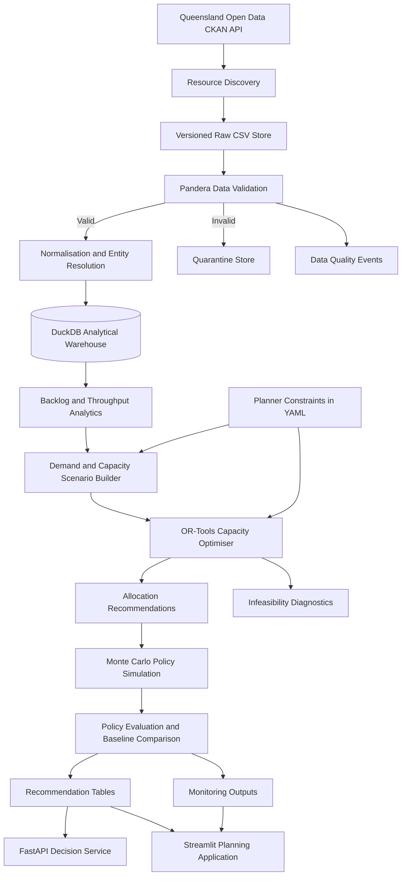

# Queensland Elective Surgery Capacity and Waitlist Recovery Optimiser

[](https://www.python.org/)
[](https://duckdb.org/)
[](https://developers.google.com/optimization)
[](https://fastapi.tiangolo.com/)
[](https://streamlit.io/)
[](https://pytest.org/)
[](LICENSE)

A reproducible decision-support system for allocating additional elective-surgery capacity across Queensland public facilities and specialties while accounting for clinical urgency, long waits, operational constraints, equity and uncertainty.

> **Scope:** This project supports aggregate health-service planning. It does not rank individual patients, change clinical urgency categories, recommend treatment or replace clinical and operational judgement.

---

## Value proposition

Convert public elective-surgery performance data into transparent, testable and auditable capacity-allocation recommendations that help health-service planners reduce long waits under constrained resources.

---

## Project status

This repository is under active development.

Results and outputs in this repository are labelled using the following definitions:

* **Verified:** Produced by executed repository code using retrieved source data.
* **Illustrative:** Included only to explain an expected output, workflow or interpretation.
* **Scenario-based:** Produced from explicitly documented planning assumptions.
* **Planned:** Designed but not yet implemented or executed.
* **Synthetic:** Generated programmatically and clearly separated from observed data.

No optimisation-performance, forecasting-performance or operational-impact claims are considered verified until the complete pipeline and evaluation suite have been executed.

---

## Business problem

Elective-surgery planning requires health services to balance:

* patients waiting beyond clinically recommended timeframes;
* differences between specialties and facilities;
* limited operating-theatre sessions;
* surgeon, anaesthetic, nursing and recovery capacity;
* emergency-demand displacement;
* cancellation risk;
* regional access;
* future waitlist additions;
* and uncertainty in session productivity.

Public reporting describes historical and current elective-surgery performance, but it does not directly answer the operational allocation question:

> Given a limited pool of additional operating-theatre sessions, how should capacity be distributed across facilities and specialties to reduce clinically overdue waiting while maintaining realistic and equitable service coverage?

A purely throughput-focused allocation could direct capacity towards facilities that can treat the largest number of patients per session. That approach may reduce the total waiting list while overlooking:

* urgency-category performance;
* persistent long waits;
* smaller regional services;
* minimum service requirements;
* operational feasibility;
* and uncertainty in expected treatment capacity.

This project treats capacity allocation as a constrained decision problem rather than a simple prediction task.

---

## Target stakeholder

### Primary stakeholder

Queensland Health statewide elective-surgery planning and performance teams.

### Secondary stakeholders

* Hospital and Health Service planning teams
* surgical-services managers
* operating-theatre managers
* health-service performance analysts
* public-sector data and analytics teams
* health-system funding and commissioning teams

---

## End user

The primary user is a health-service planner preparing quarterly or monthly capacity-allocation recommendations.

The user needs to compare:

* current waiting-list pressure;
* long-wait exposure;
* specialty-level demand;
* facility treatment throughput;
* available incremental sessions;
* policy constraints;
* regional and service-level equity;
* scenario uncertainty;
* and the expected effect of alternative allocation policies.

---

## Decision supported

The system recommends how many incremental elective-surgery sessions should be allocated to eligible facility-specialty combinations over a configurable planning horizon.

A recommendation may answer questions such as:

* Which facility-specialty combinations should receive additional sessions?
* How many additional sessions should each combination receive?
* What reduction in long waits could reasonably be expected?
* Which facilities remain under pressure after allocation?
* How does the recommended policy compare with equal, proportional or historical allocation?
* How sensitive is the recommendation to demand and capacity assumptions?
* Which constraints prevent a feasible allocation?

All recommendations remain subject to human review and confirmation of local operational feasibility.

---

## Decisions not supported

The system must not be used to:

* rank individual patients;
* schedule an individual patient;
* change a patient’s clinical urgency category;
* diagnose a condition;
* recommend treatment;
* estimate individual deterioration or mortality risk;
* override a clinician, hospital manager or theatre coordinator;
* automate funding decisions;
* deny an individual access to care;
* infer patient-level characteristics from aggregate data;
* or present scenario assumptions as observed hospital operations.

---

## Analytical questions

1. Which facilities and specialties have persistent long-wait pressure?
2. Where is waiting volume increasing faster than treatment throughput?
3. Which services show deteriorating in-time performance?
4. Which facility-specialty combinations have the greatest urgency-weighted backlog?
5. How much incremental capacity would be required to reach selected backlog-reduction targets?
6. How should additional sessions be allocated under a fixed statewide capacity budget?
7. How does the allocation change when clinical urgency, total throughput or regional coverage receives greater weight?
8. What is the trade-off between total backlog reduction and equitable service coverage?
9. Which recommendations remain stable when future demand, cancellations and treatment productivity vary?
10. Which constraints cause the optimisation problem to become infeasible?
11. How does the optimised allocation compare with realistic baseline policies?
12. Under which conditions should the recommendation not be used?

---

## Proposed solution

The project converts quarterly public elective-surgery data into a versioned analytical and decision-support workflow.

The system will:

1. discover and retrieve Queensland elective-surgery resources;
2. preserve immutable copies of source files;
3. validate schemas, values and reporting coverage;
4. normalise facility, specialty, urgency and reporting-period fields;
5. build a longitudinal analytical warehouse;
6. calculate waiting-list pressure and throughput measures;
7. create documented operational scenarios;
8. allocate incremental theatre sessions using constrained optimisation;
9. simulate policy performance under uncertainty;
10. compare the recommended allocation with realistic baselines;
11. expose results through a FastAPI service and Streamlit application;
12. generate data-quality, optimisation-health and policy-health reports.

---

## Data sources

### Queensland Government Open Data Portal

The core source consists of quarterly elective-surgery resources published through the Queensland Government Open Data Portal.

Expected source families include:

* elective surgery by specialty;
* elective surgery by urgency category.

Typical published fields include:

* facility code;
* facility name;
* reporting month;
* specialty;
* urgency category;
* volume treated;
* volume waiting;
* long-wait volume;
* percentage treated within time;
* percentage waiting within time;
* and data last updated.

The ingestion layer discovers resources through CKAN metadata rather than relying on one manually maintained CSV URL.

### Australian Institute of Health and Welfare

Australian Institute of Health and Welfare elective-surgery and hospital-resource data may be used for:

* national and state benchmarking;
* definition checks;
* longitudinal context;
* external reasonableness checks;
* and contextual capacity measures.

### Facility reference data

A version-controlled facility reference table will support:

* canonical facility names;
* facility codes;
* alias resolution;
* Hospital and Health Service assignments;
* geographic grouping;
* and optional regional classifications.

### Operational scenario inputs

Public reporting does not expose all variables required for capacity planning.

The repository therefore uses configurable scenario assumptions for variables such as:

* patients treated per incremental session;
* expected future waitlist additions;
* session cancellations;
* emergency-demand displacement;
* facility session limits;
* specialty eligibility;
* minimum service coverage;
* and maximum allocation changes.

These values are scenario inputs, not observed hospital data.

---

## Data-source register

Each source used by the implemented pipeline will be documented with:

| Field               | Description                                     |
| ------------------- | ----------------------------------------------- |
| Source organisation | Publishing organisation                         |
| Dataset name        | Official dataset or resource name               |
| Source URL          | Exact landing-page or resource URL              |
| API endpoint        | CKAN or other endpoint where applicable         |
| Access method       | API request, CSV download or published workbook |
| File format         | CSV, JSON, XLSX or Parquet                      |
| Geographic coverage | Queensland or Australia                         |
| Time coverage       | Earliest and latest available reporting periods |
| Update frequency    | Quarterly, annual or as published               |
| Retrieval date      | Date retrieved by the pipeline                  |
| Licence             | Source licence and attribution requirements     |
| Usage restrictions  | Any relevant reuse restrictions                 |
| Known limitations   | Reporting delays, missing fields or revisions   |
| Expected schema     | Required and optional fields                    |
| Documentation       | Definitions and methodology references          |

The retrieval manifest records the exact source resource, retrieval time, checksum and local raw-file location.

---

## Data limitations

The public datasets are aggregated and do not include:

* individual patient records;
* patient-level waiting histories;
* current theatre schedules;
* surgeon availability;
* anaesthetist availability;
* nursing rosters;
* procedure-level expected durations;
* post-anaesthesia recovery capacity;
* intensive-care capacity;
* equipment availability;
* consumable constraints;
* local cancellation causes;
* real-time emergency demand;
* facility-specific cost data;
* or complete local scheduling rules.

The project therefore separates:

1. **Observed public performance data**
2. **Derived analytical measures**
3. **External reference data**
4. **Explicit scenario assumptions**
5. **Optimisation recommendations**
6. **Simulation outputs**

Scenario assumptions must never be presented as observed Queensland hospital operations.

A mathematically feasible recommendation may still be locally infeasible because public data cannot represent every operational constraint.

---

## Architecture



---

## Technology stack

| Component              | Technology                                  | Purpose                                      |
| ---------------------- | ------------------------------------------- | -------------------------------------------- |
| Language               | Python 3.12                                 | Core implementation                          |
| Tabular processing     | Pandas                                      | Data cleaning and analytical transformations |
| Analytical database    | DuckDB                                      | Locally reproducible analytical storage      |
| Storage format         | Parquet                                     | Typed and efficient processed-data storage   |
| Data validation        | Pandera                                     | Explicit tabular schemas and checks          |
| Configuration          | Pydantic Settings and YAML                  | Typed application and scenario configuration |
| Optimisation           | OR-Tools CP-SAT                             | Integer capacity-allocation model            |
| Simulation             | NumPy                                       | Reproducible Monte Carlo scenarios           |
| Statistical modelling  | Statsmodels or scikit-learn where justified | Baselines and demand estimation              |
| API                    | FastAPI                                     | Typed decision-service interface             |
| Application            | Streamlit                                   | Interactive planning interface               |
| Testing                | pytest                                      | Unit, integration and regression tests       |
| Type checking          | mypy                                        | Static type validation                       |
| Linting and formatting | Ruff                                        | Code-quality enforcement                     |
| Packaging              | `pyproject.toml`                            | Dependency and tool configuration            |
| Containerisation       | Docker                                      | Reproducible execution                       |
| Continuous integration | GitHub Actions                              | Automated quality checks                     |
| Logging                | Python structured logging                   | Operational audit and failure diagnosis      |

Technologies will only be retained where they directly support the planning decision, reliability, reproducibility or portfolio value.

---

## Pipeline methodology

### 1. Resource discovery

The ingestion client queries CKAN metadata and identifies resources matching configured elective-surgery datasets.

The discovery process records:

* dataset identifier;
* resource identifier;
* resource title;
* source URL;
* file format;
* publication metadata;
* last-modified timestamp;
* and expected reporting category.

Resource discovery prevents the pipeline from depending on a single hard-coded quarterly file.

### 2. Data ingestion

The downloader:

* retrieves the selected resource;
* applies request timeouts and retries;
* verifies the HTTP response;
* validates the expected content type;
* rejects HTML error pages returned as successful downloads;
* calculates a SHA-256 checksum;
* writes an immutable raw file;
* and records the download in the retrieval manifest.

Raw source files are never silently overwritten.

### 3. Data validation

Pandera schemas and explicit business rules validate:

* required columns;
* expected data types;
* valid reporting dates;
* valid facility identifiers;
* non-negative volume fields;
* percentages between 0 and 100;
* duplicate facility-period-specialty records;
* duplicate facility-period-urgency records;
* waiting volume greater than or equal to long-wait volume;
* missing facility names;
* missing reporting periods;
* unexpected schema additions;
* missing expected fields;
* stale source releases;
* and incomplete facility coverage.

Invalid resources or rows are quarantined with a machine-readable failure reason.

### 4. Normalisation

The processing layer standardises:

* facility codes;
* facility names;
* specialty names;
* urgency-category labels;
* reporting dates;
* numeric fields;
* percentages;
* null representations;
* and source metadata.

Facility aliases are resolved through a version-controlled reference table.

Unresolved entities are retained as data-quality events rather than silently assigned.

### 5. Analytical warehouse

The initial warehouse model includes:

```text
dim_facility
dim_specialty
dim_urgency_category
dim_reporting_period
dim_source_resource
fact_elective_surgery_performance
fact_data_quality_event
fact_optimisation_run
fact_allocation_recommendation
fact_simulation_result
```

The principal analytical grain is:

```text
one row per facility, reporting period, reporting category and service group
```

### 6. Derived measures

The analytics layer calculates measures such as:

* treatment volume;
* waiting volume;
* long-wait volume;
* long-wait share;
* percentage treated within time;
* percentage waiting within time;
* treatment-to-waiting ratio;
* quarterly backlog change;
* trailing treatment throughput;
* trailing waiting-list growth;
* performance deterioration;
* reporting completeness;
* data freshness;
* urgency-weighted waiting burden;
* and facility-specialty pressure score.

Derived measures are calculated only where their required fields and reporting grain are compatible.

### 7. Demand and capacity scenarios

A scenario defines the planning conditions under which capacity is allocated.

Example scenario inputs include:

```yaml
scenario:
  name: baseline
  planning_periods: 1
  incremental_sessions_available: 120
  random_seed: 42

capacity:
  default_patients_per_session: 3.0
  default_cancellation_rate: 0.08
  emergency_displacement_rate: 0.05

policy:
  minimum_sessions_per_eligible_facility: 0
  maximum_share_per_facility: 0.20
  enforce_regional_coverage: true

objective_weights:
  long_waits_remaining: 1.0
  urgency_burden: 2.0
  inequitable_underallocation: 0.5
  allocation_concentration: 0.2
  unused_sessions: 1.0
```

Every scenario records:

* source data version;
* configuration version;
* optimisation parameters;
* objective weights;
* random seed;
* execution timestamp;
* and output locations.

---

## Optimisation model

### Model type

The initial implementation uses mixed-integer optimisation through OR-Tools CP-SAT.

### Decision variable

For each eligible facility (f) and specialty (s):

[
x_{f,s} = \text{number of incremental sessions allocated}
]

The decision variables are non-negative integers.

### Primary objective

The optimisation minimises a weighted combination of:

* long waits remaining after allocation;
* urgency-weighted overdue burden;
* inequitable under-allocation;
* excessive allocation concentration;
* unused available sessions;
* and instability relative to a previous allocation.

Conceptually:

[
\min
\left(
\alpha L

* \beta O
* \gamma E
* \delta C
* \eta U
* \theta S
  \right)
  ]

Where:

* (L) is expected long waits remaining;
* (O) is urgency-weighted overdue burden;
* (E) is an equity or minimum-coverage penalty;
* (C) is an allocation-concentration penalty;
* (U) is unused available capacity;
* (S) is allocation instability relative to a prior plan;
* and the Greek terms represent configurable policy weights.

The implemented formulation may linearise or reformulate these terms to remain compatible with the selected solver.

### Constraints

The initial model supports:

* total incremental-session budget;
* non-negative integer allocations;
* facility-level session limits;
* specialty-level session limits;
* facility-specialty eligibility;
* expected treatment capacity;
* non-negative residual waiting volume;
* minimum service coverage;
* maximum allocation per facility;
* maximum share of statewide capacity;
* maximum change from the previous plan;
* regional coverage floors;
* policy-defined exclusions;
* and configurable protected capacity.

### Infeasibility handling

The system does not fabricate an allocation when no feasible solution exists.

An infeasible run produces a diagnostic report containing:

* solver status;
* scenario identifier;
* active constraints;
* suspected conflicting constraints;
* capacity shortfall;
* minimum-coverage requirements;
* and suggested constraint-relaxation tests.

Relaxation tests are diagnostic only. They do not silently alter the approved planning policy.

---

## Baseline allocation policies

The optimised policy is compared with realistic baselines.

### Baseline 1: No additional capacity

No incremental sessions are allocated.

This establishes the expected outcome without intervention.

### Baseline 2: Equal allocation

Available sessions are divided as evenly as possible across eligible facility-specialty combinations.

### Baseline 3: Waiting-volume allocation

Sessions are allocated in proportion to current waiting volume.

### Baseline 4: Long-wait allocation

Sessions are allocated in proportion to long-wait volume.

### Baseline 5: Historical allocation

The previous planning period’s allocation is reused, where such an allocation is available.

### Baseline 6: Greedy pressure allocation

Sessions are assigned sequentially to the highest-pressure eligible combinations until capacity is exhausted.

All baseline policies must satisfy the same mandatory feasibility constraints where possible.

---

## Simulation and uncertainty

The public data cannot determine exact future demand or treatment productivity.

Monte Carlo simulation therefore varies explicitly documented assumptions such as:

* future waitlist additions;
* patients treated per session;
* cancellation rates;
* emergency-demand displacement;
* reporting revisions;
* facility capacity;
* and specialty productivity.

Each simulation run uses a recorded random seed and configuration version.

### Simulation outputs

The simulation layer reports:

* expected backlog reduction;
* median backlog reduction;
* uncertainty intervals;
* probability of meeting a selected target;
* fifth-percentile outcome;
* downside-risk scenarios;
* expected regret relative to hindsight allocation;
* allocation stability;
* facility-selection frequency;
* and sensitivity to policy weights.

A recommendation should not be treated as robust merely because it performs well under the central scenario.

---

## Evaluation framework

### Operational metrics

* reduction in long-wait volume;
* reduction in urgency-weighted overdue burden;
* expected patients treated;
* session utilisation;
* residual waiting volume;
* residual long-wait share;
* facilities receiving minimum coverage;
* regional distribution of sessions;
* and allocation stability.

### Baseline-comparison metrics

* absolute improvement over each baseline;
* percentage improvement over each baseline;
* incremental sessions required;
* additional expected patients treated;
* expected long waits avoided;
* and equity trade-offs.

### Optimisation-health metrics

* solver status;
* feasibility rate;
* objective value;
* best bound where available;
* optimality gap where available;
* solve time;
* constraint violations;
* unused sessions;
* and solution reproducibility.

### Robustness metrics

* probability of meeting the planning target;
* expected regret;
* fifth-percentile backlog reduction;
* sensitivity to session productivity;
* sensitivity to cancellation rates;
* sensitivity to new waitlist additions;
* sensitivity to objective weights;
* and percentage of simulations retaining the same priority facilities.

### Data-quality metrics

* valid-row rate;
* invalid-row count;
* missing-field rate;
* duplicate-key rate;
* schema-drift events;
* reporting completeness;
* source freshness;
* unresolved facility aliases;
* quarantined-resource count;
* and reconciliation differences.

---

## Success criteria

The initial project will be considered technically successful when:

1. source resources can be discovered and downloaded reproducibly;
2. raw files are versioned with retrieval metadata and checksums;
3. invalid source structures are rejected or quarantined;
4. longitudinal analytical tables are built without manual intervention;
5. baseline allocation policies execute under documented constraints;
6. the optimiser returns either a valid allocation or an explicit infeasibility report;
7. all recommendations satisfy mandatory constraints;
8. simulation results are deterministic when the random seed is fixed;
9. API responses conform to documented schemas;
10. the Streamlit application displays data freshness and scenario provenance;
11. automated tests pass in continuous integration;
12. verified results are clearly separated from illustrative outputs.

Operational adoption would require additional success criteria defined with the relevant health-service stakeholders.

---

## Ethical considerations

### Aggregate planning boundary

The system operates on aggregate facility, specialty and urgency-category information.

It must not be extended to patient-level decision-making without a separate clinical-safety, privacy, security, legal and regulatory assessment.

### Equity

A purely efficiency-focused objective may direct capacity towards larger facilities or specialties with greater session productivity.

The system therefore supports:

* minimum service coverage;
* regional allocation floors;
* allocation-concentration limits;
* distributional reporting;
* alternative objective weights;
* and comparison between efficiency and equity scenarios.

Equity constraints are policy choices. They must be documented and approved rather than hidden within code.

### Historical bias

Historical throughput may reflect:

* existing resource constraints;
* unequal access;
* reporting practices;
* geographic barriers;
* and prior policy decisions.

Historical performance must not automatically be treated as the ideal future allocation.

### Human review

A planner must review:

* source-data freshness;
* scenario assumptions;
* active constraints;
* infeasibility warnings;
* facility-level recommendations;
* sensitivity results;
* and limitations.

The software produces decision support, not an autonomous allocation decision.

### Transparency

Each recommendation must retain:

* source-data version;
* scenario identifier;
* objective weights;
* constraint configuration;
* solver status;
* execution timestamp;
* and simulation summary.

---

## Privacy and security

The default project uses public aggregate data and contains no patient-identifiable information.

The repository must not include:

* patient names;
* medical-record numbers;
* dates of birth;
* addresses;
* individual procedure records;
* or other patient-level health information.

Any future integration with restricted operational data would require:

* formal data classification;
* access controls;
* secure secret management;
* audit logging;
* encryption;
* retention rules;
* privacy review;
* and an approved deployment environment.

Environment variables are used for configurable secrets or credentials. Secrets must never be committed to the repository.

---

## Regulatory considerations

This project is designed as aggregate health-service planning software, not a diagnostic or treatment system.

The public portfolio implementation does not claim to be:

* a medical device;
* clinical decision-support software;
* a patient scheduling system;
* or an approved Queensland Health production system.

Any operational deployment would require review of:

* applicable Queensland Government information-security policies;
* health-information privacy requirements;
* clinical-safety responsibilities;
* records-management obligations;
* accessibility requirements;
* procurement requirements;
* and software assurance standards.

---

## Repository structure

```text
qld-elective-surgery-optimiser/
├── README.md
├── LICENSE
├── .gitignore
├── .env.example
├── pyproject.toml
├── Makefile
├── Dockerfile
├── docker-compose.yml
│
├── configs/
│   ├── base.yml
│   ├── facilities.yml
│   ├── optimisation.yml
│   └── scenarios/
│       ├── baseline.yml
│       ├── constrained_capacity.yml
│       └── demand_surge.yml
│
├── data/
│   ├── raw/
│   │   └── .gitkeep
│   ├── interim/
│   │   └── .gitkeep
│   ├── processed/
│   │   └── .gitkeep
│   ├── reference/
│   │   └── facility_aliases.csv
│   └── quarantine/
│       └── .gitkeep
│
├── docs/
│   ├── architecture.md
│   ├── assumptions-register.md
│   ├── data-dictionary.md
│   ├── data-quality-framework.md
│   ├── decision-log.md
│   ├── ethical-assessment.md
│   ├── monitoring-plan.md
│   ├── operational-runbook.md
│   ├── optimisation-model.md
│   ├── risk-register.md
│   └── system-card.md
│
├── reports/
│   ├── figures/
│   │   └── .gitkeep
│   └── outputs/
│       └── .gitkeep
│
├── src/
│   └── qld_surgery_optimiser/
│       ├── __init__.py
│       ├── cli.py
│       ├── config.py
│       ├── logging_config.py
│       ├── exceptions.py
│       │
│       ├── ingestion/
│       │   ├── __init__.py
│       │   ├── ckan_client.py
│       │   ├── downloader.py
│       │   └── manifest.py
│       │
│       ├── validation/
│       │   ├── __init__.py
│       │   ├── schemas.py
│       │   ├── quality_rules.py
│       │   └── quarantine.py
│       │
│       ├── processing/
│       │   ├── __init__.py
│       │   ├── normalise.py
│       │   ├── entities.py
│       │   ├── longitudinal.py
│       │   └── warehouse.py
│       │
│       ├── analytics/
│       │   ├── __init__.py
│       │   ├── backlog.py
│       │   ├── throughput.py
│       │   ├── equity.py
│       │   └── baselines.py
│       │
│       ├── forecasting/
│       │   ├── __init__.py
│       │   ├── features.py
│       │   ├── demand.py
│       │   └── validation.py
│       │
│       ├── optimisation/
│       │   ├── __init__.py
│       │   ├── inputs.py
│       │   ├── model.py
│       │   ├── constraints.py
│       │   ├── objectives.py
│       │   └── diagnostics.py
│       │
│       ├── simulation/
│       │   ├── __init__.py
│       │   ├── scenarios.py
│       │   ├── monte_carlo.py
│       │   └── policy_evaluation.py
│       │
│       ├── reporting/
│       │   ├── __init__.py
│       │   ├── tables.py
│       │   ├── figures.py
│       │   └── export.py
│       │
│       └── monitoring/
│           ├── __init__.py
│           ├── data_health.py
│           ├── optimisation_health.py
│           └── policy_health.py
│
├── app/
│   ├── streamlit_app.py
│   ├── pages/
│   │   ├── 1_System_Pressure.py
│   │   ├── 2_Capacity_Allocation.py
│   │   ├── 3_Scenario_Comparison.py
│   │   └── 4_Data_and_Model_Health.py
│   └── components/
│       ├── charts.py
│       ├── filters.py
│       └── messages.py
│
├── api/
│   ├── main.py
│   ├── dependencies.py
│   ├── schemas.py
│   └── routes/
│       ├── health.py
│       ├── scenarios.py
│       └── recommendations.py
│
├── scripts/
│   ├── run_pipeline.py
│   ├── build_warehouse.py
│   ├── run_optimisation.py
│   ├── run_simulation.py
│   └── generate_monitoring_report.py
│
├── sql/
│   ├── create_warehouse.sql
│   ├── marts/
│   │   ├── facility_pressure.sql
│   │   └── specialty_pressure.sql
│   └── checks/
│       └── reconciliation.sql
│
├── tests/
│   ├── conftest.py
│   ├── fixtures/
│   ├── unit/
│   │   ├── test_validation.py
│   │   ├── test_normalisation.py
│   │   ├── test_backlog.py
│   │   ├── test_optimisation.py
│   │   └── test_simulation.py
│   ├── integration/
│   │   ├── test_ingestion_pipeline.py
│   │   ├── test_warehouse_pipeline.py
│   │   └── test_api.py
│   └── regression/
│       └── test_baseline_scenario.py
│
└── .github/
    └── workflows/
        ├── ci.yml
        └── data-contract-check.yml
```

---

## Installation

### Prerequisites

* Python 3.12
* Git
* Make, optional but recommended
* Docker, optional

### Clone the repository

```bash
git clone https://github.com/<your-github-username>/qld-elective-surgery-optimiser.git
cd qld-elective-surgery-optimiser
```

### Create a virtual environment

#### Windows PowerShell

```powershell
python -m venv .venv
.venv\Scripts\Activate.ps1
```

#### macOS or Linux

```bash
python -m venv .venv
source .venv/bin/activate
```

### Install the package

```bash
python -m pip install --upgrade pip
pip install -e ".[dev]"
```

Alternatively:

```bash
make install
```

---

## Environment configuration

Copy the example environment file:

```bash
cp .env.example .env
```

Windows PowerShell:

```powershell
Copy-Item .env.example .env
```

Expected configuration will include:

```env
APP_ENV=development
LOG_LEVEL=INFO
DATA_DIR=data
REPORTS_DIR=reports
DUCKDB_PATH=data/processed/elective_surgery.duckdb
REQUEST_TIMEOUT_SECONDS=30
REQUEST_MAX_RETRIES=3
RANDOM_SEED=42
```

No credentials are expected for the public Queensland Open Data resources.

---

## Configuration

### Base configuration

`configs/base.yml` defines:

* application paths;
* source datasets;
* logging;
* warehouse settings;
* reporting;
* and default random seeds.

### Facility configuration

`configs/facilities.yml` defines:

* canonical facilities;
* aliases;
* geographic groupings;
* optional capacity limits;
* and facility-specialty eligibility.

### Optimisation configuration

`configs/optimisation.yml` defines:

* objective weights;
* solver limits;
* policy constraints;
* concentration limits;
* and infeasibility-diagnostic settings.

### Scenario configuration

Files under `configs/scenarios/` define planning assumptions.

Each scenario should be independently reproducible and must not overwrite another scenario’s outputs.

---

## Running the project

### Discover and download source data

```bash
make ingest
```

Equivalent command:

```bash
python -m qld_surgery_optimiser.cli ingest
```

### Validate retrieved resources

```bash
make validate
```

Equivalent command:

```bash
python -m qld_surgery_optimiser.cli validate
```

### Build the analytical warehouse

```bash
make warehouse
```

Equivalent command:

```bash
python scripts/build_warehouse.py
```

### Run a baseline allocation

```bash
python -m qld_surgery_optimiser.cli baseline \
  --scenario configs/scenarios/baseline.yml
```

### Run the optimiser

```bash
make optimise
```

Equivalent command:

```bash
python scripts/run_optimisation.py \
  --scenario configs/scenarios/baseline.yml
```

### Run policy simulation

```bash
make simulate
```

Equivalent command:

```bash
python scripts/run_simulation.py \
  --scenario configs/scenarios/baseline.yml \
  --iterations 1000
```

### Generate reports

```bash
make report
```

### Run the complete pipeline

```bash
make pipeline
```

Equivalent command:

```bash
python scripts/run_pipeline.py \
  --scenario configs/scenarios/baseline.yml
```

---

## API

Launch the FastAPI service:

```bash
uvicorn api.main:app --reload
```

Planned endpoints include:

| Method | Endpoint                                | Purpose                                      |
| ------ | --------------------------------------- | -------------------------------------------- |
| `GET`  | `/health`                               | Application and dependency health            |
| `GET`  | `/data-health`                          | Source freshness and validation status       |
| `GET`  | `/scenarios`                            | Available planning scenarios                 |
| `POST` | `/scenarios/evaluate`                   | Validate a proposed scenario                 |
| `POST` | `/recommendations`                      | Run or retrieve an allocation recommendation |
| `GET`  | `/recommendations/{run_id}`             | Retrieve a completed recommendation          |
| `GET`  | `/recommendations/{run_id}/diagnostics` | Retrieve infeasibility or solver diagnostics |

The generated OpenAPI documentation will be available at:

```text
http://localhost:8000/docs
```

---

## Streamlit application

Launch the planning application:

```bash
streamlit run app/streamlit_app.py
```

### Planned pages

#### 1. System pressure

Displays:

* current waiting volume;
* long-wait volume;
* performance by specialty;
* performance by facility;
* trend direction;
* data freshness;
* and reporting completeness.

#### 2. Capacity allocation

Allows planners to:

* select a scenario;
* configure the incremental-session budget;
* review active constraints;
* run the optimiser;
* inspect facility-specialty allocations;
* and compare recommendations with baselines.

#### 3. Scenario comparison

Compares:

* central;
* constrained-capacity;
* demand-surge;
* high-cancellation;
* equity-prioritised;
* and throughput-prioritised scenarios.

#### 4. Data and model health

Displays:

* source availability;
* schema status;
* invalid-row counts;
* unresolved entities;
* solver status;
* solve time;
* constraint warnings;
* and simulation robustness.

Every page displaying recommendations must also show:

* reporting period;
* source-data retrieval date;
* scenario name;
* run identifier;
* solver status;
* and whether outputs are verified, illustrative or scenario-based.

---

## Expected outputs

```text
reports/outputs/
├── data_quality_summary.json
├── source_manifest.csv
├── facility_pressure.csv
├── specialty_pressure.csv
├── urgency_pressure.csv
├── baseline_allocations.csv
├── allocation_recommendations.csv
├── baseline_comparison.csv
├── simulation_summary.csv
├── allocation_stability.csv
├── infeasibility_report.json
├── optimisation_run_metadata.json
└── monitoring_report.html
```

Planned figures include:

```text
reports/figures/
├── facility_waiting_pressure.png
├── specialty_long_wait_share.png
├── backlog_change_by_facility.png
├── recommended_session_allocation.png
├── baseline_policy_comparison.png
├── allocation_equity_tradeoff.png
├── simulation_outcome_distribution.png
└── recommendation_stability.png
```

No sample outputs will be presented as verified until generated by the implemented pipeline.

---

## Testing strategy

The repository uses meaningful tests covering implemented behaviour.

### Unit tests

Unit tests cover:

* configuration validation;
* CKAN metadata parsing;
* checksum generation;
* schema validation;
* invalid percentage handling;
* negative volume rejection;
* duplicate-key detection;
* facility alias resolution;
* backlog calculations;
* throughput calculations;
* urgency weighting;
* baseline allocations;
* optimisation constraints;
* objective calculations;
* infeasibility diagnostics;
* and deterministic simulation.

### Integration tests

Integration tests cover:

* source discovery and ingestion;
* raw-to-processed pipeline execution;
* warehouse creation;
* scenario loading;
* optimisation execution;
* output persistence;
* and API contracts.

### Regression tests

Regression tests verify that a fixed scenario with a fixed seed continues to produce:

* the same feasible status;
* the same allocation totals;
* the same mandatory constraint outcomes;
* and numerically consistent summary outputs.

Regression tests do not require that every solver-internal value remain identical across incompatible solver versions.

### Run tests

```bash
make test
```

Equivalent command:

```bash
pytest
```

Run with coverage:

```bash
pytest --cov=qld_surgery_optimiser --cov-report=term-missing
```

### Code-quality checks

```bash
make lint
make typecheck
```

Equivalent commands:

```bash
ruff check .
ruff format --check .
mypy src api app
```

---

## Continuous integration

GitHub Actions will run:

* dependency installation;
* Ruff linting;
* formatting checks;
* mypy type checking;
* unit tests;
* integration tests;
* package build validation;
* and data-contract smoke tests.

The data-contract workflow may run on a schedule to detect:

* unavailable source resources;
* schema changes;
* missing required fields;
* stale reporting periods;
* and unexpected file formats.

Scheduled workflows must not commit newly downloaded data automatically without an explicit review process.

---

## Docker

Build the application image:

```bash
docker build -t qld-elective-surgery-optimiser .
```

Run with Docker Compose:

```bash
docker compose up --build
```

The default local deployment may expose:

* FastAPI on port `8000`;
* Streamlit on port `8501`;
* and a shared local data volume.

Containerisation supports reproducibility but is not a substitute for production security controls.

---

## Monitoring approach

### Source monitoring

The system monitors:

* source-resource availability;
* HTTP response status;
* file checksum changes;
* source last-modified timestamps;
* expected quarterly releases;
* and retrieval failures.

### Data-quality monitoring

The system monitors:

* missing required columns;
* unexpected columns;
* type failures;
* duplicate records;
* invalid percentages;
* negative volumes;
* contradictory waiting measures;
* facility-coverage changes;
* unresolved aliases;
* and reporting gaps.

### Optimisation monitoring

The system monitors:

* solver status;
* solve time;
* feasibility rate;
* optimality gap where available;
* unused capacity;
* allocation concentration;
* active constraints;
* and baseline improvement.

### Policy monitoring

The system monitors:

* realised versus expected throughput where later observations are available;
* realised backlog movement;
* target-attainment rates;
* allocation stability;
* regional distribution;
* and persistent under-allocation.

### Failure response

When a critical check fails, the system should:

1. stop the affected pipeline stage;
2. retain the original input;
3. write a structured failure event;
4. avoid publishing a new recommendation;
5. preserve the last valid output separately;
6. display output freshness clearly;
7. and require human review before resuming.

---

## Deployment approach

The default deployment is locally reproducible and open source:

* Python package;
* DuckDB analytical database;
* Parquet processed data;
* FastAPI decision service;
* Streamlit planning application;
* Docker image;
* and GitHub Actions validation.

A lightweight operational deployment could run:

* ingestion quarterly after source publication;
* data-quality checks after each retrieval;
* warehouse rebuilding after successful validation;
* optimisation on demand for approved scenarios;
* and monitoring reports after every run.

Cloud services are optional. They should only be added when managed scheduling, identity, storage, access control or monitoring provides genuine organisational value.

---

## Failure modes

The system may fail when:

* the source portal is unavailable;
* a published resource changes schema;
* reporting periods are missing;
* facility identifiers change;
* scenario assumptions are incomplete;
* capacity constraints conflict;
* the solver cannot find a feasible allocation;
* a recommendation is highly unstable under simulation;
* public reporting is too stale for the proposed decision;
* or local operational constraints are not represented.

The system must respond by withholding or qualifying the recommendation rather than generating unsupported certainty.

---

## Assumptions

Initial assumptions include:

* public aggregate data is suitable for portfolio-level service-planning analysis;
* facility and specialty labels can be reconciled across reporting periods;
* additional sessions can be represented as integer allocation units;
* expected patients treated per session can be represented through configurable scenario values;
* planners can provide or validate local capacity limits before operational use;
* minimum-coverage and equity settings are explicit policy choices;
* and uncertainty can be explored through scenario simulation.

All assumptions will be maintained in `docs/assumptions-register.md`.

---

## Limitations

* Public reporting is delayed and aggregated.
* Facility-level observations do not capture patient-level clinical complexity.
* Local theatre constraints are not completely observable.
* Session productivity must be estimated or supplied as a scenario assumption.
* Historical associations do not establish causal policy effects.
* Previous throughput may reflect existing access inequities.
* A mathematically feasible allocation may still be operationally impractical.
* Simulation results depend on the selected probability distributions.
* Equity objectives require policy judgement.
* The system cannot guarantee that additional capacity will translate directly into completed procedures.
* The public portfolio implementation is not validated for production use.
* Outputs support planning discussions rather than automatic execution.

---

## Planned documentation

Professional documentation will include:

| Document                    | Purpose                                      |
| --------------------------- | -------------------------------------------- |
| `architecture.md`           | Components, interfaces and data flows        |
| `assumptions-register.md`   | Analytical and operational assumptions       |
| `data-dictionary.md`        | Source and derived field definitions         |
| `data-quality-framework.md` | Validation rules and failure handling        |
| `decision-log.md`           | Important technical and analytical decisions |
| `ethical-assessment.md`     | Responsible-use and equity analysis          |
| `monitoring-plan.md`        | Data, optimisation and policy monitoring     |
| `operational-runbook.md`    | Execution and incident-response procedures   |
| `optimisation-model.md`     | Variables, objectives and constraints        |
| `risk-register.md`          | Risks, impacts, controls and owners          |
| `system-card.md`            | Intended use, limitations and governance     |

---

## Results

### Current status

No project results are currently verified.

This section will be populated only after:

1. the authoritative source resources have been retrieved;
2. the data contracts have passed;
3. the analytical warehouse has been built;
4. the baseline policies have been executed;
5. the optimisation model has been validated;
6. the simulation framework has been run;
7. and output reconciliation has been completed.

### Planned reporting structure

Verified results will include:

* source-data coverage;
* data-quality findings;
* facility and specialty pressure patterns;
* baseline-policy performance;
* optimiser performance;
* constraint diagnostics;
* robustness under simulation;
* equity and concentration effects;
* operational implications;
* and limitations on interpretation.

Illustrative findings will always be labelled explicitly and will not be presented as observed Queensland health-system outcomes.

---

## Skills demonstrated

The completed project is intended to demonstrate:

### Data engineering

* public API integration;
* metadata-driven ingestion;
* source versioning;
* checksums and lineage;
* schema management;
* data validation;
* quarantine workflows;
* entity resolution;
* longitudinal data modelling;
* DuckDB;
* Parquet;
* and analytical SQL.

### Analytics

* backlog analysis;
* throughput analysis;
* service-pressure indicators;
* trend analysis;
* benchmark comparison;
* uncertainty analysis;
* and equity reporting.

### Optimisation

* decision-variable design;
* objective-function design;
* operational constraints;
* mixed-integer optimisation;
* baseline-policy comparison;
* infeasibility handling;
* sensitivity analysis;
* and decision trade-off reporting.

### Simulation

* Monte Carlo scenario generation;
* reproducible random seeds;
* operational uncertainty;
* downside analysis;
* policy regret;
* and recommendation stability.

### Software engineering

* modular package design;
* type hints;
* structured logging;
* configuration management;
* exception handling;
* automated testing;
* continuous integration;
* Docker;
* and reproducible commands.

### Data products

* FastAPI development;
* Streamlit application development;
* typed API contracts;
* monitoring views;
* and auditable recommendation outputs.

### Responsible analytics

* aggregate-only scope;
* human review;
* equity constraints;
* scenario provenance;
* limitation reporting;
* and separation of observed and assumed data.

---

## Future improvements

Potential future extensions include:

* procedure-group modelling where authoritative data supports it;
* richer geographic accessibility analysis;
* travel-time and remoteness measures;
* stochastic or robust optimisation;
* multi-period capacity allocation;
* workforce constraints;
* recovery-bed constraints;
* cancellation-cause modelling;
* causal evaluation of historical capacity interventions;
* planner-authored scenario templates;
* role-based access control;
* managed scheduling;
* and integration with approved internal operational data.

Future work must preserve the project’s non-clinical, aggregate planning boundary unless a separate governance process approves a broader scope.

---

## Contributing

Contributions should:

* preserve the aggregate planning boundary;
* include tests for new behaviour;
* document new assumptions;
* avoid committing restricted or patient-level data;
* retain source attribution;
* and update relevant documentation.

Before submitting a pull request:

```bash
make lint
make typecheck
make test
```

---

## Licence

The project code is released under the MIT Licence.

Source datasets retain their original licences, attribution requirements and usage restrictions. The repository’s MIT Licence does not override the terms applied by source-data publishers.

---

## Disclaimer

This is an independent portfolio project and is not produced, endorsed or approved by Queensland Health, the Queensland Government or the Australian Institute of Health and Welfare.

The system is not a clinical tool, patient scheduling system or production health-service application. Its outputs must not be used as the sole basis for clinical, operational or funding decisions.