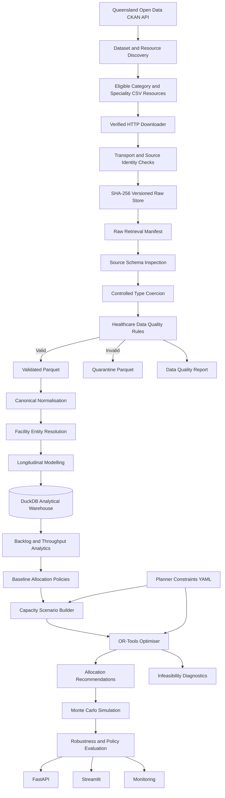

# Queensland Elective Surgery Capacity and Waitlist Recovery Optimiser

[](https://www.python.org/)
[](https://duckdb.org/)
[](https://developers.google.com/optimization)
[](https://fastapi.tiangolo.com/)
[](https://streamlit.io/)
[](https://pytest.org/)
[](LICENSE)

A production-style healthcare operations analytics project for transforming Queensland public elective-surgery performance data into a reproducible analytical warehouse and, ultimately, a constrained capacity-allocation decision-support system.

The project currently implements the complete engineering pipeline from public-source discovery through validated, canonical and longitudinal DuckDB data.

Future phases will add operational analytics, baseline allocation policies, mathematical optimisation, uncertainty simulation, an API and an interactive planning application.

> **Responsible-use boundary:** This project supports aggregate health-service planning. It does not rank individual patients, schedule individual patients, change clinical urgency classifications, recommend treatment or replace clinical and operational judgement.

---

# 1. Project overview

Elective-surgery planning is not simply a forecasting problem.

Health services must balance:

* patients waiting beyond clinically recommended timeframes;
* variation in waiting pressure between hospitals;
* variation between surgical specialties;
* clinical urgency;
* limited theatre capacity;
* workforce constraints;
* cancellation risk;
* emergency-demand displacement;
* regional access;
* future additions to waiting lists;
* and uncertainty in treatment productivity.

Public reporting provides evidence about historical and current elective-surgery performance, but reporting alone does not answer the operational decision:

> **Given a limited amount of additional elective-surgery capacity, how should that capacity be distributed across facilities and specialties to reduce long waits while respecting operational and policy constraints?**

This repository is being built as an end-to-end decision-support system for that problem.

The architecture deliberately separates:

1. source retrieval;
2. data validation;
3. canonical processing;
4. analytical storage;
5. operational analytics;
6. optimisation;
7. uncertainty analysis;
8. delivery and monitoring.

This prevents raw publisher data, analytical assumptions and model outputs from being mixed together.

---

# 2. Current project status

**Development status: implemented through Phase 4**

The following phases are complete at code level.

## Phase 1 — Repository foundation

Implemented:

* Python 3.12 package structure;
* `pyproject.toml`;
* dependency management;
* typed Pydantic configuration;
* YAML planning scenarios;
* environment configuration;
* project-specific exceptions;
* structured JSON logging;
* Typer command-line interface;
* pytest;
* Ruff;
* mypy;
* reproducible local directory structure.

## Phase 2 — Source ingestion

Implemented:

* Queensland Open Data CKAN integration;
* deterministic dataset lookup;
* Category and Speciality resource classification;
* configurable source-pattern matching;
* HTTP retries and timeouts;
* response-status verification;
* HTML/error-page rejection;
* CSV identity checks;
* SHA-256 hashing;
* immutable raw-file versioning;
* duplicate-content detection;
* retrieval metadata;
* source lineage manifest;
* latest-resource development mode;
* historical-resource ingestion;
* ingestion unit tests;
* ingestion integration testing.

## Phase 3 — Data validation and quarantine

Implemented:

* source-family column contracts;
* required-column checks;
* schema-drift detection;
* explicit textual-null handling;
* controlled numeric coercion;
* controlled percentage coercion;
* controlled date coercion;
* parse-failure detection;
* required identity checks;
* negative-volume checks;
* percentage-range checks;
* duplicate business-key detection;
* long-wait consistency checks;
* non-blocking diagnostic warnings;
* validated Parquet outputs;
* row-level quarantine;
* machine-readable quality issues;
* JSON data-quality reporting;
* validation unit tests;
* validation integration testing.

## Phase 4 — Canonical processing and analytical warehouse

Implemented:

* canonical source-field mapping;
* support for publisher field-name variation;
* facility identifier normalisation;
* facility name normalisation;
* deterministic facility alias resolution;
* canonical service representation;
* canonical reporting periods;
* source lineage preservation;
* longitudinal business keys;
* deterministic handling of revised source versions;
* period-over-period backlog measures;
* long-wait change;
* long-wait share;
* treatment-to-waiting ratio;
* canonical Parquet output;
* longitudinal Parquet output;
* DuckDB dimensional model;
* elective-surgery performance fact table;
* data-quality event fact table;
* warehouse reconciliation checks;
* warehouse unit tests;
* end-to-end warehouse integration testing.

---

# 3. What is not implemented yet

The following components are intentionally still future work:

* facility-pressure analytics;
* specialty-pressure analytics;
* throughput analysis;
* equity analysis;
* baseline allocation policies;
* demand modelling;
* capacity modelling;
* OR-Tools optimisation;
* infeasibility diagnostics;
* Monte Carlo simulation;
* policy robustness analysis;
* FastAPI service;
* Streamlit application;
* monitoring framework;
* Docker deployment;
* GitHub Actions;
* verified optimisation results.

These components are described where useful for architectural context, but they must not be treated as completed functionality.

---

# 4. Result terminology

The repository distinguishes between different types of information.

| Term               | Meaning                                                                                |
| ------------------ | -------------------------------------------------------------------------------------- |
| **Verified**       | Generated by executed repository code using retrieved source data and reviewed outputs |
| **Observed**       | Directly sourced from public data                                                      |
| **Derived**        | Calculated deterministically from observed data                                        |
| **Scenario-based** | Generated using explicitly documented planning assumptions                             |
| **Illustrative**   | Used only to explain an expected workflow or output                                    |
| **Synthetic**      | Programmatically generated and explicitly separated from observed data                 |
| **Planned**        | Designed but not yet implemented                                                       |

No analytical, optimisation or operational-impact result should be described as verified merely because the corresponding code exists.

Runtime outputs should be reviewed and reconciled before being reported as findings.

---

# 5. Value proposition

The project converts public elective-surgery reporting into a transparent analytical and decision-support pipeline that can eventually answer questions such as:

* Where is elective-surgery waiting pressure concentrated?
* Which services have persistent long waits?
* Which facilities are deteriorating over time?
* Where is treatment throughput insufficient relative to waiting volume?
* How should incremental capacity be allocated under a fixed budget?
* What trade-offs exist between efficiency and service coverage?
* Which allocations remain useful under uncertain future demand?
* What constraints make a proposed capacity plan infeasible?

The current Phase 4 implementation establishes the trusted analytical data foundation required to answer those questions responsibly.

---

# 6. Target stakeholder

## Primary stakeholder

Queensland Health statewide elective-surgery planning and performance teams.

## Secondary stakeholders

Potential users include:

* Hospital and Health Service planners;
* surgical-services managers;
* operating-theatre managers;
* health-service performance analysts;
* public-sector data teams;
* funding and commissioning teams;
* operational research practitioners;
* and healthcare analytics teams.

---

# 7. Intended end user

The primary end user is a health-service planner preparing periodic capacity-planning recommendations.

A planner may need to understand:

* current waiting-list pressure;
* long-wait exposure;
* specialty-level pressure;
* facility-level throughput;
* changes between reporting periods;
* available incremental capacity;
* policy constraints;
* geographic coverage;
* data quality;
* source freshness;
* planning assumptions;
* and uncertainty around future outcomes.

---

# 8. Decision supported

The completed system is intended to support the aggregate planning question:

> **How should additional elective-surgery sessions be allocated across eligible facility-specialty combinations under a constrained capacity budget?**

Future recommendations may help answer:

1. Which facility-specialty combinations should receive additional sessions?
2. How many sessions should each combination receive?
3. What reduction in long waits could reasonably be expected?
4. Which services remain under pressure after allocation?
5. How does the policy compare with simple allocation baselines?
6. What happens if cancellations increase?
7. What happens if future waiting-list additions increase?
8. How sensitive is the allocation to policy weights?
9. Which facilities repeatedly receive little capacity?
10. Which operational constraints prevent feasibility?

All recommendations will remain subject to human review.

---

# 9. Decisions not supported

The project must not be used to:

* rank individual patients;
* schedule individual patients;
* modify clinical urgency categories;
* diagnose conditions;
* recommend treatment;
* estimate individual deterioration risk;
* estimate individual mortality;
* infer patient characteristics from aggregate reporting;
* override clinicians;
* automate individual funding decisions;
* deny individual access to care;
* or represent scenario assumptions as observed Queensland hospital operations.

---

# 10. Data source

## Queensland Government Open Data

The primary source is the Queensland Government Open Data elective-surgery dataset.

The configured CKAN dataset identifier is:

```text
elective-surgery
```

Rather than maintaining a manually hard-coded quarterly CSV URL, the ingestion layer queries CKAN metadata and identifies eligible resources.

The project currently works with two source families:

* **Category / Summary 1**
* **Speciality / Summary 2**

Inside the Python package, the resource-family identifier uses:

```text
category
specialty
```

The spelling `specialty` is therefore an internal canonical identifier even where the source publication uses `Speciality`.

---

# 11. Data limitations

The public source is aggregate reporting data.

It does not provide complete information about:

* individual patients;
* patient-level waiting histories;
* current operating-theatre schedules;
* individual procedure duration;
* surgeon availability;
* anaesthetist availability;
* nursing rosters;
* recovery-bed constraints;
* ICU constraints;
* equipment availability;
* local cancellation causes;
* real-time emergency demand;
* facility-specific costs;
* or every local scheduling policy.

The project therefore keeps five categories of information distinct:

```text
Observed public data
        ↓
Validated source data
        ↓
Derived analytical measures
        ↓
Scenario assumptions
        ↓
Decision-support outputs
```

Scenario assumptions must never be described as observed hospital operations.

---

# 12. System architecture


```mermaid
flowchart TD
    A[Queensland Open Data CKAN API] --> B[Dataset and Resource Discovery]

    B --> C[Eligible Category and Speciality CSV Resources]

    C --> D[Verified HTTP Downloader]

    D --> E[Transport and Source Identity Checks]

    E --> F[SHA-256 Versioned Raw Store]

    F --> G[Raw Retrieval Manifest]

    G --> H[Source Schema Inspection]

    H --> I[Controlled Type Coercion]

    I --> J[Healthcare Data Quality Rules]

    J -->|Valid| K[Validated Parquet]

    J -->|Invalid| L[Quarantine Parquet]

    J --> M[Data Quality Report]

    K --> N[Canonical Normalisation]

    N --> O[Facility Entity Resolution]

    O --> P[Longitudinal Modelling]

    P --> Q[(DuckDB Analytical Warehouse)]

    Q --> R[Backlog and Throughput Analytics]

    R --> S[Baseline Allocation Policies]

    S --> T[Capacity Scenario Builder]

    U[Planner Constraints YAML] --> T
    U --> V[OR-Tools Optimiser]

    T --> V

    V --> W[Allocation Recommendations]
    V --> X[Infeasibility Diagnostics]

    W --> Y[Monte Carlo Simulation]

    Y --> Z[Robustness and Policy Evaluation]

    Z --> AA[FastAPI]
    Z --> AB[Streamlit]
    Z --> AC[Monitoring]
```

---

# 13. Architecture status

| Layer                      | Status      |
| -------------------------- | ----------- |
| Package foundation         | Implemented |
| Typed configuration        | Implemented |
| Structured logging         | Implemented |
| CLI                        | Implemented |
| CKAN discovery             | Implemented |
| Raw ingestion              | Implemented |
| SHA-256 versioning         | Implemented |
| Source manifest            | Implemented |
| Source validation          | Implemented |
| Controlled coercion        | Implemented |
| Quarantine workflow        | Implemented |
| Data-quality reporting     | Implemented |
| Canonical normalisation    | Implemented |
| Facility entity resolution | Implemented |
| Longitudinal modelling     | Implemented |
| DuckDB warehouse           | Implemented |
| Warehouse reconciliation   | Implemented |
| Operational analytics      | Planned     |
| Baseline policies          | Planned     |
| Optimisation               | Planned     |
| Simulation                 | Planned     |
| API                        | Planned     |
| Streamlit                  | Planned     |
| Monitoring                 | Planned     |
| Deployment                 | Planned     |

---

# 14. Technology stack

| Component            | Technology                          | Purpose                                 |
| -------------------- | ----------------------------------- | --------------------------------------- |
| Language             | Python 3.12                         | Core implementation                     |
| HTTP                 | HTTPX                               | CKAN and CSV retrieval                  |
| Configuration        | Pydantic Settings + YAML            | Typed project configuration             |
| Tabular processing   | Pandas                              | Validation and transformation           |
| Validation           | Explicit rules / Pandera dependency | Source and canonical data contracts     |
| Raw storage          | CSV                                 | Immutable source preservation           |
| Intermediate storage | Parquet                             | Validated and canonical data            |
| Analytical database  | DuckDB                              | Reproducible local analytical warehouse |
| Optimisation         | OR-Tools CP-SAT                     | Planned integer allocation model        |
| Simulation           | NumPy                               | Planned uncertainty analysis            |
| API                  | FastAPI                             | Planned decision service                |
| Application          | Streamlit                           | Planned planning interface              |
| Tests                | pytest                              | Automated verification                  |
| Static typing        | mypy                                | Type checking                           |
| Formatting / linting | Ruff                                | Code-quality enforcement                |
| Packaging            | Hatchling                           | Build configuration                     |
| Logging              | Structured Python logging           | Execution and failure records           |
| Containerisation     | Docker                              | Planned deployment                      |
| CI                   | GitHub Actions                      | Planned automated quality gates         |

---

# 15. Repository structure

The repository through Phase 4 is organised as follows:

```text
qld-elective-surgery-optimiser/
├── README.md
├── LICENSE
├── .gitignore
├── .env.example
├── pyproject.toml
├── Makefile
│
├── configs/
│   ├── base.yml
│   ├── facilities.yml
│   ├── optimisation.yml
│   └── scenarios/
│       ├── baseline.yml
│       ├── constrained_capacity.yml
│       └── demand_surge.yml
│
├── data/
│   ├── raw/
│   │   ├── .gitkeep
│   │   ├── manifest.csv
│   │   ├── category/
│   │   └── specialty/
│   │
│   ├── interim/
│   │   ├── .gitkeep
│   │   ├── category/
│   │   └── specialty/
│   │
│   ├── processed/
│   │   ├── .gitkeep
│   │   ├── canonical_performance.parquet
│   │   ├── longitudinal_performance.parquet
│   │   └── elective_surgery.duckdb
│   │
│   ├── reference/
│   │   └── facility_aliases.csv
│   │
│   └── quarantine/
│       ├── .gitkeep
│       ├── category/
│       └── specialty/
│
├── reports/
│   ├── figures/
│   │   └── .gitkeep
│   │
│   └── outputs/
│       ├── .gitkeep
│       ├── data_quality_summary.json
│       └── warehouse_reconciliation.json
│
├── src/
│   └── qld_surgery_optimiser/
│       ├── __init__.py
│       ├── cli.py
│       ├── config.py
│       ├── exceptions.py
│       ├── logging_config.py
│       │
│       ├── ingestion/
│       │   ├── __init__.py
│       │   ├── models.py
│       │   ├── ckan_client.py
│       │   ├── downloader.py
│       │   ├── manifest.py
│       │   └── pipeline.py
│       │
│       ├── validation/
│       │   ├── __init__.py
│       │   ├── models.py
│       │   ├── schemas.py
│       │   ├── coercion.py
│       │   ├── quality_rules.py
│       │   ├── quarantine.py
│       │   ├── report.py
│       │   └── pipeline.py
│       │
│       └── processing/
│           ├── __init__.py
│           ├── models.py
│           ├── normalise.py
│           ├── entities.py
│           ├── longitudinal.py
│           └── warehouse.py
│
├── sql/
│   ├── create_warehouse.sql
│   └── checks/
│       └── reconciliation.sql
│
└── tests/
    ├── conftest.py
    │
    ├── unit/
    │   ├── test_config.py
    │   ├── test_ckan_client.py
    │   ├── test_downloader.py
    │   ├── test_manifest.py
    │   ├── test_coercion.py
    │   ├── test_quality_rules.py
    │   ├── test_quarantine.py
    │   ├── test_normalisation.py
    │   ├── test_entities.py
    │   └── test_longitudinal.py
    │
    └── integration/
        ├── test_ingestion_pipeline.py
        ├── test_validation_pipeline.py
        └── test_warehouse_pipeline.py
```

Generated raw, interim, quarantine, processed and reporting outputs should not be treated as source code and should be handled according to `.gitignore`.

---

# 16. Phase 2 — Ingestion

The ingestion package is responsible only for retrieving and preserving external source data.

It does not perform analytical transformations.

```text
src/qld_surgery_optimiser/ingestion/
├── __init__.py
├── models.py
├── ckan_client.py
├── downloader.py
├── manifest.py
└── pipeline.py
```

---

# 17. CKAN resource discovery

The CKAN client queries the configured dataset through:

```text
/api/3/action/package_show
```

It captures information including:

* dataset ID;
* dataset title;
* organisation;
* licence;
* resource ID;
* resource title;
* source URL;
* format;
* upstream hash when available;
* creation time;
* modification time.

Resources are classified using configured naming patterns.

Unsupported formats and unrelated resources are excluded.

This avoids maintaining a single manually hard-coded quarterly URL.

---

# 18. Verified raw downloads

Before a downloaded response is accepted as source data, the downloader performs checks including:

* successful HTTP response;
* non-empty payload;
* expected content behaviour;
* HTML/error-page rejection;
* text decoding;
* CSV-header parsing;
* required source identity fields.

The minimum source identity currently includes:

```text
Facility_Code
Facility_Name
Report_Month
```

This check establishes that the payload resembles the expected source family.

Detailed analytical validation occurs later.

---

# 19. Immutable raw storage

Every accepted resource is hashed using SHA-256.

Raw files are stored using:

```text
data/raw/<resource-kind>/<resource-id>/<sha256-prefix>_<source-file>.csv
```

For example:

```text
data/raw/
├── category/
│   └── <resource-id>/
│       └── <checksum>_<file>.csv
└── specialty/
    └── <resource-id>/
        └── <checksum>_<file>.csv
```

The same byte content is not repeatedly rewritten.

This provides:

* source reproducibility;
* historical preservation;
* content-level provenance;
* resistance to silent upstream replacement.

Raw source files are never modified by downstream stages.

---

# 20. Source manifest

Source lineage is recorded in:

```text
data/raw/manifest.csv
```

Typical manifest fields include:

| Field                  | Meaning                         |
| ---------------------- | ------------------------------- |
| `dataset_id`           | Source dataset identifier       |
| `dataset_title`        | Published dataset title         |
| `source_organisation`  | Publisher                       |
| `source_licence`       | Source licence                  |
| `resource_id`          | CKAN resource identifier        |
| `resource_name`        | Published resource name         |
| `resource_kind`        | Category or specialty           |
| `resource_format`      | File format                     |
| `source_url`           | Original download URL           |
| `source_hash`          | Upstream hash where supplied    |
| `source_created`       | Publisher creation metadata     |
| `source_last_modified` | Publisher modification metadata |
| `retrieved_at`         | Local retrieval timestamp       |
| `local_path`           | Immutable raw path              |
| `sha256`               | Local content hash              |
| `byte_count`           | File size                       |
| `content_type`         | HTTP content type               |

Duplicate combinations of:

```text
resource_id + sha256
```

are not repeatedly added.

---

# 21. Phase 3 — Data validation

Validation is deliberately separated from ingestion.

```text
raw source
    ↓
validation
    ↓
validated analytical input
```

The validation layer answers:

> Is the retrieved source structurally and logically suitable for downstream processing?

---

# 22. Schema contracts

Common required fields currently include:

```text
Facility_Code
Facility_Name
Report_Month
Vol_Treated
Vol_Waiting
Vol_LongWaits
```

Speciality resources additionally require:

```text
Specialty_Code
Specialty_Desc
```

Category resources require:

```text
Category
```

Additional columns are reported as schema drift rather than automatically causing rejection.

Missing mandatory fields are treated as file-level errors.

---

# 23. Controlled coercion

Source values are initially treated conservatively.

Known numeric, percentage and date fields are converted explicitly instead of relying on inferred CSV types.

This allows the pipeline to distinguish between:

```text
valid numeric value
missing value
invalid non-null value
```

For example:

```text
1,234
```

can be converted safely to:

```text
1234
```

while a non-null value such as:

```text
unknown
```

in a numeric field produces a quality issue.

---

# 24. Null handling

Configured null representations include:

```text
""
NA
N/A
NULL
null
-
--
```

These are treated as missing rather than failed numeric values.

A genuine malformed non-null value remains a parse failure.

---

# 25. Data-quality rules

Current validation rules include:

| Rule                           | Severity | Treatment             |
| ------------------------------ | -------- | --------------------- |
| Missing required column        | Error    | File fails            |
| Invalid numeric parsing        | Error    | Row quarantined       |
| Invalid date parsing           | Error    | Row quarantined       |
| Invalid percentage parsing     | Error    | Row quarantined       |
| Missing required identity      | Error    | Row quarantined       |
| Negative volume                | Error    | Row quarantined       |
| Percentage outside 0–100       | Error    | Row quarantined       |
| Long waits above total waiting | Error    | Row quarantined       |
| Duplicate business key         | Error    | Row quarantined       |
| Unexpected source column       | Warning  | Retained and reported |
| Long-wait component mismatch   | Warning  | Retained and reported |

---

# 26. Long-wait consistency

The validation layer enforces:

$$
\text{Vol\_LongWaits}
\le
\text{Vol\_Waiting}
$$

A row violating this relationship is quarantined.

Where component fields are available, the system may also compare:

$$
\text{Vol\_LongWaits\_RFS}
+
\text{Vol\_LongWaits\_NRFS}
$$

with:

$$
\text{Vol\_LongWaits}
$$

A mismatch is currently diagnostic rather than automatically blocking.

---

# 27. Duplicate business keys

Specialty records use a source-level business key based on:

```text
Facility_Code
Report_Month
Specialty_Code
```

Category records use:

```text
Facility_Code
Report_Month
Category
```

Duplicates at the validation stage are treated as quality errors.

---

# 28. Quarantine

Invalid observations are not silently dropped.

They are written to:

```text
data/quarantine/
```

Quarantine records retain:

* original source values;
* original row index;
* source path;
* resource family;
* quality-rule IDs;
* failure messages.

Example:

```text
data/quarantine/
├── category/
│   └── <source>_quarantine.parquet
└── specialty/
    └── <source>_quarantine.parquet
```

A quarantine file is created only when invalid rows exist.

---

# 29. Validated data

Rows passing blocking checks are written to:

```text
data/interim/
```

Example:

```text
data/interim/
├── category/
│   └── <source>_validated.parquet
└── specialty/
    └── <source>_validated.parquet
```

These files become the input to Phase 4.

---

# 30. Data-quality report

Each validation run writes:

```text
reports/outputs/data_quality_summary.json
```

The report contains:

* files processed;
* files passed;
* files failed;
* rows read;
* valid rows;
* quarantined rows;
* quality-rule counts;
* missing columns;
* unexpected columns;
* file-level issues.

This creates an auditable boundary between external source files and the canonical analytical layer.

---

# 31. Phase 4 — Canonical processing

The processing layer converts validated source files into a stable internal model.

```text
src/qld_surgery_optimiser/processing/
├── __init__.py
├── models.py
├── normalise.py
├── entities.py
├── longitudinal.py
└── warehouse.py
```

The objective is to prevent publisher-specific field names or formatting differences from propagating through downstream analytics.

---

# 32. Canonical schema

The canonical performance structure contains fields including:

```text
record_id
resource_kind

source_resource_id
source_sha256
source_url
source_retrieved_at
source_file

facility_code
facility_name
report_month

service_code
service_name

vol_treated
pct_treated_in_time
pct_variation_treated_prior_year

vol_waiting
vol_long_waits
pct_waiting_in_time_total

data_last_update

vol_long_waits_rfs
vol_long_waits_nrfs
pct_waiting_in_time_rfs
```

The source-specific distinction is retained through:

```text
resource_kind
```

where:

```text
specialty
category
```

identify the source grain.

---

# 33. Source-field mapping

The canonical layer supports recognised source field names and maps them into stable internal names.

For example:

```text
Facility_Code
        ↓
facility_code
```

```text
Facility_Name
        ↓
facility_name
```

```text
Report_Month
        ↓
report_month
```

```text
Specialty_Code
        ↓
service_code
```

```text
Specialty_Desc
        ↓
service_name
```

and:

```text
Category
        ↓
service_name
```

This allows Category and Speciality resources to share the same downstream performance model without pretending they have the same analytical grain.

---

# 34. Reporting-period normalisation

Reporting dates are canonicalised to a month-level timestamp.

For example, a valid observation anywhere within September 2025 is represented canonically as:

```text
2025-09-01
```

This provides stable joins and period ordering.

It does not imply that the original publication occurred on the first day of the month.

---

# 35. Facility identifier normalisation

Facility codes are stored as strings.

Values such as:

```text
101.0
```

that arise from spreadsheet-style numeric representation may be normalised to:

```text
101
```

Facility names also receive deterministic whitespace normalisation.

The process does not use approximate fuzzy matching.

---

# 36. Facility entity resolution

The project contains a reviewed alias registry:

```text
data/reference/facility_aliases.csv
```

Current file structure:

```csv
alias_name,canonical_name,canonical_code,hhs,region,active
```

The file intentionally starts without fabricated facility mappings.

Mappings should only be added after genuine source-name variation has been observed and verified.

---

# 37. Facility resolution policy

Two resolution states currently exist.

## `source`

The official published facility identity is retained.

This is not automatically a data-quality problem.

Example interpretation:

```text
facility_resolution_status = source
```

means:

> no reviewed alias mapping was required or available; retain the published identity.

## `alias`

A reviewed version-controlled alias has been applied.

```text
facility_resolution_status = alias
```

means:

> the source identity matched an explicitly approved alias mapping.

The project deliberately disables automatic fuzzy matching for health-service facilities.

---

# 38. Why no fuzzy matching?

Automatic name similarity can produce plausible but incorrect entity mappings.

In a healthcare planning context, an incorrect hospital mapping could silently contaminate:

* longitudinal trends;
* facility pressure metrics;
* regional analysis;
* optimisation inputs;
* allocation recommendations.

The project therefore prefers:

```text
unknown but transparent
```

over:

```text
automatically mapped but potentially wrong
```

---

# 39. Source lineage in canonical data

Canonical observations preserve:

* source resource ID;
* source SHA-256;
* source URL;
* retrieval timestamp;
* source file reference.

This allows a warehouse row to be traced back to the exact source content from which it originated.

---

# 40. Canonical output

The combined canonical dataset is written to:

```text
data/processed/canonical_performance.parquet
```

This dataset preserves available source versions before longitudinal deduplication.

---

# 41. Longitudinal modelling

The longitudinal layer produces one selected canonical observation for each stable analytical business key.

The key includes:

```text
canonical_facility_code
report_month
resource_kind
service_code
service_name
```

A deterministic hash creates:

```text
business_key_id
```

---

# 42. Revised source versions

An upstream publisher may revise data for a reporting period.

The raw and canonical layers preserve those different content versions.

The longitudinal model then resolves repeated canonical business keys deterministically.

Preference is based on:

1. `data_last_update`;
2. source retrieval timestamp;
3. deterministic source metadata ordering.

Older raw source versions remain preserved.

The selected longitudinal observation does not erase source history.

---

# 43. Longitudinal output

The selected longitudinal dataset is stored as:

```text
data/processed/longitudinal_performance.parquet
```

This becomes the primary input to the analytical warehouse.

---

# 44. Derived longitudinal measures

Phase 4 derives several foundational measures.

## Previous waiting volume

```text
previous_vol_waiting
```

represents the prior available reporting-period value for the same facility and service grain.

## Backlog change

$$
\text{backlog\_change}
=
\text{vol\_waiting}
-
\text{previous\_vol\_waiting}
$$

A positive value indicates a larger reported waiting volume than in the preceding observation.

A negative value indicates a smaller reported waiting volume.

This is a descriptive change measure, not a causal estimate of an intervention.

## Previous long-wait volume

```text
previous_vol_long_waits
```

## Long-wait change

$$
\text{long\_wait\_change}
=
\text{vol\_long\_waits}
-
\text{previous\_vol\_long\_waits}
$$

## Long-wait share

$$
\text{long\_wait\_share}
=
\frac{\text{vol\_long\_waits}}
{\text{vol\_waiting}}
$$

where total waiting volume is non-zero.

## Treatment-to-waiting ratio

$$
\text{treatment\_to\_waiting\_ratio}
=
\frac{\text{vol\_treated}}
{\text{vol\_waiting}}
$$

where waiting volume is non-zero.

These are foundational descriptive features. More sophisticated service-pressure measures belong in Phase 5.

---

# 45. Analytical warehouse

Phase 4 creates:

```text
data/processed/elective_surgery.duckdb
```

DuckDB was selected because it provides:

* SQL analytical capability;
* strong local reproducibility;
* low infrastructure overhead;
* Parquet interoperability;
* simple portfolio execution;
* and a clear migration path if a larger analytical platform is later justified.

---

# 46. Warehouse model

The current warehouse contains:

```text
dim_facility
dim_specialty
dim_urgency_category
dim_reporting_period
dim_source_resource

fact_elective_surgery_performance
fact_data_quality_event
```

---

# 47. `dim_facility`

Contains canonical facility identity.

Typical fields:

```text
facility_key
facility_code
facility_name
hhs
region
resolution_status
```

`hhs` and `region` remain nullable until verified reference mappings are available.

They must not be populated with assumptions presented as observed data.

---

# 48. `dim_specialty`

Contains specialty identity.

Typical fields:

```text
specialty_key
specialty_code
specialty_name
```

---

# 49. `dim_urgency_category`

Contains Category/Summary 1 service categories.

Typical fields:

```text
urgency_category_key
urgency_category_name
```

The dimension is intentionally separate from specialties because the source families represent different analytical grains.

---

# 50. `dim_reporting_period`

Contains normalised reporting-period information.

Typical fields:

```text
reporting_period_key
calendar_year
calendar_quarter
month
quarter_label
```

---

# 51. `dim_source_resource`

Provides warehouse-level source lineage.

Typical fields:

```text
source_resource_key
resource_id
source_sha256
source_url
source_file
retrieved_at
```

A source-resource key is derived from the resource identifier and exact content version.

---

# 52. `fact_elective_surgery_performance`

The primary fact includes measures such as:

```text
vol_treated
pct_treated_in_time
pct_variation_treated_prior_year

vol_waiting
vol_long_waits
pct_waiting_in_time_total

vol_long_waits_rfs
vol_long_waits_nrfs
pct_waiting_in_time_rfs

previous_vol_waiting
backlog_change

previous_vol_long_waits
long_wait_change

long_wait_share
treatment_to_waiting_ratio
```

It also contains foreign keys linking each record to:

* facility;
* reporting period;
* specialty or urgency category;
* source resource.

---

# 53. `fact_data_quality_event`

Validation issues from Phase 3 can be persisted into the analytical warehouse.

Typical fields include:

```text
event_id
source_path
resource_kind
rule_id
severity
row_index
column_name
observed_value
message
```

This allows downstream data-health reporting to use the same warehouse as operational analytics.

---

# 54. Warehouse reconciliation

Phase 4 includes explicit warehouse checks.

The reconciliation SQL is located at:

```text
sql/checks/reconciliation.sql
```

Checks include:

* missing facility foreign keys;
* missing reporting periods;
* missing source lineage;
* specialty rows without specialty keys;
* category rows without category keys;
* specialty rows incorrectly linked to urgency categories;
* category rows incorrectly linked to specialties;
* long waits exceeding waiting volume;
* duplicate fact record IDs.

---

# 55. Warehouse reconciliation report

The warehouse build also creates:

```text
reports/outputs/warehouse_reconciliation.json
```

This includes evidence such as:

```text
canonical_rows
longitudinal_rows
fact_rows
duplicate_canonical_keys_removed
fact_matches_longitudinal
```

The expected core reconciliation is:

```text
fact_rows == longitudinal_rows
```

before downstream analytics are trusted.

---

# 56. Configuration

## `.env`

Environment-specific settings are defined through `.env`.

Example:

```env
APP_ENV=development
LOG_LEVEL=INFO

BASE_CONFIG_PATH=configs/base.yml
OPTIMISATION_CONFIG_PATH=configs/optimisation.yml
DEFAULT_SCENARIO_PATH=configs/scenarios/baseline.yml
FACILITY_ALIASES_PATH=data/reference/facility_aliases.csv

DATA_DIR=data
RAW_DATA_DIR=data/raw
INTERIM_DATA_DIR=data/interim
PROCESSED_DATA_DIR=data/processed
QUARANTINE_DATA_DIR=data/quarantine
REPORTS_DIR=reports

DUCKDB_PATH=data/processed/elective_surgery.duckdb

REQUEST_TIMEOUT_SECONDS=30
REQUEST_MAX_RETRIES=3
REQUEST_RETRY_BACKOFF_SECONDS=1.0

USER_AGENT=qld-elective-surgery-optimiser/0.1.0

RANDOM_SEED=42

SOLVER_TIME_LIMIT_SECONDS=60
SOLVER_NUM_WORKERS=1
```

No authentication credentials are expected for the current public Queensland Open Data ingestion workflow.

---

# 57. Base configuration

`configs/base.yml` controls areas such as:

* project identity;
* CKAN endpoint;
* dataset identifier;
* allowed source formats;
* resource classification patterns;
* storage behaviour;
* validation policy;
* recognised null tokens;
* required columns;
* numeric fields;
* percentage fields;
* date fields;
* warehouse behaviour;
* reporting behaviour.

---

# 58. Facility configuration

`configs/facilities.yml` currently defines facility-resolution policy.

The guiding principles are:

```text
prefer source identity
require reviewed aliases
no fuzzy matching
no automatic code replacement
```

---

# 59. Planning scenarios

Three initial scenario files are included.

```text
configs/scenarios/
├── baseline.yml
├── constrained_capacity.yml
└── demand_surge.yml
```

These belong to future optimisation and simulation stages.

They are already version-controlled so future model runs can be reproducible.

---

# 60. Baseline scenario

The baseline scenario includes planning assumptions such as:

```yaml
scenario:
  name: baseline
  planning_periods: 1
  incremental_sessions_available: 120
  random_seed: 42

capacity:
  default_patients_per_session: 3.0
  default_cancellation_rate: 0.08
  emergency_displacement_rate: 0.05

demand:
  quarterly_growth_rate: 0.02
  uncertainty_standard_deviation: 0.05
```

These are **scenario assumptions**.

They must not be interpreted as observed Queensland hospital productivity or cancellation rates.

---

# 61. Installation

## Prerequisites

Required:

```text
Python 3.12
Git
```

Optional:

```text
Make
```

Clone the repository:

```bash
git clone https://github.com/<your-github-username>/qld-elective-surgery-optimiser.git
cd qld-elective-surgery-optimiser
```

---

# 62. Create a virtual environment

## Windows PowerShell

```powershell
python -m venv .venv
.venv\Scripts\Activate.ps1
```

## macOS / Linux

```bash
python -m venv .venv
source .venv/bin/activate
```

---

# 63. Install dependencies

```bash
python -m pip install --upgrade pip
pip install -e ".[dev]"
```

Alternatively:

```bash
make install
```

---

# 64. Environment setup

## macOS / Linux

```bash
cp .env.example .env
```

## Windows PowerShell

```powershell
Copy-Item .env.example .env
```

---

# 65. CLI

The installed CLI is:

```bash
qld-surgery
```

It can also be run using:

```bash
python -m qld_surgery_optimiser.cli
```

Current commands include:

```text
doctor
show-config
discover
ingest
validate
warehouse
```

---

# 66. Check the local environment

```bash
qld-surgery doctor
```

or:

```bash
make doctor
```

The command validates the local configuration and creates required directories.

---

# 67. Display resolved configuration

```bash
qld-surgery show-config
```

To inspect another scenario:

```bash
qld-surgery show-config \
  --scenario configs/scenarios/demand_surge.yml
```

---

# 68. Discover upstream resources

```bash
qld-surgery discover
```

or:

```bash
make discover
```

Discovery queries CKAN metadata but does not download source files.

---

# 69. Development ingestion

To retrieve a reduced current resource set:

```bash
qld-surgery ingest --latest-only
```

or:

```bash
make ingest-latest
```

This mode is useful for development and smoke testing.

Because publisher metadata timestamps may reflect metadata updates rather than the semantic reporting quarter, the selected resources should be inspected before treating `--latest-only` as authoritative evidence of the latest reporting period.

For longitudinal analysis, historical ingestion is preferred.

---

# 70. Historical ingestion

```bash
qld-surgery ingest
```

or:

```bash
make ingest
```

This retrieves all eligible configured historical resources discovered by the ingestion layer.

---

# 71. Validate source data

```bash
qld-surgery validate
```

or:

```bash
make validate
```

A validation run reports values such as:

```text
Files processed
Files passed
Files failed
Rows read
Rows valid
Rows quarantined
Quality report path
```

Actual values are produced at runtime and should not be hard-coded into project documentation before verification.

---

# 72. Build the canonical warehouse

```bash
qld-surgery warehouse
```

or:

```bash
make warehouse
```

The warehouse command:

1. finds validated Parquet files;
2. resolves each file to source-manifest metadata;
3. converts publisher fields to the canonical schema;
4. applies deterministic facility resolution;
5. constructs longitudinal records;
6. resolves duplicate source versions;
7. derives foundational longitudinal measures;
8. writes canonical Parquet;
9. writes longitudinal Parquet;
10. builds DuckDB dimensions;
11. builds the performance fact;
12. loads data-quality events;
13. writes reconciliation evidence.

---

# 73. Recommended execution sequence

For a development run:

```bash
qld-surgery doctor

qld-surgery discover

qld-surgery ingest --latest-only

qld-surgery validate

qld-surgery warehouse
```

Equivalent:

```bash
make doctor
make discover
make ingest-latest
make validate
make warehouse
```

For longitudinal processing:

```bash
make ingest
make validate
make warehouse
```

---

# 74. Generated data products

After Phases 2–4 execute successfully, the primary generated outputs are expected to include:

```text
data/
├── raw/
│   └── ...
│
├── interim/
│   └── ...
│
├── quarantine/
│   └── ...
│
└── processed/
    ├── canonical_performance.parquet
    ├── longitudinal_performance.parquet
    └── elective_surgery.duckdb
```

Reporting outputs include:

```text
reports/outputs/
├── data_quality_summary.json
└── warehouse_reconciliation.json
```

Generated file presence alone is not evidence that every result is analytically valid. Reconciliation and test results should also be reviewed.

---

# 75. Inspect DuckDB

Example:

```python
import duckdb

connection = duckdb.connect(
    "data/processed/elective_surgery.duckdb"
)

print(
    connection.sql(
        "SHOW TABLES"
    ).df()
)
```

---

# 76. Example warehouse queries

## Available tables

```sql
SHOW TABLES;
```

## Facility count

```sql
SELECT COUNT(*)
FROM dim_facility;
```

## Reporting coverage

```sql
SELECT
    MIN(reporting_period_key) AS first_period,
    MAX(reporting_period_key) AS latest_period,
    COUNT(*) AS reporting_periods
FROM dim_reporting_period;
```

## Observations by source family

```sql
SELECT
    resource_kind,
    COUNT(*) AS observations
FROM fact_elective_surgery_performance
GROUP BY resource_kind
ORDER BY resource_kind;
```

## Long-wait relationship check

```sql
SELECT
    COUNT(*) AS invalid_rows
FROM fact_elective_surgery_performance
WHERE vol_long_waits > vol_waiting;
```

The expected value after successful validation is:

```text
0
```

---

# 77. Example specialty query

```sql
SELECT
    p.reporting_period_key,
    f.facility_name,
    s.specialty_name,
    p.vol_treated,
    p.vol_waiting,
    p.vol_long_waits,
    p.long_wait_share,
    p.backlog_change
FROM fact_elective_surgery_performance AS p

JOIN dim_facility AS f
    ON p.facility_key = f.facility_key

JOIN dim_specialty AS s
    ON p.specialty_key = s.specialty_key

WHERE p.resource_kind = 'specialty'

ORDER BY
    p.reporting_period_key DESC,
    p.vol_long_waits DESC;
```

Query results should not be published as verified findings until the warehouse has been reconciled against the retrieved source data.

---

# 78. Testing strategy

The repository uses unit and integration tests rather than relying only on successful manual execution.

---

# 79. Configuration tests

Tests cover:

* base configuration;
* scenario validation;
* invalid probability values;
* missing configuration files;
* required directory creation;
* idempotent directory creation.

---

# 80. Ingestion tests

Tests cover:

* deterministic CKAN lookup;
* Category resource classification;
* Speciality resource classification;
* unsupported resource exclusion;
* CSV retrieval;
* response validation;
* HTML rejection;
* required source identity;
* checksum generation;
* immutable raw paths;
* repeated-content detection;
* source-manifest creation;
* manifest duplicate protection.

---

# 81. Validation tests

Tests cover:

* numeric coercion;
* comma-formatted numeric values;
* percentage parsing;
* textual nulls;
* parse failures;
* negative volumes;
* percentage range violations;
* duplicate business keys;
* long-wait consistency;
* quarantine preservation;
* validation integration.

---

# 82. Canonical processing tests

Tests cover:

* facility-code normalisation;
* whitespace normalisation;
* report-month standardisation;
* specialty service mapping;
* Category service mapping;
* preservation of source metadata;
* stable canonical fields.

---

# 83. Entity-resolution tests

Tests verify:

* explicit aliases replace source identity;
* canonical facility codes are applied only through reviewed mapping;
* unmapped facilities preserve source identities;
* automatic fuzzy matching is not introduced.

---

# 84. Longitudinal tests

Tests verify:

* period ordering;
* previous waiting volume;
* backlog change;
* previous long-wait volume;
* long-wait change;
* deterministic source-version resolution.

---

# 85. Warehouse integration test

The Phase 4 integration test exercises:

```text
validated Parquet
       ↓
canonical normalisation
       ↓
facility resolution
       ↓
longitudinal model
       ↓
DuckDB dimensions
       ↓
DuckDB fact
       ↓
reconciliation report
```

This validates the data-engineering boundary before Phase 5 analytics are introduced.

---

# 86. Run tests

```bash
pytest
```

or:

```bash
make test
```

---

# 87. Coverage

```bash
pytest \
  --cov=qld_surgery_optimiser \
  --cov-report=term-missing
```

or:

```bash
make coverage
```

---

# 88. Formatting

```bash
make format
```

Equivalent:

```bash
ruff format .
ruff check . --fix
```

---

# 89. Linting

```bash
make lint
```

Equivalent:

```bash
ruff format --check .
ruff check .
```

---

# 90. Static type checking

```bash
make typecheck
```

Equivalent:

```bash
mypy src tests
```

---

# 91. Recommended pre-commit verification

Before committing a phase:

```bash
make format
make lint
make typecheck
make test
```

Then perform a development pipeline run:

```bash
make ingest-latest
make validate
make warehouse
```

For full historical analysis:

```bash
make ingest
make validate
make warehouse
```

---

# 92. Data-quality philosophy

The project follows four principles.

## Preserve the source

Raw downloaded content is immutable.

## Fail explicitly

Invalid structures or impossible values should create visible failures rather than silent coercion.

## Quarantine rather than erase

Invalid rows remain available for inspection.

## Keep assumptions separate

Operational assumptions used later by optimisation must never be presented as observed public data.

---

# 93. Canonical modelling philosophy

The canonical layer follows similar principles.

## Stable internal names

Downstream analytics should not depend directly on publisher column names.

## Preserve source grain

Category and Speciality data are not collapsed into a false common grain.

## Deterministic entities

Facility resolution uses reviewed mappings rather than speculative similarity matching.

## Preserve lineage

Every analytical observation should remain traceable to source content.

## Preserve revisions

Updated source versions should be resolved analytically without deleting source history.

---

# 94. Ethical considerations

## Aggregate planning boundary

The project operates on aggregate service-level data.

It is not a patient-level prioritisation system.

Any future extension involving identifiable health records would require a separate assessment covering:

* privacy;
* information security;
* clinical safety;
* regulatory obligations;
* legal authority;
* deployment controls;
* and validation.

---

# 95. Equity

A purely efficiency-oriented future optimiser could favour:

* larger facilities;
* metropolitan services;
* specialties with greater throughput;
* services historically receiving more capacity.

Future optimisation therefore anticipates explicit controls such as:

* minimum service coverage;
* regional coverage;
* allocation concentration limits;
* alternative policy weights;
* distributional reporting.

Equity parameters are policy decisions and must remain transparent.

---

# 96. Historical bias

Historical throughput may reflect:

* past funding;
* workforce shortages;
* geographic barriers;
* unequal access;
* capacity constraints;
* previous policy choices.

Historical activity therefore describes what occurred.

It should not automatically define what future capacity allocation ought to be.

---

# 97. Human review

Before any future recommendation is used operationally, a planner should review:

* source-data freshness;
* validation results;
* quarantined rows;
* facility mappings;
* scenario assumptions;
* active constraints;
* objective weights;
* optimiser status;
* sensitivity results;
* limitations.

The software produces decision support, not autonomous health-service decisions.

---

# 98. Privacy and security

The current public portfolio project uses aggregate public data.

The repository must not contain:

* patient names;
* medical record numbers;
* dates of birth;
* addresses;
* individual procedure histories;
* other identifiable health information.

Any future use of restricted operational data would require appropriate:

* identity management;
* access control;
* encryption;
* secret management;
* audit logging;
* retention policies;
* privacy review;
* approved deployment controls.

---

# 99. Regulatory boundary

The repository does not claim to be:

* a medical device;
* clinical decision-support software;
* a patient scheduling application;
* a Queensland Health production application;
* or an approved operational allocation system.

Operational deployment would require assessment under the policies, legislation, governance and assurance standards relevant to the intended environment.

---

# 100. Current failure modes

The implemented pipeline may fail when:

* the source portal is unavailable;
* CKAN metadata changes unexpectedly;
* resource URLs fail;
* HTML is returned instead of data;
* publisher schemas change;
* mandatory fields disappear;
* source numeric values become malformed;
* reporting dates cannot be parsed;
* duplicate business keys occur;
* waiting measures contradict one another;
* validated files cannot be mapped to source lineage;
* facility alias configuration is invalid;
* canonical business keys cannot be constructed;
* DuckDB tables fail reconciliation.

The correct behaviour is explicit failure or qualification, not unsupported certainty.

---

# 101. Current verified capability

At the end of Phase 4, the codebase is designed to support the following engineering workflow:

```text
Queensland Open Data
        ↓
CKAN metadata discovery
        ↓
verified resource download
        ↓
immutable SHA-256 raw storage
        ↓
source manifest
        ↓
source validation
        ↓
quality-rule evaluation
        ↓
valid / quarantine split
        ↓
canonical normalisation
        ↓
facility entity resolution
        ↓
longitudinal modelling
        ↓
DuckDB star schema
        ↓
warehouse reconciliation
```

This is the project's implemented analytical foundation.

---

# 102. Current analytical results

No facility-pressure, specialty-pressure, capacity-allocation or optimisation findings are claimed in this README yet.

Those results should only be added after:

1. the historical source set has been retrieved;
2. validation results have been reviewed;
3. facility identity has been reconciled;
4. the longitudinal model has been checked;
5. warehouse reconciliation passes;
6. Phase 5 analytics have been implemented;
7. outputs have been independently inspected.

---

# 103. Planned Phase 5 — Operational analytics and baselines

Phase 5 will add:

```text
src/qld_surgery_optimiser/
└── analytics/
    ├── __init__.py
    ├── backlog.py
    ├── throughput.py
    ├── equity.py
    └── baselines.py
```

and SQL marts such as:

```text
sql/marts/
├── facility_pressure.sql
└── specialty_pressure.sql
```

Planned analytics include:

* current waiting volume;
* long-wait volume;
* long-wait share;
* backlog movement;
* trailing throughput;
* trailing waiting growth;
* persistent deterioration;
* specialty pressure;
* facility pressure;
* regional distribution;
* minimum-service coverage.

---

# 104. Planned baseline allocation policies

Before mathematical optimisation is introduced, future recommended allocations must be compared with simple policies.

Planned baselines include:

## No additional capacity

No incremental sessions are allocated.

## Equal allocation

Available sessions are distributed approximately evenly among eligible services.

## Waiting-volume allocation

Capacity is distributed in proportion to total waiting volume.

## Long-wait allocation

Capacity is distributed in proportion to long-wait volume.

## Previous allocation

A prior approved capacity plan is reused where available.

## Greedy pressure allocation

Capacity is assigned iteratively to the highest-pressure eligible services.

A future optimiser will need to outperform meaningful baselines rather than merely produce a mathematically feasible answer.

---

# 105. Planned optimisation

The proposed allocation variable is:

$$
x_{f,s}
=
\text{incremental sessions allocated to facility } f
\text{ and specialty } s
$$

The initial OR-Tools CP-SAT formulation is expected to consider:

* total capacity budget;
* facility capacity;
* specialty capacity;
* eligibility;
* minimum service coverage;
* regional coverage;
* maximum facility share;
* allocation stability;
* non-negative residual backlog;
* policy exclusions.

---

# 106. Planned objective

The proposed objective combines terms representing:

* remaining long waits;
* urgency-weighted burden;
* equity;
* concentration;
* unused capacity;
* allocation instability.

Conceptually:

$$
\min
\left(
\alpha L +
\beta O +
\gamma E +
\delta C +
\eta U +
\theta S
\right)
$$

where policy weights are explicit configuration rather than hidden assumptions.

---

# 107. Planned uncertainty analysis

Future Monte Carlo simulation will vary assumptions such as:

* future waiting-list additions;
* patients treated per session;
* cancellation rates;
* emergency displacement;
* capacity availability;
* specialty productivity.

Planned outputs include:

* expected backlog reduction;
* median outcome;
* uncertainty intervals;
* probability of achieving a target;
* downside performance;
* expected regret;
* allocation stability;
* facility-selection frequency;
* sensitivity to policy weights.

---

# 108. Planned delivery layer

Future delivery components include:

```text
api/
app/
```

The API is expected to use FastAPI.

The interactive planning application is expected to use Streamlit.

These layers should only be introduced after the analytical and optimisation components are stable.

---

# 109. Development roadmap

## Foundation

* [x] Project README and decision framing
* [x] Python packaging
* [x] Typed configuration
* [x] Environment configuration
* [x] Scenario configuration
* [x] Structured logging
* [x] CLI
* [x] Testing framework

## Ingestion

* [x] CKAN dataset discovery
* [x] Resource classification
* [x] HTTP retrieval
* [x] Retry handling
* [x] Response verification
* [x] HTML rejection
* [x] SHA-256 hashing
* [x] Immutable raw storage
* [x] Retrieval manifest
* [x] Ingestion tests

## Data quality

* [x] Source-family contracts
* [x] Required-column checks
* [x] Null handling
* [x] Numeric coercion
* [x] Percentage coercion
* [x] Date coercion
* [x] Parse-failure detection
* [x] Negative-volume validation
* [x] Percentage validation
* [x] Duplicate-key validation
* [x] Long-wait validation
* [x] Quarantine workflow
* [x] Data-quality reporting
* [x] Validation tests

## Canonical processing

* [x] Canonical schema
* [x] Source-column mapping
* [x] Facility-code normalisation
* [x] Facility-name normalisation
* [x] Reporting-period normalisation
* [x] Source lineage preservation
* [x] Facility alias registry
* [x] Deterministic entity resolution
* [x] Canonical processing tests

## Longitudinal modelling

* [x] Stable analytical business key
* [x] Source-version selection
* [x] Previous waiting volume
* [x] Backlog change
* [x] Previous long waits
* [x] Long-wait change
* [x] Long-wait share
* [x] Treatment-to-waiting ratio
* [x] Longitudinal tests

## Analytical warehouse

* [x] DuckDB database
* [x] Facility dimension
* [x] Specialty dimension
* [x] Urgency-category dimension
* [x] Reporting-period dimension
* [x] Source-resource dimension
* [x] Elective-surgery fact
* [x] Data-quality event fact
* [x] Reconciliation checks
* [x] Warehouse integration test

## Operational analytics

* [ ] Backlog analytics
* [ ] Throughput analytics
* [ ] Facility pressure
* [ ] Specialty pressure
* [ ] Regional analysis
* [ ] Equity analysis

## Baseline policies

* [ ] No-capacity baseline
* [ ] Equal allocation
* [ ] Waiting-volume allocation
* [ ] Long-wait allocation
* [ ] Historical allocation
* [ ] Greedy pressure allocation

## Optimisation

* [ ] Input contracts
* [ ] Decision variables
* [ ] Objective functions
* [ ] Operational constraints
* [ ] Equity constraints
* [ ] Infeasibility diagnostics
* [ ] Baseline comparison

## Simulation

* [ ] Monte Carlo engine
* [ ] Demand uncertainty
* [ ] Productivity uncertainty
* [ ] Cancellation uncertainty
* [ ] Policy robustness
* [ ] Regret analysis
* [ ] Allocation stability

## Delivery

* [ ] FastAPI
* [ ] Streamlit
* [ ] Monitoring
* [ ] Docker
* [ ] GitHub Actions
* [ ] Operational documentation

## Verification

* [ ] Execute full historical pipeline
* [ ] Review source coverage
* [ ] Review data-quality findings
* [ ] Review facility mappings
* [ ] Reconcile warehouse
* [ ] Produce analytical findings
* [ ] Validate optimisation
* [ ] Run uncertainty analysis
* [ ] Publish verified results
* [ ] Complete repository review

---

# 110. Skills demonstrated through Phase 4

## Software engineering

* modular package architecture;
* Python packaging;
* dependency management;
* typed settings;
* YAML configuration;
* custom exceptions;
* structured logging;
* CLI development;
* reusable domain models;
* separation of concerns.

## Data engineering

* CKAN integration;
* HTTP ingestion;
* metadata-driven source discovery;
* retry strategies;
* source validation;
* immutable raw storage;
* SHA-256 hashing;
* source versioning;
* source lineage;
* manifests;
* Parquet;
* DuckDB;
* dimensional modelling.

## Data quality

* schema contracts;
* controlled type coercion;
* null semantics;
* business-rule validation;
* duplicate detection;
* healthcare metric consistency;
* quarantine design;
* schema-drift reporting;
* machine-readable quality events.

## Data modelling

* canonical field design;
* entity resolution;
* stable business keys;
* slowly changing source-version handling;
* dimensions;
* facts;
* longitudinal modelling;
* source lineage.

## Analytics engineering

* reporting-period normalisation;
* period-over-period calculations;
* backlog change;
* long-wait change;
* ratio measures;
* reconciliation controls.

## Testing

* unit tests;
* integration tests;
* HTTP mocking;
* invalid-input testing;
* pipeline testing;
* database persistence tests;
* reconciliation tests.

## Governance

* provenance;
* explicit assumptions;
* public-data boundaries;
* human review;
* transparent quality failures;
* no fabricated facility mappings;
* responsible-use restrictions.

---

# 111. Future improvements

Potential later extensions include:

* geographic accessibility analysis;
* remoteness measures;
* travel-time modelling;
* workforce constraints;
* theatre-session availability;
* recovery-bed constraints;
* intensive-care constraints;
* procedure-level capacity modelling;
* cancellation-risk models;
* multi-period optimisation;
* robust optimisation;
* stochastic optimisation;
* causal evaluation;
* planner-defined policy templates;
* role-based access control;
* managed cloud deployment;
* appropriately governed operational data integration.

Each extension should be added only when it provides clear analytical or operational value.

---

# 112. Contributing

Contributions should:

* preserve the aggregate-planning boundary;
* preserve source lineage;
* avoid fabricated source mappings;
* include tests for new behaviour;
* document new assumptions;
* retain data-quality failures rather than hide them;
* avoid patient-level or restricted health data;
* update relevant documentation.

Before committing:

```bash
make format
make lint
make typecheck
make test
```

---

# 113. Licence

Project code is released under the MIT Licence.

External data retains its original licensing and attribution requirements.

The repository licence does not modify the terms applied by external data publishers.

---

# 114. Disclaimer

This is an independent portfolio project.

It is not produced, endorsed or approved by Queensland Health, the Queensland Government or the Australian Institute of Health and Welfare.

It is not a clinical tool, patient scheduling system or production health-service application.

Future analytical and optimisation outputs are intended to support aggregate planning analysis and must not be used as the sole basis for clinical, funding or operational decisions.