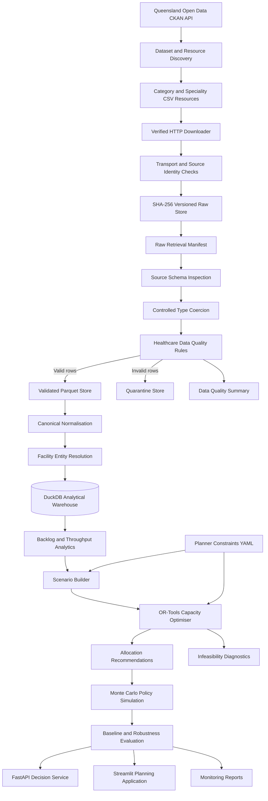

# Queensland Elective Surgery Capacity and Waitlist Recovery Optimiser

[](https://www.python.org/)
[](https://duckdb.org/)
[](https://developers.google.com/optimization)
[](https://fastapi.tiangolo.com/)
[](https://streamlit.io/)
[](https://pytest.org/)
[](LICENSE)

A production-style healthcare operations analytics project for allocating additional elective-surgery capacity across Queensland public facilities and specialties while accounting for long waits, clinical urgency, operational constraints, equity and uncertainty.

> **Scope:** This project supports aggregate health-service planning. It does not rank individual patients, change clinical urgency classifications, recommend treatment or replace clinical and operational judgement.

---

## Value proposition

Transform quarterly public elective-surgery performance data into a reproducible, quality-controlled decision-support workflow that helps health-service planners identify system pressure and evaluate transparent capacity-allocation strategies under constrained resources.

---

# Project status

**Status: active development**

The repository is being developed incrementally. Each phase introduces a complete and testable layer before downstream modelling is added.

## Implemented

### Project foundation

* Python 3.12 package structure
* dependency and build configuration through `pyproject.toml`
* typed application configuration using Pydantic Settings
* validated YAML project configuration
* reproducible planning-scenario configuration
* structured JSON logging
* project-specific exception hierarchy
* Typer command-line interface
* Ruff formatting and linting configuration
* mypy static type checking
* pytest test framework

### Source ingestion

* Queensland Open Data CKAN integration
* deterministic elective-surgery dataset discovery
* Category and Speciality resource classification
* configurable resource-pattern matching
* retry-aware HTTP retrieval
* HTTP response validation
* HTML/error-page rejection
* UTF-8 and CSV-header checks
* SHA-256 content hashing
* immutable raw-file versioning
* duplicate-content detection
* raw-source retrieval manifest
* latest-only ingestion
* historical-resource ingestion
* source metadata and licence capture

### Data validation

* source-family column contracts
* configurable required columns
* schema-drift detection
* controlled numeric coercion
* controlled percentage coercion
* controlled date coercion
* explicit textual-null handling
* non-null parse-failure detection
* required identifier checks
* non-negative volume validation
* percentage-range validation
* duplicate business-key detection
* long-wait consistency checks
* long-wait component diagnostics
* row-level quarantine
* machine-readable quality-rule identifiers
* validated Parquet outputs
* quarantine Parquet outputs
* JSON data-quality summary
* CLI validation workflow

### Testing

* configuration tests
* CKAN metadata parsing tests
* downloader tests
* checksum/versioning tests
* source-manifest tests
* coercion tests
* healthcare data-quality rule tests
* quarantine tests
* ingestion integration test
* validation integration test

---

## In development

* canonical source normalisation
* facility entity resolution
* longitudinal source reconciliation
* source-to-canonical field mapping

---

## Planned

* DuckDB analytical warehouse
* backlog and throughput analytics
* facility and specialty pressure measures
* baseline capacity-allocation policies
* demand and capacity modelling
* OR-Tools optimisation
* infeasibility diagnostics
* Monte Carlo simulation
* robustness analysis
* FastAPI decision service
* Streamlit planning application
* operational monitoring
* Docker deployment
* GitHub Actions CI
* verified analytical and optimisation results

---

# Result labelling

Outputs use the following terminology:

* **Verified:** generated by executed repository code using retrieved source data.
* **Illustrative:** included only to demonstrate expected structure, interpretation or workflow.
* **Scenario-based:** generated from explicitly documented planning assumptions.
* **Planned:** designed but not yet implemented.
* **Synthetic:** programmatically generated and explicitly separated from observed data.

No optimisation, forecasting or operational-impact claim is considered verified until the corresponding implementation has been executed and evaluated.

---

# Business problem

Elective-surgery planning requires health services to balance:

* patients waiting beyond clinically recommended timeframes;
* different levels of pressure across facilities and specialties;
* finite operating-theatre capacity;
* workforce availability;
* recovery capacity;
* cancellations;
* emergency-demand displacement;
* regional access;
* future additions to waiting lists;
* and uncertainty in treatment productivity.

Public reporting provides evidence about historical and current elective-surgery performance, but reporting alone does not answer the operational question:

> Given a limited pool of additional elective-surgery sessions, how should capacity be distributed across facilities and specialties to reduce long waits while maintaining realistic and equitable service coverage?

A policy based entirely on throughput could direct capacity towards services capable of treating the most patients per session.

That may reduce total waiting volume while overlooking:

* clinical urgency;
* persistent long waits;
* regional service coverage;
* smaller facilities;
* minimum service requirements;
* operational feasibility;
* and uncertainty.

This project therefore treats elective-surgery capacity allocation as a **constrained decision problem**, rather than simply a forecasting or dashboarding exercise.

---

# Target stakeholder

## Primary stakeholder

Queensland Health statewide elective-surgery planning and performance teams.

## Secondary stakeholders

* Hospital and Health Service planning teams
* surgical-services managers
* operating-theatre managers
* health-service performance analysts
* public-sector analytics teams
* health-system funding and commissioning teams

---

# End user

The primary end user is a health-service planner preparing periodic capacity-allocation recommendations.

The planner needs visibility into:

* waiting-list pressure;
* long-wait exposure;
* specialty-level demand;
* facility treatment throughput;
* available incremental capacity;
* policy constraints;
* regional coverage;
* data quality;
* source freshness;
* scenario assumptions;
* uncertainty;
* and the expected implications of alternative allocation policies.

---

# Decision supported

The completed system is intended to recommend how many incremental elective-surgery sessions should be allocated to eligible facility-specialty combinations.

It will support questions such as:

1. Which facilities and specialties have persistent long-wait pressure?
2. Which services are experiencing increasing waiting volume?
3. Where is treatment throughput insufficient relative to waiting pressure?
4. Which facility-specialty combinations should receive incremental capacity?
5. How many sessions should each combination receive?
6. What long-wait reduction could reasonably be expected?
7. Which services remain under pressure following allocation?
8. How does an optimised allocation compare with simple baseline policies?
9. How sensitive are recommendations to uncertain capacity and demand?
10. Which constraints make a proposed allocation infeasible?

Recommendations remain subject to human review and confirmation of local operational feasibility.

---

# Decisions not supported

The project must not be used to:

* rank individual patients;
* schedule individual patients;
* change patient urgency categories;
* diagnose conditions;
* recommend treatment;
* estimate individual clinical deterioration;
* predict individual mortality;
* override clinical judgement;
* automate individual funding decisions;
* deny care;
* infer patient-level characteristics from aggregate data;
* or represent planning assumptions as observed hospital operations.

---

# Architecture


```mermaid id="2g3hjq"
flowchart TD
    A[Queensland Open Data CKAN API] --> B[Dataset and Resource Discovery]

    B --> C[Category and Speciality CSV Resources]

    C --> D[Verified HTTP Downloader]

    D --> E[Transport and Source Identity Checks]

    E --> F[SHA-256 Versioned Raw Store]

    F --> G[Raw Retrieval Manifest]

    G --> H[Source Schema Inspection]

    H --> I[Controlled Type Coercion]

    I --> J[Healthcare Data Quality Rules]

    J -->|Valid rows| K[Validated Parquet Store]

    J -->|Invalid rows| L[Quarantine Store]

    J --> M[Data Quality Summary]

    K --> N[Canonical Normalisation]

    N --> O[Facility Entity Resolution]

    O --> P[(DuckDB Analytical Warehouse)]

    P --> Q[Backlog and Throughput Analytics]

    Q --> R[Scenario Builder]

    S[Planner Constraints YAML] --> R
    S --> T[OR-Tools Capacity Optimiser]

    R --> T

    T --> U[Allocation Recommendations]
    T --> V[Infeasibility Diagnostics]

    U --> W[Monte Carlo Policy Simulation]

    W --> X[Baseline and Robustness Evaluation]

    X --> Y[FastAPI Decision Service]
    X --> Z[Streamlit Planning Application]
    X --> AA[Monitoring Reports]
```

---

# Architecture status

| Layer                    | Status         |
| ------------------------ | -------------- |
| Project configuration    | Implemented    |
| Structured logging       | Implemented    |
| CLI                      | Implemented    |
| CKAN discovery           | Implemented    |
| Verified raw ingestion   | Implemented    |
| SHA-256 versioning       | Implemented    |
| Source manifest          | Implemented    |
| Source schema contracts  | Implemented    |
| Controlled coercion      | Implemented    |
| Business-rule validation | Implemented    |
| Quarantine workflow      | Implemented    |
| Data-quality reporting   | Implemented    |
| Canonical normalisation  | In development |
| Entity resolution        | Planned        |
| DuckDB warehouse         | Planned        |
| Analytics                | Planned        |
| Baseline policies        | Planned        |
| Optimisation             | Planned        |
| Simulation               | Planned        |
| API                      | Planned        |
| Streamlit                | Planned        |
| Monitoring               | Planned        |

---

# Technology stack

| Component           | Technology                       | Purpose                                |
| ------------------- | -------------------------------- | -------------------------------------- |
| Language            | Python 3.12                      | Core implementation                    |
| HTTP client         | HTTPX                            | Source retrieval                       |
| Configuration       | Pydantic Settings + YAML         | Typed application configuration        |
| Raw processing      | Pandas                           | Source parsing and validation          |
| Validation          | Explicit quality rules / Pandera | Source and canonical data contracts    |
| Analytical database | DuckDB                           | Planned analytical warehouse           |
| Processed storage   | Parquet                          | Typed intermediate and analytical data |
| Optimisation        | OR-Tools CP-SAT                  | Planned capacity-allocation model      |
| Simulation          | NumPy                            | Planned Monte Carlo analysis           |
| API                 | FastAPI                          | Planned decision-service layer         |
| Application         | Streamlit                        | Planned planning interface             |
| Testing             | pytest                           | Automated verification                 |
| HTTP testing        | HTTPX MockTransport              | Deterministic external-source testing  |
| Type checking       | mypy                             | Static validation                      |
| Linting             | Ruff                             | Code-quality enforcement               |
| Packaging           | Hatchling                        | Python package builds                  |
| Logging             | Python structured logging        | Failure and execution records          |
| Containerisation    | Docker                           | Planned reproducible deployment        |
| CI                  | GitHub Actions                   | Planned automated quality gates        |

---

# Data sources

## Queensland Government Open Data

The primary source is the Queensland Government Open Data elective-surgery dataset.

The ingestion layer targets the configured CKAN dataset identifier:

```text id="8nijq5"
elective-surgery
```

Resources are discovered using CKAN metadata instead of manually maintained quarterly URLs.

Two resource families are currently identified:

* **Category / Summary 1**
* **Speciality / Summary 2**

Only configured CSV resources are eligible for ingestion.

---

# Source discovery

The CKAN client retrieves:

* dataset identifier;
* dataset title;
* organisation;
* licence;
* dataset metadata timestamps;
* resource identifiers;
* resource names;
* source URLs;
* source formats;
* resource hashes where available;
* resource creation timestamps;
* and source modification timestamps.

This allows the ingestion workflow to respond to new quarterly releases without manually editing source URLs.

---

# Raw-data ingestion

## Verified HTTP retrieval

`ResourceDownloader` applies:

* configurable timeouts;
* retries with exponential backoff;
* HTTP status checks;
* redirect handling;
* empty-body checks;
* content-type inspection;
* HTML-response detection;
* UTF-8 validation;
* CSV-header parsing;
* and mandatory source-identity checks.

The raw ingestion layer requires:

```text id="57y71q"
Facility_Code
Facility_Name
Report_Month
```

before accepting a response as an elective-surgery source file.

Detailed business validation occurs in the validation layer.

---

# Immutable source storage

Accepted source files are hashed using SHA-256.

Files are stored as:

```text id="jegj1f"
data/raw/<resource-kind>/<resource-id>/<sha256-prefix>_<source-file>.csv
```

For example:

```text id="57zl0k"
data/raw/
├── category/
│   └── <resource-id>/
│       └── <checksum>_category.csv
└── specialty/
    └── <resource-id>/
        └── <checksum>_speciality.csv
```

Identical source content is not rewritten.

This protects historical releases from accidental replacement and allows downstream outputs to be linked to exact source bytes.

---

# Retrieval manifest

Raw-source lineage is recorded in:

```text id="pqmn23"
data/raw/manifest.csv
```

Recorded metadata includes:

| Field                  | Purpose                       |
| ---------------------- | ----------------------------- |
| `dataset_id`           | Upstream dataset identifier   |
| `dataset_title`        | Published dataset name        |
| `source_organisation`  | Publisher                     |
| `source_licence`       | Source licence                |
| `resource_id`          | CKAN resource identifier      |
| `resource_name`        | Published resource name       |
| `resource_kind`        | Category or Speciality        |
| `resource_format`      | File format                   |
| `source_url`           | Original source URL           |
| `source_hash`          | Upstream hash where available |
| `source_created`       | Resource creation time        |
| `source_last_modified` | Resource modification time    |
| `retrieved_at`         | Local retrieval timestamp     |
| `local_path`           | Raw source path               |
| `sha256`               | Locally calculated checksum   |
| `byte_count`           | Retrieved file size           |
| `content_type`         | HTTP content type             |

Duplicate entries for the same:

```text id="bf73kh"
resource_id + sha256
```

are not added.

---

# Data validation

Phase 3 introduces a separate validation layer after ingestion.

The design deliberately separates:

```text id="0b4duo"
external source retrieval
        ↓
raw immutable data
        ↓
data validation
        ↓
validated analytical input
```

This prevents source-retrieval concerns from becoming mixed with analytical data-quality rules.

---

# Source schema contracts

Different source families have different business keys.

## Common required fields

```text id="2yfdrj"
Facility_Code
Facility_Name
Report_Month
Vol_Treated
Vol_Waiting
Vol_LongWaits
```

## Speciality identity fields

```text id="7j5w0c"
Specialty_Code
Specialty_Desc
```

## Category identity field

```text id="ma3aov"
Category
```

Unexpected additional columns are reported as schema-drift warnings rather than automatically rejected.

Missing mandatory columns are treated as file-level failures.

---

# Controlled type coercion

Raw CSVs are initially read conservatively as strings.

Known fields are then explicitly converted.

## Volume fields

Configured fields include:

```text id="ltn8mp"
Vol_Treated
Vol_Waiting
Vol_LongWaits
Vol_LongWaits_RFS
Vol_LongWaits_NRFS
```

The parser handles representations such as:

```text id="il491y"
1234
1,234
 50
0
```

A non-null value that cannot be converted is recorded as:

```text id="g8uc46"
PARSE_FAILURE
```

and the affected row is quarantined.

---

# Percentage parsing

Configured percentage columns include:

```text id="971vwh"
Percent_Treated_InTime
Percent_Variation_Treated_Prior_Year
Percent_Waiting_InTime_Total
Percent_Waiting_InTime_RFS
```

Values such as:

```text id="p5jwbv"
95
95%
87.5 %
```

are normalised to numeric percentage values.

A configured valid range of:

```text id="si7x4u"
0 <= percentage <= 100
```

is then applied.

---

# Null handling

Configured textual null representations include:

```text id="veiuig"
""
NA
N/A
NULL
null
-
--
```

These are converted to missing values before type validation.

A null token is different from an invalid non-null value.

For example:

```text id="eodl0f"
NA
```

may be accepted as missing, while:

```text id="zyrk93"
unknown-value
```

in a numeric field produces a parse failure.

---

# Data-quality rules

The validation layer currently evaluates the following rules.

## Required identifiers

Rows must contain:

* facility code;
* facility name;
* reporting period.

Missing required identity values are quarantined.

Rule:

```text id="wgvabz"
MISSING_REQUIRED_VALUE
```

---

## Non-negative volumes

Patient-count measures must not be negative.

Rule:

```text id="vy88nz"
NEGATIVE_VOLUME
```

---

## Percentage range

Configured percentage measures must remain between 0 and 100.

Rule:

```text id="xv7h3h"
PERCENTAGE_OUT_OF_RANGE
```

---

## Long-wait consistency

Long-wait volume cannot exceed total waiting volume.

Required relationship:

$$
\text{Vol\_LongWaits}
\le
\text{Vol\_Waiting}
$$

Rule:

```text id="dh0zz7"
LONG_WAITS_EXCEED_WAITING
```

---

## Duplicate business keys

Speciality records are checked using:

```text id="b2lzba"
Facility_Code
+ Report_Month
+ Specialty_Code
```

Category records use:

```text id="yxggwa"
Facility_Code
+ Report_Month
+ Category
```

Duplicated source observations are quarantined.

Rule:

```text id="jf7hlp"
DUPLICATE_BUSINESS_KEY
```

---

## Long-wait component consistency

Where all relevant fields exist:

$$
\text{Vol\_LongWaits\_RFS}
+
\text{Vol\_LongWaits\_NRFS}
=
\text{Vol\_LongWaits}
$$

Differences are currently treated as warnings rather than blocking errors because source reporting definitions may require further verification.

Rule:

```text id="ntmfgf"
LONG_WAIT_COMPONENT_MISMATCH
```

---

# Error and warning policy

| Check                        | Severity | Treatment             |
| ---------------------------- | -------- | --------------------- |
| Missing mandatory column     | Error    | File fails validation |
| Invalid numeric parsing      | Error    | Row quarantined       |
| Invalid percentage parsing   | Error    | Row quarantined       |
| Invalid date parsing         | Error    | Row quarantined       |
| Missing facility identity    | Error    | Row quarantined       |
| Negative volume              | Error    | Row quarantined       |
| Percentage outside 0–100     | Error    | Row quarantined       |
| Long waits above total waits | Error    | Row quarantined       |
| Duplicate business key       | Error    | Row quarantined       |
| Unexpected source column     | Warning  | Retained and reported |
| Long-wait component mismatch | Warning  | Retained and reported |

The distinction is deliberate.

A newly introduced publisher column should not automatically make an otherwise valid quarterly release unusable.

A missing mandatory field or logically impossible volume relationship is materially different and is treated as blocking.

---

# Quarantine workflow

Rows that fail blocking quality rules are preserved rather than silently removed.

Quarantine records contain:

* the original source values;
* original row index;
* source path;
* resource family;
* quality-rule identifiers;
* and human-readable failure messages.

Example generated structure:

```text id="vax2vz"
data/quarantine/
├── category/
│   └── <source>_quarantine.parquet
└── specialty/
    └── <source>_quarantine.parquet
```

Quarantine files are written only when invalid observations exist.

---

# Validated outputs

Rows that pass blocking quality rules are written as Parquet.

```text id="o7vqvm"
data/interim/
├── category/
│   └── <source>_validated.parquet
└── specialty/
    └── <source>_validated.parquet
```

These files form the input to Phase 4 normalisation.

Raw files remain unchanged.

---

# Data-quality report

Every validation run generates:

```text id="gwtnfj"
reports/outputs/data_quality_summary.json
```

The report records:

* generation timestamp;
* files processed;
* files passed;
* files failed;
* rows read;
* rows valid;
* rows quarantined;
* counts by quality rule;
* missing columns;
* unexpected columns;
* and detailed file-level issues.

This report provides an auditable bridge between raw public data and downstream analytics.

---

# Current pipeline

The implemented workflow is now:

```text id="rx3htk"
Queensland Open Data
        ↓
CKAN discovery
        ↓
eligible resources
        ↓
verified HTTP retrieval
        ↓
SHA-256 raw source
        ↓
retrieval manifest
        ↓
schema inspection
        ↓
controlled coercion
        ↓
quality rules
       ↙   ↘
 valid     invalid
   ↓         ↓
interim   quarantine
   ↓         ↓
Parquet   Parquet
       \   /
        ↓
data_quality_summary.json
```

---

# Planning scenarios

Three configuration-driven scenarios are currently included.

## Baseline

```yaml id="1gp3cv"
scenario:
  name: baseline
  planning_periods: 1
  incremental_sessions_available: 120
  random_seed: 42

capacity:
  default_patients_per_session: 3.0
  default_cancellation_rate: 0.08
  emergency_displacement_rate: 0.05

demand:
  quarterly_growth_rate: 0.02
  uncertainty_standard_deviation: 0.05
```

## Constrained capacity

Represents lower capacity availability and higher operational pressure.

## Demand surge

Represents materially increased incoming demand with unchanged central incremental capacity.

These parameters are **scenario assumptions**.

They are not observed Queensland hospital operating parameters.

---

# Planned canonical model

Phase 4 will convert validated source data into stable analytical structures independent of source-quarter schema variation.

Planned canonical dimensions include:

```text id="on9exf"
dim_facility
dim_specialty
dim_urgency_category
dim_reporting_period
dim_source_resource
```

Planned facts include:

```text id="2crd7d"
fact_elective_surgery_performance
fact_data_quality_event
fact_optimisation_run
fact_allocation_recommendation
fact_simulation_result
```

---

# Planned optimisation model

For each eligible facility \(f\) and specialty \(s\), the optimisation decision variable will represent:

$$
x_{f,s}
=
\text{incremental elective-surgery sessions allocated}
$$

The planned objective combines:

* remaining long waits;
* urgency-weighted burden;
* equity;
* allocation concentration;
* unused capacity;
* and allocation instability.

Conceptually:

$$
\min
(
\alpha L +
\beta O +
\gamma E +
\delta C +
\eta U +
\theta S
)
$$

subject to operational and policy constraints.

---

# Planned baseline policies

The optimisation policy will be compared against:

1. no additional capacity;
2. equal allocation;
3. proportional waiting-volume allocation;
4. proportional long-wait allocation;
5. previous allocation where available;
6. greedy pressure allocation.

The optimiser must demonstrate value relative to credible baselines rather than merely produce a feasible mathematical solution.

---

# Planned uncertainty analysis

Monte Carlo simulation will vary assumptions such as:

* incoming waiting-list additions;
* patients treated per session;
* cancellations;
* emergency displacement;
* capacity availability;
* and specialty productivity.

Planned outputs include:

* expected backlog reduction;
* uncertainty intervals;
* target-attainment probability;
* fifth-percentile outcomes;
* allocation stability;
* expected regret;
* facility-selection frequency;
* and sensitivity to policy weights.

---

# Repository structure

```text id="pkpu7j"
qld-elective-surgery-optimiser/
├── README.md
├── LICENSE
├── .gitignore
├── .env.example
├── pyproject.toml
├── Makefile
│
├── configs/
│   ├── base.yml
│   ├── optimisation.yml
│   └── scenarios/
│       ├── baseline.yml
│       ├── constrained_capacity.yml
│       └── demand_surge.yml
│
├── data/
│   ├── raw/
│   │   ├── .gitkeep
│   │   ├── manifest.csv
│   │   ├── category/
│   │   └── specialty/
│   │
│   ├── interim/
│   │   ├── .gitkeep
│   │   ├── category/
│   │   └── specialty/
│   │
│   ├── processed/
│   │   └── .gitkeep
│   │
│   └── quarantine/
│       ├── .gitkeep
│       ├── category/
│       └── specialty/
│
├── reports/
│   ├── figures/
│   │   └── .gitkeep
│   └── outputs/
│       ├── .gitkeep
│       └── data_quality_summary.json
│
├── src/
│   └── qld_surgery_optimiser/
│       ├── __init__.py
│       ├── cli.py
│       ├── config.py
│       ├── exceptions.py
│       ├── logging_config.py
│       │
│       ├── ingestion/
│       │   ├── __init__.py
│       │   ├── models.py
│       │   ├── ckan_client.py
│       │   ├── downloader.py
│       │   ├── manifest.py
│       │   └── pipeline.py
│       │
│       └── validation/
│           ├── __init__.py
│           ├── models.py
│           ├── schemas.py
│           ├── coercion.py
│           ├── quality_rules.py
│           ├── quarantine.py
│           ├── report.py
│           └── pipeline.py
│
└── tests/
    ├── conftest.py
    │
    ├── unit/
    │   ├── test_config.py
    │   ├── test_ckan_client.py
    │   ├── test_downloader.py
    │   ├── test_manifest.py
    │   ├── test_coercion.py
    │   ├── test_quality_rules.py
    │   └── test_quarantine.py
    │
    └── integration/
        ├── test_ingestion_pipeline.py
        └── test_validation_pipeline.py
```

Planned later packages include:

```text id="cl9fqh"
src/qld_surgery_optimiser/
├── processing/
├── analytics/
├── forecasting/
├── optimisation/
├── simulation/
├── reporting/
└── monitoring/

app/
api/
scripts/
sql/
docs/
.github/workflows/
```

These directories should be added when their implementations exist rather than being maintained as empty architectural placeholders.

---

# Installation

## Prerequisites

* Python 3.12
* Git
* Make, optional

Clone:

```bash id="ytrzqh"
git clone https://github.com/<your-github-username>/qld-elective-surgery-optimiser.git
cd qld-elective-surgery-optimiser
```

Create a virtual environment.

### Windows PowerShell

```powershell id="h5p3up"
python -m venv .venv
.venv\Scripts\Activate.ps1
```

### macOS/Linux

```bash id="wex7oz"
python -m venv .venv
source .venv/bin/activate
```

Install:

```bash id="khuidm"
python -m pip install --upgrade pip
pip install -e ".[dev]"
```

Alternatively:

```bash id="kxtciw"
make install
```

---

# Environment configuration

Copy:

```bash id="j8my88"
cp .env.example .env
```

Windows:

```powershell id="qg65bk"
Copy-Item .env.example .env
```

Expected settings include:

```env id="c17h5u"
APP_ENV=development
LOG_LEVEL=INFO

BASE_CONFIG_PATH=configs/base.yml
OPTIMISATION_CONFIG_PATH=configs/optimisation.yml
DEFAULT_SCENARIO_PATH=configs/scenarios/baseline.yml

DATA_DIR=data
RAW_DATA_DIR=data/raw
INTERIM_DATA_DIR=data/interim
PROCESSED_DATA_DIR=data/processed
QUARANTINE_DATA_DIR=data/quarantine
REPORTS_DIR=reports
DUCKDB_PATH=data/processed/elective_surgery.duckdb

REQUEST_TIMEOUT_SECONDS=30
REQUEST_MAX_RETRIES=3
REQUEST_RETRY_BACKOFF_SECONDS=1.0
USER_AGENT=qld-elective-surgery-optimiser/0.1.0

RANDOM_SEED=42

SOLVER_TIME_LIMIT_SECONDS=60
SOLVER_NUM_WORKERS=1
```

---

# CLI

Available commands:

```text id="ohxsjh"
qld-surgery doctor
qld-surgery show-config
qld-surgery discover
qld-surgery ingest
qld-surgery validate
```

---

## Validate project configuration

```bash id="2hihls"
qld-surgery doctor
```

---

## Display configuration

```bash id="avlgfk"
qld-surgery show-config
```

Use another scenario:

```bash id="2ypkjx"
qld-surgery show-config \
  --scenario configs/scenarios/demand_surge.yml
```

---

## Discover source resources

```bash id="wteq7y"
qld-surgery discover
```

Or:

```bash id="10zuls"
make discover
```

This performs discovery only and does not persist raw files.

---

## Ingest latest resources

```bash id="pxc819"
qld-surgery ingest --latest-only
```

Or:

```bash id="79zur3"
make ingest-latest
```

This is recommended during development.

---

## Ingest historical resources

```bash id="5oqyg0"
qld-surgery ingest
```

Or:

```bash id="5scfzc"
make ingest
```

---

## Validate retrieved data

```bash id="om8xzi"
qld-surgery validate
```

Or:

```bash id="9929d5"
make validate
```

Example CLI summary:

```text id="59hhzk"
Validation completed.
Files processed: <count>
Files passed: <count>
Files failed: <count>
Rows read: <count>
Rows valid: <count>
Rows quarantined: <count>
Validated data directory: data/interim
Quarantine directory: data/quarantine
Quality report: reports/outputs/data_quality_summary.json
```

Counts are generated at runtime and are not hard-coded project results.

---

# Recommended execution order

```bash id="8qvuj9"
qld-surgery doctor

qld-surgery discover

qld-surgery ingest --latest-only

qld-surgery validate
```

For historical processing:

```bash id="ksv9v9"
qld-surgery ingest
qld-surgery validate
```

---

# Testing

Run:

```bash id="j9ca11"
pytest
```

Or:

```bash id="ph3wl9"
make test
```

Coverage:

```bash id="jl4kny"
pytest \
  --cov=qld_surgery_optimiser \
  --cov-report=term-missing
```

---

# Current test coverage

## Configuration

* valid repository configuration;
* scenario validation;
* invalid probability rejection;
* missing configuration detection;
* directory creation;
* idempotent directory creation.

## Ingestion

* CKAN dataset lookup;
* resource classification;
* unsupported-resource exclusion;
* valid CSV downloading;
* immutable checksum-based paths;
* duplicate-content handling;
* HTML-response rejection;
* source identity validation;
* lineage manifest persistence;
* duplicate manifest protection.

## Validation

* numeric parsing;
* percentages containing `%`;
* textual null values;
* parse-failure detection;
* negative-volume detection;
* percentage-range detection;
* long-wait consistency;
* duplicate specialty business keys;
* quarantine metadata preservation;
* raw-to-validated integration flow.

---

# Code quality

Format:

```bash id="jgg8cc"
make format
```

Lint:

```bash id="e1fd2b"
make lint
```

Type check:

```bash id="a03ehv"
make typecheck
```

Equivalent:

```bash id="ljsp3o"
ruff format .
ruff check .
mypy src tests
```

---

# Data-quality metrics

Future historical validation runs will report metrics such as:

* files processed;
* file-level validation failures;
* valid-row rate;
* quarantined-row rate;
* parse-failure rate;
* missing identifier rate;
* negative-volume rate;
* invalid-percentage rate;
* duplicate-key rate;
* long-wait inconsistency rate;
* schema-drift events;
* and reporting coverage.

Observed values will only be published after execution and review.

---

# Evaluation framework

The completed project will be evaluated across five layers.

## 1. Data engineering

* source discovery reliability;
* successful retrieval rate;
* checksum reproducibility;
* manifest completeness;
* duplicate-content rate;
* and source freshness.

## 2. Data quality

* valid-row rate;
* quarantined observations;
* schema drift;
* parse failures;
* duplicates;
* contradictory metrics;
* reporting completeness;
* and unresolved entities.

## 3. Operational analytics

* waiting volume;
* long-wait volume;
* long-wait share;
* throughput;
* backlog movement;
* service pressure;
* and urgency-weighted burden.

## 4. Optimisation

* long-wait reduction;
* baseline improvement;
* capacity utilisation;
* feasibility;
* solve time;
* allocation concentration;
* regional coverage;
* and stability.

## 5. Robustness

* probability of meeting targets;
* expected regret;
* downside outcomes;
* sensitivity to productivity;
* sensitivity to cancellations;
* sensitivity to demand;
* and recommendation stability.

---

# Success criteria

## Phase 1 — Foundation

* [x] installable Python package
* [x] typed configuration
* [x] reproducible planning scenarios
* [x] structured logging
* [x] CLI
* [x] automated tests

## Phase 2 — Ingestion

* [x] deterministic CKAN discovery
* [x] resource classification
* [x] verified HTTP retrieval
* [x] retry handling
* [x] invalid-response detection
* [x] SHA-256 hashing
* [x] immutable raw storage
* [x] source lineage
* [x] manifest deduplication
* [x] ingestion integration testing

## Phase 3 — Data quality

* [x] source-family schema contracts
* [x] explicit null handling
* [x] controlled numeric parsing
* [x] controlled percentage parsing
* [x] controlled date parsing
* [x] parse-failure detection
* [x] required-value validation
* [x] negative-volume validation
* [x] percentage-range validation
* [x] long-wait consistency validation
* [x] duplicate-key detection
* [x] schema-drift reporting
* [x] row-level quarantine
* [x] validated Parquet output
* [x] quality-summary reporting
* [x] validation tests

## Phase 4 — Processing and warehouse

* [ ] canonical field naming
* [ ] facility normalisation
* [ ] specialty normalisation
* [ ] category normalisation
* [ ] facility alias resolution
* [ ] canonical source lineage
* [ ] longitudinal model
* [ ] DuckDB analytical warehouse
* [ ] reconciliation checks

## Phase 5 — Analytics

* [ ] backlog analysis
* [ ] throughput analysis
* [ ] pressure indicators
* [ ] regional analysis
* [ ] equity analysis
* [ ] baseline allocation policies

## Phase 6 — Optimisation

* [ ] optimisation contracts
* [ ] decision variables
* [ ] objective functions
* [ ] operational constraints
* [ ] equity constraints
* [ ] infeasibility diagnostics
* [ ] baseline evaluation

## Phase 7 — Simulation

* [ ] Monte Carlo framework
* [ ] demand uncertainty
* [ ] productivity uncertainty
* [ ] cancellation uncertainty
* [ ] policy robustness
* [ ] regret analysis
* [ ] recommendation stability

## Phase 8 — Delivery

* [ ] FastAPI
* [ ] Streamlit
* [ ] report exports
* [ ] monitoring
* [ ] Docker
* [ ] GitHub Actions

## Phase 9 — Verification

* [ ] execute full historical ingestion
* [ ] review data-quality findings
* [ ] reconcile longitudinal warehouse
* [ ] execute analytical pipeline
* [ ] validate optimisation
* [ ] execute simulation
* [ ] publish verified results
* [ ] complete final repository review

---

# Ethical considerations

## Aggregate planning boundary

The project operates on aggregate service-level data.

It is not intended for patient-level clinical prioritisation.

Patient-level use would require an entirely separate:

* privacy assessment;
* security assessment;
* legal assessment;
* clinical-safety assessment;
* validation framework;
* and governance process.

---

## Equity

A purely efficiency-focused allocation may favour:

* large hospitals;
* metropolitan facilities;
* high-throughput specialties;
* or services that historically received greater capacity.

The planned optimisation layer therefore supports explicit:

* regional coverage;
* minimum service coverage;
* concentration limits;
* alternative policy weights;
* and distributional reporting.

Equity assumptions must remain visible rather than being embedded invisibly within code.

---

## Historical bias

Historical service performance may reflect:

* workforce limitations;
* geographic barriers;
* historical funding;
* prior access inequalities;
* capacity restrictions;
* and reporting practices.

Observed historical throughput therefore describes the current system but is not automatically treated as the optimal future allocation.

---

## Human review

Operational use would require review of:

* source freshness;
* validation results;
* quarantined observations;
* assumptions;
* capacity settings;
* active constraints;
* model diagnostics;
* sensitivity results;
* and limitations.

The software provides decision support rather than autonomous allocation.

---

# Privacy and security

The public portfolio implementation uses aggregate public data.

The repository must not contain:

* patient names;
* medical record numbers;
* dates of birth;
* addresses;
* patient-level procedure histories;
* or other identifiable health information.

Future restricted-data integration would require appropriate:

* access control;
* identity management;
* encryption;
* audit logs;
* retention controls;
* secret management;
* privacy review;
* and an approved operating environment.

---

# Failure modes

The pipeline may fail when:

* the source portal is unavailable;
* a resource URL becomes invalid;
* the publisher returns an error page;
* source columns disappear;
* source data changes format;
* numeric fields contain unexpected values;
* reporting periods are malformed;
* duplicate business keys occur;
* waiting measures contradict one another;
* facility identifiers change;
* downstream assumptions are incomplete;
* capacity constraints conflict;
* or public reporting becomes too stale for the decision.

The system should fail explicitly rather than silently creating unsupported analytical outputs.

---

# Current results

## Engineering status

The repository currently implements the pipeline from public-source discovery through validated and quarantined analytical inputs:

```text id="muvchq"
Source discovery
      ↓
Verified ingestion
      ↓
Immutable raw data
      ↓
Source lineage
      ↓
Schema inspection
      ↓
Controlled coercion
      ↓
Data-quality rules
      ↓
Validated + quarantined outputs
```

## Analytical results

No facility-performance, specialty-pressure, backlog-reduction or optimisation findings are currently claimed.

These will only be added once downstream analytical stages have been implemented, executed and reconciled.

---

# Skills demonstrated

## Software engineering

* modular Python architecture;
* typed application configuration;
* environment management;
* CLI development;
* custom exception design;
* structured logging;
* reproducible package configuration;
* and automated testing.

## Data engineering

* CKAN APIs;
* metadata-driven ingestion;
* external HTTP integration;
* retries;
* file validation;
* immutable source storage;
* SHA-256 versioning;
* source lineage;
* manifest management;
* Parquet outputs;
* and pipeline separation.

## Data quality

* source contracts;
* schema-drift handling;
* explicit type coercion;
* missing-value semantics;
* business-rule validation;
* duplicate detection;
* healthcare metric consistency rules;
* quarantine design;
* machine-readable quality events;
* and data-quality reporting.

## Testing

* unit testing;
* integration testing;
* external API mocking;
* invalid-input testing;
* failure-path testing;
* and deterministic pipeline verification.

## Governance

* aggregate-use boundaries;
* provenance;
* source/assumption separation;
* human review;
* transparent quality failures;
* and responsible-use documentation.

---

# Next phase

## Phase 4 — Canonical processing and analytical warehouse

The next phase will convert validated quarterly source files into a consistent analytical model.

It will add:

```text id="wfqurs"
src/qld_surgery_optimiser/
└── processing/
    ├── __init__.py
    ├── normalise.py
    ├── entities.py
    ├── longitudinal.py
    └── warehouse.py
```

along with:

```text id="eiorp5"
data/reference/facility_aliases.csv
sql/create_warehouse.sql
sql/checks/reconciliation.sql
tests/unit/test_normalisation.py
tests/integration/test_warehouse_pipeline.py
```

Phase 4 will establish the canonical data layer required by all later analytics and optimisation work.

---

# Future improvements

Potential extensions include:

* geographic accessibility measures;
* remoteness analysis;
* travel-time modelling;
* workforce constraints;
* multi-period optimisation;
* stochastic optimisation;
* robust optimisation;
* procedure-level capacity constraints;
* recovery-bed constraints;
* cancellation-risk modelling;
* planner-defined scenario templates;
* role-based application access;
* and appropriately governed internal operational data.

---

# Contributing

Changes should:

* maintain aggregate planning boundaries;
* preserve source provenance;
* include tests;
* document new assumptions;
* retain invalid source information where appropriate;
* avoid restricted health data;
* and update relevant documentation.

Before committing:

```bash id="iooq8u"
make format
make lint
make typecheck
make test
```

---

# Licence

Project code is released under the MIT Licence.

External datasets retain their own licensing and attribution requirements.

The repository licence does not replace or modify source-data terms.

---

# Disclaimer

This is an independent portfolio project.

It is not produced, endorsed or approved by Queensland Health, the Queensland Government or the Australian Institute of Health and Welfare.

The project is not a clinical tool, patient scheduling system or production health-service application.

Its future analytical and optimisation outputs are intended to support planning analysis and must not be used as the sole basis for clinical, funding or operational decisions.