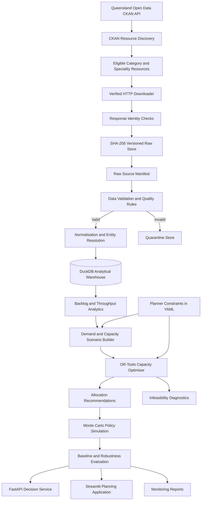

# Queensland Elective Surgery Capacity and Waitlist Recovery Optimiser

[](https://www.python.org/)
[](https://duckdb.org/)
[](https://developers.google.com/optimization)
[](https://fastapi.tiangolo.com/)
[](https://streamlit.io/)
[](https://pytest.org/)
[](LICENSE)

A production-style healthcare operations analytics project for allocating additional elective-surgery capacity across Queensland public facilities and specialties while accounting for long waits, clinical urgency, operational constraints, equity and uncertainty.

> **Scope:** This project supports aggregate health-service planning. It does not rank individual patients, change clinical urgency classifications, recommend treatment or replace clinical and operational judgement.

---

## Value proposition

Transform quarterly public elective-surgery performance data into a reproducible decision-support workflow that helps health-service planners identify system pressure and, ultimately, compare transparent capacity-allocation strategies under constrained resources.

---

## Project status

**Status: active development**

The repository is being built incrementally so that each layer is executable, tested and internally consistent before the next layer is introduced.

### Implemented

* Python 3.12 package structure
* dependency and build configuration through `pyproject.toml`
* typed environment configuration using Pydantic Settings
* validated YAML project and planning-scenario configuration
* structured JSON logging
* project-specific exception hierarchy
* Typer command-line interface
* Queensland Open Data CKAN dataset discovery
* deterministic identification of elective-surgery Category and Speciality CSV resources
* retry-aware HTTP retrieval
* response and source-identity validation
* protection against HTML/error-page downloads being stored as CSV
* SHA-256 content hashing
* immutable versioned raw-file storage
* duplicate-content detection
* raw-source lineage manifest
* latest-only and historical ingestion modes
* unit tests for configuration and ingestion components
* integration test covering discovery, download and manifest persistence
* reproducible baseline, constrained-capacity and demand-surge configuration files

### In development

* source-data schema validation
* row-level quality rules
* quarantine handling
* schema-drift detection
* normalisation
* facility entity resolution
* longitudinal analytical modelling

### Planned

* DuckDB analytical warehouse
* backlog and throughput analytics
* baseline allocation policies
* demand and capacity scenario modelling
* OR-Tools capacity optimisation
* infeasibility diagnostics
* Monte Carlo policy simulation
* FastAPI decision service
* Streamlit planning application
* monitoring and operational health reporting
* Docker packaging
* GitHub Actions CI
* verified analytical and optimisation results

---

## Result labelling

Outputs in this repository use the following terminology:

* **Verified:** produced by executed repository code using retrieved source data.
* **Illustrative:** included only to explain an expected output, workflow or interpretation.
* **Scenario-based:** generated from explicitly documented planning assumptions.
* **Planned:** designed but not yet implemented or executed.
* **Synthetic:** programmatically generated and explicitly separated from observed data.

No optimisation-performance, forecasting-performance or operational-impact claims are considered verified until the relevant pipeline stages have been implemented, executed and validated.

---

# Business problem

Elective-surgery planning requires health services to balance:

* patients waiting beyond clinically recommended timeframes;
* differences between facilities and surgical specialties;
* limited operating-theatre capacity;
* workforce and recovery constraints;
* cancellations;
* emergency-demand displacement;
* regional access;
* future additions to waiting lists;
* and uncertainty in treatment productivity.

Public reporting provides valuable evidence about historical and current performance, but reporting alone does not answer the operational allocation question:

> Given a limited pool of additional elective-surgery sessions, how should capacity be distributed across facilities and specialties to reduce long waits while maintaining realistic and equitable service coverage?

A purely throughput-focused policy could concentrate capacity in services capable of treating the largest number of patients per session. While potentially efficient, such a strategy may overlook:

* clinical urgency;
* persistent long waits;
* smaller regional services;
* minimum service requirements;
* geographic access;
* operational feasibility;
* and uncertainty around expected treatment capacity.

This project therefore treats elective-surgery capacity allocation as a **constrained decision problem**, rather than simply a forecasting or dashboarding exercise.

---

# Target stakeholder

## Primary stakeholder

Queensland Health statewide elective-surgery planning and performance teams.

## Secondary stakeholders

* Hospital and Health Service planning teams
* surgical-services managers
* operating-theatre managers
* health-service performance analysts
* public-sector data and analytics teams
* health-system funding and commissioning teams

---

# End user

The primary end user is a health-service planner preparing periodic capacity-allocation recommendations.

The planner needs to understand:

* current waiting-list pressure;
* long-wait exposure;
* specialty-level pressure;
* facility treatment throughput;
* available incremental capacity;
* policy constraints;
* regional and service-level equity;
* scenario uncertainty;
* data freshness;
* and the expected implications of alternative allocation policies.

---

# Decision supported

The completed system is intended to recommend how many incremental elective-surgery sessions should be allocated to eligible facility-specialty combinations over a configurable planning horizon.

The system is intended to support questions such as:

1. Which facility-specialty combinations face the greatest persistent pressure?
2. How many additional sessions should each eligible service receive?
3. What reduction in long waits could reasonably be expected?
4. Which services remain under pressure after allocation?
5. How does an optimised policy compare with equal or proportional allocation?
6. How sensitive are recommendations to demand and capacity assumptions?
7. What trade-offs arise between throughput and equitable service coverage?
8. Which constraints prevent a feasible allocation?

Recommendations will remain subject to human review and confirmation of local operational feasibility.

---

# Decisions not supported

The system must not be used to:

* rank individual patients;
* schedule individual patients;
* change clinical urgency categories;
* diagnose conditions;
* recommend treatment;
* estimate individual deterioration or mortality risk;
* override clinicians or hospital management;
* automate individual funding decisions;
* deny an individual access to care;
* infer patient characteristics from aggregate data;
* or represent planning assumptions as observed hospital operations.

---

# Analytical questions

The project is designed to answer:

1. Which facilities and specialties have persistent long-wait pressure?
2. Where is waiting volume increasing relative to treatment throughput?
3. Which services show deteriorating in-time performance?
4. Which facility-specialty combinations carry the greatest urgency-weighted waiting burden?
5. How much incremental capacity would be required to meet selected backlog-reduction targets?
6. How should additional sessions be allocated under a fixed capacity budget?
7. How does allocation change when urgency, throughput or regional coverage receives greater weight?
8. What is the trade-off between total backlog reduction and equitable service coverage?
9. Which recommendations remain stable when demand, cancellations and treatment productivity vary?
10. Which constraints make a proposed allocation infeasible?
11. How does the optimised policy compare with realistic baseline allocation strategies?
12. Under which conditions should a recommendation be withheld?

---

# Solution architecture


```mermaid
flowchart TD
    A[Queensland Open Data CKAN API] --> B[CKAN Resource Discovery]
    B --> C[Eligible Category and Speciality Resources]

    C --> D[Verified HTTP Downloader]
    D --> E[Response Identity Checks]
    E --> F[SHA-256 Versioned Raw Store]
    F --> G[Raw Source Manifest]

    G --> H[Data Validation and Quality Rules]
    H -->|Valid| I[Normalisation and Entity Resolution]
    H -->|Invalid| J[Quarantine Store]

    I --> K[(DuckDB Analytical Warehouse)]
    K --> L[Backlog and Throughput Analytics]
    L --> M[Demand and Capacity Scenario Builder]

    N[Planner Constraints in YAML] --> M
    N --> O[OR-Tools Capacity Optimiser]
    M --> O

    O --> P[Allocation Recommendations]
    O --> Q[Infeasibility Diagnostics]

    P --> R[Monte Carlo Policy Simulation]
    R --> S[Baseline and Robustness Evaluation]

    S --> T[FastAPI Decision Service]
    S --> U[Streamlit Planning Application]
    S --> V[Monitoring Reports]
```

### Architecture status

| Layer                  | Status         |
| ---------------------- | -------------- |
| Project configuration  | Implemented    |
| Structured logging     | Implemented    |
| CKAN discovery         | Implemented    |
| Verified raw ingestion | Implemented    |
| SHA-256 versioning     | Implemented    |
| Source manifest        | Implemented    |
| Data validation        | In development |
| Quarantine workflow    | In development |
| Normalisation          | Planned next   |
| DuckDB warehouse       | Planned        |
| Analytics              | Planned        |
| Optimisation           | Planned        |
| Simulation             | Planned        |
| API                    | Planned        |
| Streamlit application  | Planned        |
| Monitoring             | Planned        |

---

# Technology stack

| Component              | Technology                      | Purpose                                      |
| ---------------------- | ------------------------------- | -------------------------------------------- |
| Language               | Python 3.12                     | Core implementation                          |
| HTTP client            | HTTPX                           | CKAN and CSV retrieval                       |
| Configuration          | Pydantic Settings + YAML        | Typed application and scenario configuration |
| Logging                | Python logging + JSON formatter | Structured execution and failure records     |
| Tabular processing     | Pandas                          | Planned cleaning and analytics               |
| Validation             | Pandera                         | Planned source-data contracts                |
| Analytical database    | DuckDB                          | Planned longitudinal analytical warehouse    |
| Storage                | CSV / Parquet                   | Raw and processed data                       |
| Optimisation           | OR-Tools CP-SAT                 | Planned integer capacity-allocation model    |
| Simulation             | NumPy                           | Planned Monte Carlo scenario analysis        |
| API                    | FastAPI                         | Planned decision-service interface           |
| Application            | Streamlit                       | Planned planning interface                   |
| Testing                | pytest                          | Unit and integration testing                 |
| Type checking          | mypy                            | Static analysis                              |
| Formatting and linting | Ruff                            | Code-quality enforcement                     |
| Packaging              | Hatchling / `pyproject.toml`    | Reproducible package installation            |
| Containerisation       | Docker                          | Planned reproducible deployment              |
| CI                     | GitHub Actions                  | Planned automated validation                 |

Technologies are included only where they support the planning problem, system reliability, reproducibility or maintainability.

---

# Data sources

## Queensland Government Open Data Portal

The primary source is the Queensland Government Open Data elective-surgery dataset.

The ingestion pipeline targets the CKAN dataset identifier:

```text
elective-surgery
```

The implementation discovers eligible quarterly resources through the CKAN `package_show` action rather than relying on a manually maintained quarterly CSV URL.

The resource-discovery layer currently recognises two source families:

* **Category / Summary 1**
* **Speciality / Summary 2**

Only configured CSV resources are eligible for ingestion.

Resources such as unrelated description workbooks are excluded from the ingestion workflow.

### Typical source fields

Published files include fields representing areas such as:

* facility code;
* facility name;
* reporting month;
* specialty or category;
* treatment volume;
* waiting volume;
* long-wait volume;
* and in-time performance measures.

The validation layer will define exact accepted schemas rather than assuming that field types and column structures remain constant between quarterly releases.

---

# Raw-data ingestion

The ingestion layer is currently implemented.

## 1. Deterministic dataset discovery

`CkanClient` queries:

```text
/api/3/action/package_show
```

using the configured dataset ID.

It retrieves:

* dataset ID;
* dataset name;
* dataset title;
* source organisation;
* licence metadata;
* dataset metadata timestamps;
* resource identifiers;
* resource titles;
* download URLs;
* formats;
* source hashes where published;
* creation timestamps;
* and last-modified timestamps.

Resources are filtered against configured:

* file formats;
* Category naming patterns;
* and Speciality naming patterns.

---

## 2. Verified HTTP downloads

Raw files are downloaded through `ResourceDownloader`.

The downloader:

* applies configurable HTTP timeouts;
* retries transient request failures;
* follows redirects;
* rejects unsuccessful HTTP responses;
* rejects empty response bodies;
* rejects HTML content returned instead of CSV;
* validates UTF-8 compatibility;
* parses the CSV header;
* verifies mandatory source-identity fields;
* and refuses to persist structurally unrelated CSV files.

Mandatory identity fields currently include:

```text
Facility_Code
Facility_Name
Report_Month
```

Detailed clinical and analytical field validation is handled separately by the forthcoming validation layer.

---

## 3. Immutable raw-file versioning

Every accepted response is hashed with SHA-256.

Raw files are stored under:

```text
data/raw/<resource-kind>/<resource-id>/
```

using a filename containing the leading portion of the SHA-256 digest.

Example:

```text
data/raw/
├── category/
│   └── <resource-id>/
│       └── <sha256-prefix>_<source-filename>.csv
└── specialty/
    └── <resource-id>/
        └── <sha256-prefix>_<source-filename>.csv
```

If identical source content is retrieved again:

* the existing file is reused;
* the raw file is not rewritten;
* and a duplicate resource/checksum entry is not added to the lineage manifest.

This makes source retrieval reproducible and protects historical source versions from silent replacement.

---

# Source lineage manifest

Raw-resource provenance is stored in:

```text
data/raw/manifest.csv
```

The manifest records:

| Field                  | Purpose                           |
| ---------------------- | --------------------------------- |
| `dataset_id`           | CKAN dataset identifier           |
| `dataset_title`        | Published dataset title           |
| `source_organisation`  | Publishing organisation           |
| `source_licence`       | Published licence                 |
| `resource_id`          | CKAN resource identifier          |
| `resource_name`        | Published resource title          |
| `resource_kind`        | Category or Speciality            |
| `resource_format`      | Published resource format         |
| `source_url`           | Original download URL             |
| `source_hash`          | Upstream hash when available      |
| `source_created`       | Upstream creation timestamp       |
| `source_last_modified` | Upstream modification timestamp   |
| `retrieved_at`         | Local retrieval timestamp         |
| `local_path`           | Immutable local raw-file path     |
| `sha256`               | Locally calculated SHA-256 digest |
| `byte_count`           | Download size                     |
| `content_type`         | HTTP response content type        |

The manifest uses the combination of:

```text
resource_id + sha256
```

to prevent duplicate lineage records for unchanged content.

---

# Planned data validation

The next implementation layer will validate source data using explicit schemas and quality rules.

Planned checks include:

* required columns;
* schema drift;
* numeric parsing;
* percentage parsing;
* reporting-date validity;
* missing facility codes;
* missing facility names;
* negative volumes;
* duplicate business keys;
* waiting volume below long-wait volume;
* malformed values;
* unexpected nulls;
* incomplete reporting coverage;
* and source freshness.

Invalid observations will not be silently discarded.

Where appropriate they will be:

1. retained in the original raw source;
2. excluded from validated analytical data;
3. written to a quarantine dataset;
4. assigned machine-readable failure reasons;
5. and summarised in a data-quality report.

---

# Planned normalisation

The processing layer will standardise:

* facility identifiers;
* facility names;
* specialty labels;
* urgency/category labels;
* reporting periods;
* numeric values;
* percentage representations;
* null values;
* and source metadata.

Facility aliases will be resolved through a version-controlled reference table rather than approximate string matching without review.

Unresolved entities will remain visible as data-quality events.

---

# Planned analytical warehouse

The longitudinal DuckDB model is expected to include:

```text
dim_facility
dim_specialty
dim_urgency_category
dim_reporting_period
dim_source_resource

fact_elective_surgery_performance
fact_data_quality_event
fact_optimisation_run
fact_allocation_recommendation
fact_simulation_result
```

The analytical grain will preserve source lineage and reporting-period context.

Derived measures are expected to include:

* treatment volume;
* waiting volume;
* long-wait volume;
* long-wait share;
* percentage treated within time;
* percentage waiting within time;
* quarterly backlog change;
* treatment-to-waiting ratio;
* trailing treatment throughput;
* waiting-list growth;
* service-pressure indicators;
* reporting completeness;
* and data freshness.

---

# Planning scenarios

Three initial scenario configurations are already included.

## Baseline

Represents central planning assumptions.

```yaml
scenario:
  name: baseline
  planning_periods: 1
  incremental_sessions_available: 120
  random_seed: 42

capacity:
  default_patients_per_session: 3.0
  default_cancellation_rate: 0.08
  emergency_displacement_rate: 0.05

demand:
  quarterly_growth_rate: 0.02
  uncertainty_standard_deviation: 0.05
```

## Constrained capacity

Represents:

* fewer available incremental sessions;
* reduced treatment productivity;
* higher cancellation pressure;
* and greater operational displacement.

## Demand surge

Represents:

* materially higher incoming waiting-list demand;
* unchanged central session availability;
* and greater demand uncertainty.

These values are **scenario assumptions**, not observed Queensland hospital operating parameters.

Their purpose is to provide reproducible inputs for the optimisation and simulation layers once those components are implemented.

---

# Planned optimisation model

## Model type

The initial optimisation design uses OR-Tools CP-SAT.

For each eligible facility (f) and specialty (s):

[
x_{f,s}
=======

\text{incremental sessions allocated}
]

Decision variables will be non-negative integers.

## Objective

The planned objective minimises a configurable weighted combination of:

* long waits remaining;
* urgency-weighted burden;
* inequitable under-allocation;
* allocation concentration;
* unused capacity;
* and allocation instability.

Conceptually:

[
\min
\left(
\alpha L +
\beta O +
\gamma E +
\delta C +
\eta U +
\theta S
\right)
]

where:

* (L) = long waits remaining;
* (O) = urgency-weighted overdue burden;
* (E) = equity or minimum-coverage penalty;
* (C) = allocation-concentration penalty;
* (U) = unused capacity;
* (S) = instability relative to a prior allocation.

The implemented formulation will use solver-compatible integer or linearised representations of these terms.

## Planned constraints

* statewide incremental-session budget;
* non-negative integer allocations;
* facility capacity;
* specialty capacity;
* facility-specialty eligibility;
* non-negative residual backlog;
* minimum service coverage;
* maximum facility allocation share;
* regional coverage;
* protected capacity;
* and configurable change limits.

---

# Baseline allocation policies

The optimiser will be compared against realistic alternatives.

Planned baselines include:

1. **No additional capacity**
2. **Equal allocation**
3. **Allocation proportional to waiting volume**
4. **Allocation proportional to long-wait volume**
5. **Previous-period allocation**, where available
6. **Greedy pressure allocation**

The optimiser will not be considered useful merely because it produces a feasible solution. It must demonstrate value relative to credible operational baselines.

---

# Simulation and uncertainty

Operational capacity cannot be represented as a deterministic quantity with complete confidence.

The planned Monte Carlo layer will vary assumptions such as:

* future waiting-list additions;
* patients treated per session;
* cancellation rates;
* emergency displacement;
* facility capacity;
* and specialty productivity.

Planned outputs include:

* expected backlog reduction;
* median outcome;
* uncertainty intervals;
* probability of reaching a target;
* downside outcomes;
* allocation stability;
* facility-selection frequency;
* policy regret;
* and sensitivity to objective weights.

---

# Repository structure

The repository currently combines implemented modules with directories reserved for later project stages.

```text
qld-elective-surgery-optimiser/
├── README.md
├── LICENSE
├── .gitignore
├── .env.example
├── pyproject.toml
├── Makefile
│
├── configs/
│   ├── base.yml
│   ├── optimisation.yml
│   └── scenarios/
│       ├── baseline.yml
│       ├── constrained_capacity.yml
│       └── demand_surge.yml
│
├── data/
│   ├── raw/
│   │   ├── .gitkeep
│   │   └── manifest.csv              # generated after ingestion
│   ├── interim/
│   │   └── .gitkeep
│   ├── processed/
│   │   └── .gitkeep
│   └── quarantine/
│       └── .gitkeep
│
├── reports/
│   ├── figures/
│   │   └── .gitkeep
│   └── outputs/
│       └── .gitkeep
│
├── src/
│   └── qld_surgery_optimiser/
│       ├── __init__.py
│       ├── cli.py
│       ├── config.py
│       ├── exceptions.py
│       ├── logging_config.py
│       │
│       └── ingestion/
│           ├── __init__.py
│           ├── models.py
│           ├── ckan_client.py
│           ├── downloader.py
│           ├── manifest.py
│           └── pipeline.py
│
└── tests/
    ├── conftest.py
    ├── unit/
    │   ├── test_config.py
    │   ├── test_ckan_client.py
    │   ├── test_downloader.py
    │   └── test_manifest.py
    │
    └── integration/
        └── test_ingestion_pipeline.py
```

### Planned later structure

```text
src/qld_surgery_optimiser/
├── validation/
├── processing/
├── analytics/
├── forecasting/
├── optimisation/
├── simulation/
├── reporting/
└── monitoring/

app/
api/
scripts/
sql/
docs/
.github/workflows/
```

These later modules should only be added to the repository when their implementation exists.

---

# Installation

## Prerequisites

* Python 3.12
* Git
* Make, optional

Clone the repository:

```bash
git clone https://github.com/<your-github-username>/qld-elective-surgery-optimiser.git
cd qld-elective-surgery-optimiser
```

Create a virtual environment.

### Windows PowerShell

```powershell
python -m venv .venv
.venv\Scripts\Activate.ps1
```

### macOS or Linux

```bash
python -m venv .venv
source .venv/bin/activate
```

Upgrade `pip`:

```bash
python -m pip install --upgrade pip
```

Install the package with development dependencies:

```bash
pip install -e ".[dev]"
```

Or:

```bash
make install
```

---

# Environment configuration

Copy the example environment file.

### macOS or Linux

```bash
cp .env.example .env
```

### Windows PowerShell

```powershell
Copy-Item .env.example .env
```

Current settings include:

```env
APP_ENV=development
LOG_LEVEL=INFO

BASE_CONFIG_PATH=configs/base.yml
OPTIMISATION_CONFIG_PATH=configs/optimisation.yml
DEFAULT_SCENARIO_PATH=configs/scenarios/baseline.yml

DATA_DIR=data
RAW_DATA_DIR=data/raw
INTERIM_DATA_DIR=data/interim
PROCESSED_DATA_DIR=data/processed
QUARANTINE_DATA_DIR=data/quarantine
REPORTS_DIR=reports
DUCKDB_PATH=data/processed/elective_surgery.duckdb

REQUEST_TIMEOUT_SECONDS=30
REQUEST_MAX_RETRIES=3
REQUEST_RETRY_BACKOFF_SECONDS=1.0
USER_AGENT=qld-elective-surgery-optimiser/0.1.0

RANDOM_SEED=42

SOLVER_TIME_LIMIT_SECONDS=60
SOLVER_NUM_WORKERS=1
```

No authentication credentials are required for the public Queensland Open Data source used by the current ingestion layer.

---

# Current CLI commands

The package exposes the command:

```bash
qld-surgery
```

You can also execute the CLI using:

```bash
python -m qld_surgery_optimiser.cli
```

## Check configuration

```bash
qld-surgery doctor
```

This:

* validates project configuration;
* validates the default scenario;
* creates required local directories;
* and reports configuration problems clearly.

## Inspect configuration

```bash
qld-surgery show-config
```

Use another scenario:

```bash
qld-surgery show-config \
  --scenario configs/scenarios/demand_surge.yml
```

## Discover source resources

```bash
qld-surgery discover
```

Equivalent Make command:

```bash
make discover
```

This retrieves CKAN dataset metadata and lists the Category and Speciality CSV resources currently eligible for ingestion.

No raw source files are written by `discover`.

## Retrieve only the latest resources

Recommended for a first development run:

```bash
qld-surgery ingest --latest-only
```

Equivalent:

```bash
make ingest-latest
```

The command selects the most recent eligible resource for each resource family.

## Retrieve all eligible historical resources

```bash
qld-surgery ingest
```

Equivalent:

```bash
make ingest
```

The complete historical retrieval mode is intended to provide the longitudinal raw-data foundation required by later analytical stages.

---

# Raw-data output

Following ingestion, the expected structure is:

```text
data/raw/
├── manifest.csv
├── category/
│   └── <resource-id>/
│       └── <sha256-prefix>_<source-file>.csv
└── specialty/
    └── <resource-id>/
        └── <sha256-prefix>_<source-file>.csv
```

Raw data is intentionally excluded from Git through `.gitignore`.

The manifest itself may also be excluded from version control if it contains machine-specific local paths. A portable manifest-export stage can be added later for published repository artefacts.

---

# Testing

The repository currently includes tests for the implemented foundation and ingestion layer.

## Configuration tests

Tests verify:

* the committed base configuration is valid;
* the baseline scenario is valid;
* invalid probability values are rejected;
* missing configuration files raise project-specific errors;
* required directories are created correctly;
* and directory creation is idempotent.

## CKAN discovery tests

Tests verify:

* direct lookup of the configured dataset ID;
* parsing of CKAN metadata;
* classification of Category resources;
* classification of Speciality resources;
* exclusion of unsupported formats;
* and exclusion of unrelated resources.

## Downloader tests

Tests verify:

* valid CSV responses are stored;
* raw paths include the resource family and resource ID;
* content-derived filenames contain the SHA-256 prefix;
* repeated identical content is not rewritten;
* HTML responses are rejected;
* and unrelated CSV schemas fail source-identity validation.

## Manifest tests

Tests verify:

* retrieval metadata is persisted;
* source licence metadata is retained;
* resource checksums are recorded;
* and identical resource/checksum combinations are not duplicated.

## Integration test

The current integration test exercises:

```text
CKAN metadata
      ↓
Resource classification
      ↓
CSV download
      ↓
Source validation
      ↓
Immutable raw storage
      ↓
Lineage manifest
```

with mocked HTTP transport so the test suite does not depend on the live portal.

---

# Run tests

```bash
pytest
```

Or:

```bash
make test
```

Run coverage:

```bash
pytest \
  --cov=qld_surgery_optimiser \
  --cov-report=term-missing
```

Or:

```bash
make coverage
```

---

# Code-quality checks

Format:

```bash
make format
```

Lint:

```bash
make lint
```

Type-check:

```bash
make typecheck
```

Equivalent commands:

```bash
ruff format .
ruff check .
mypy src tests
```

---

# Evaluation framework

The completed system will be evaluated at multiple levels.

## Data engineering

* successful resource-discovery rate;
* successful retrieval rate;
* content-validation failures;
* duplicate-content rate;
* schema-drift events;
* manifest completeness;
* source freshness;
* and raw-data reproducibility.

## Data quality

* valid-row rate;
* invalid-row count;
* missing-value rate;
* duplicate business keys;
* invalid percentage rate;
* negative volume rate;
* contradictory wait-volume observations;
* unresolved facilities;
* and quarantined observations.

## Operational analytics

* waiting volume;
* long-wait volume;
* long-wait share;
* urgency-weighted burden;
* throughput;
* backlog movement;
* and service-pressure persistence.

## Allocation performance

* expected long-wait reduction;
* urgency-weighted backlog reduction;
* session utilisation;
* residual waiting volume;
* facility coverage;
* allocation concentration;
* and regional distribution.

## Optimisation health

* solver status;
* feasibility;
* solve time;
* best bound;
* optimality gap where available;
* constraint violations;
* unused sessions;
* and solution reproducibility.

## Robustness

* probability of meeting planning targets;
* fifth-percentile performance;
* expected regret;
* sensitivity to treatment productivity;
* sensitivity to cancellation rates;
* sensitivity to future demand;
* allocation stability;
* and sensitivity to objective weights.

---

# Success criteria

The project will be considered technically complete when:

* [x] project configuration is typed and validated;
* [x] planning scenarios are reproducible;
* [x] public source resources can be discovered programmatically;
* [x] source files can be retrieved with retries and response checks;
* [x] raw files are content-versioned using SHA-256;
* [x] unchanged raw files are not silently overwritten;
* [x] source lineage is recorded;
* [x] ingestion behaviour is covered by unit and integration tests;
* [ ] source schemas are validated;
* [ ] invalid records are quarantined and reported;
* [ ] longitudinal analytical tables are built reproducibly;
* [ ] baseline allocation policies are implemented;
* [ ] the optimiser returns either a feasible allocation or an explicit diagnostic;
* [ ] mandatory constraints are tested;
* [ ] simulation results are reproducible under fixed seeds;
* [ ] recommendation robustness is reported;
* [ ] API contracts are implemented and tested;
* [ ] the planning application exposes provenance and freshness;
* [ ] monitoring checks are implemented;
* [ ] CI executes quality gates automatically;
* [ ] verified results are published without overstating findings.

---

# Ethical considerations

## Aggregate planning boundary

The system operates on aggregate service-level data.

It is not designed for patient-level prioritisation.

Extending the project to patient-level health information would require a separate assessment covering:

* clinical safety;
* privacy;
* information security;
* governance;
* regulatory obligations;
* and validation requirements.

## Equity

A purely efficiency-focused objective may systematically favour:

* larger facilities;
* higher-throughput specialties;
* metropolitan services;
* or services with historically greater capacity.

The optimisation design therefore anticipates:

* minimum coverage constraints;
* regional allocation floors;
* concentration limits;
* alternative objective weights;
* and explicit reporting of distributional consequences.

These are policy choices and must be transparent.

## Historical bias

Historical throughput may reflect:

* historical funding;
* existing workforce constraints;
* geographic barriers;
* reporting differences;
* unequal access;
* and prior policy decisions.

Historical performance is therefore evidence about the existing system, not automatically a normative target for future allocation.

## Human review

Before any recommendation is used operationally, the planner should review:

* source freshness;
* data-quality warnings;
* scenario assumptions;
* objective weights;
* active constraints;
* infeasibility diagnostics;
* sensitivity results;
* and known limitations.

The software provides decision support rather than autonomous decision-making.

---

# Privacy and security

The public portfolio implementation uses aggregate public data and is not intended to contain patient-identifiable information.

The repository must not contain:

* patient names;
* medical-record numbers;
* dates of birth;
* addresses;
* individual procedure histories;
* or other patient-level health information.

Any future integration with restricted operational data would require appropriate:

* authentication;
* access control;
* encryption;
* audit logging;
* retention controls;
* data classification;
* privacy assessment;
* and an approved operating environment.

Secrets must not be committed to Git.

---

# Regulatory considerations

This repository is designed as an aggregate health-service planning project.

It does not claim to be:

* a medical device;
* clinical decision-support software;
* a patient scheduling application;
* a Queensland Health production system;
* or an approved operational allocation system.

Operational adoption would require assessment against the policies, legal requirements, security obligations and assurance standards applicable to the intended deployment environment.

---

# Failure modes

The system may fail or produce unusable recommendations when:

* the upstream data portal is unavailable;
* a quarterly source changes structure;
* required columns disappear;
* facility identifiers change;
* reporting periods are incomplete;
* public data is too stale;
* operational assumptions are unrealistic;
* facility constraints are incomplete;
* policy constraints conflict;
* the optimisation model is infeasible;
* or recommendations are unstable under plausible scenarios.

Critical failures should cause the system to **withhold a new recommendation**, rather than manufacture a result.

---

# Monitoring approach

## Source monitoring

Planned monitoring includes:

* upstream resource availability;
* HTTP failures;
* checksum changes;
* new quarterly resources;
* source modification timestamps;
* and retrieval failures.

## Data-quality monitoring

Planned monitoring includes:

* missing required columns;
* unexpected schema changes;
* invalid values;
* duplicate records;
* missing reporting periods;
* unresolved facility identifiers;
* and inconsistent waiting measures.

## Optimisation monitoring

Planned monitoring includes:

* solver status;
* solve time;
* infeasibility;
* optimality gap;
* capacity utilisation;
* allocation concentration;
* and performance relative to baseline policies.

## Policy monitoring

Where later observed data permits evaluation, planned monitoring includes:

* realised treatment throughput;
* realised waiting-list changes;
* long-wait movement;
* target attainment;
* allocation stability;
* regional distribution;
* and persistent service pressure.

---

# Expected future outputs

Once downstream layers are implemented, planned outputs include:

```text
reports/outputs/
├── data_quality_summary.json
├── source_manifest.csv
├── facility_pressure.csv
├── specialty_pressure.csv
├── urgency_pressure.csv
├── baseline_allocations.csv
├── allocation_recommendations.csv
├── baseline_comparison.csv
├── simulation_summary.csv
├── allocation_stability.csv
├── infeasibility_report.json
├── optimisation_run_metadata.json
└── monitoring_report.html
```

Planned visual outputs include:

```text
reports/figures/
├── facility_waiting_pressure.png
├── specialty_long_wait_share.png
├── backlog_change_by_facility.png
├── recommended_session_allocation.png
├── baseline_policy_comparison.png
├── allocation_equity_tradeoff.png
├── simulation_outcome_distribution.png
└── recommendation_stability.png
```

These files are **planned outputs**, not verified project results.

---

# Results

## Current verified implementation result

The repository currently demonstrates the design and implementation of a reproducible public-data ingestion foundation.

The code is designed to:

* discover the configured Queensland elective-surgery dataset through CKAN;
* identify eligible Category and Speciality CSV resources;
* validate source responses before persistence;
* version raw files by their content hash;
* avoid unnecessary overwrites;
* and preserve source lineage in a manifest.

Actual source counts, retrieval coverage and data-quality findings should only be added here after the repository has been executed against the live source and the resulting outputs have been reviewed.

## Analytical results

**Not yet available.**

No findings about:

* facility performance;
* specialty pressure;
* backlog trends;
* allocation policy performance;
* or optimisation outcomes

are claimed until the relevant pipeline stages have been implemented and executed.

---

# Skills demonstrated

## Currently demonstrated

### Software engineering

* modular Python package design;
* typed configuration;
* environment configuration;
* custom exception hierarchy;
* structured logging;
* command-line application development;
* deterministic paths;
* dependency management;
* and reproducible execution configuration.

### Data engineering

* CKAN API integration;
* metadata-driven source discovery;
* external HTTP ingestion;
* retries and failure handling;
* content validation;
* immutable raw storage;
* SHA-256 hashing;
* duplicate-content handling;
* resource versioning;
* source lineage;
* and retrieval manifests.

### Testing

* pytest;
* HTTP mocking;
* configuration validation tests;
* downloader edge-case tests;
* manifest tests;
* and end-to-end ingestion integration testing.

### Governance

* explicit use boundaries;
* source provenance;
* scenario/observed-data separation;
* human-review requirements;
* and documented limitations.

## Planned skills

* Pandera data contracts;
* quarantine workflows;
* entity resolution;
* DuckDB analytical modelling;
* analytical SQL;
* backlog and throughput analytics;
* mathematical optimisation;
* baseline policy evaluation;
* Monte Carlo simulation;
* sensitivity analysis;
* FastAPI;
* Streamlit;
* system monitoring;
* Docker;
* and CI/CD.

---

# Development roadmap

### Phase 1: Foundation

* [x] README and system design
* [x] Python packaging
* [x] environment configuration
* [x] typed YAML configuration
* [x] scenario configuration
* [x] structured logging
* [x] CLI foundation

### Phase 2: Source ingestion

* [x] deterministic CKAN discovery
* [x] Category/Speciality resource classification
* [x] verified CSV downloads
* [x] HTTP retries
* [x] HTML/error-response rejection
* [x] SHA-256 content hashing
* [x] immutable source versioning
* [x] raw-source manifest
* [x] duplicate-content handling
* [x] ingestion unit tests
* [x] ingestion integration test

### Phase 3: Data quality

* [ ] source schemas
* [ ] schema drift detection
* [ ] row-level quality rules
* [ ] invalid-row quarantine
* [ ] quality-event model
* [ ] data-quality summary

### Phase 4: Processing and warehouse

* [ ] source normalisation
* [ ] facility entity resolution
* [ ] longitudinal modelling
* [ ] DuckDB warehouse
* [ ] reconciliation checks

### Phase 5: Analytics

* [ ] waiting-list pressure measures
* [ ] treatment throughput measures
* [ ] backlog change
* [ ] specialty analysis
* [ ] regional/equity analysis
* [ ] baseline allocation policies

### Phase 6: Optimisation

* [ ] optimisation input contracts
* [ ] OR-Tools model
* [ ] objective function
* [ ] capacity constraints
* [ ] coverage constraints
* [ ] infeasibility diagnostics
* [ ] baseline comparisons

### Phase 7: Simulation

* [ ] Monte Carlo scenarios
* [ ] uncertainty distributions
* [ ] policy robustness
* [ ] regret analysis
* [ ] allocation stability

### Phase 8: Delivery

* [ ] FastAPI
* [ ] Streamlit planning application
* [ ] reporting exports
* [ ] monitoring
* [ ] Docker
* [ ] GitHub Actions
* [ ] operational documentation

### Phase 9: Results

* [ ] execute historical ingestion
* [ ] validate source coverage
* [ ] publish data-quality findings
* [ ] execute analytical pipeline
* [ ] validate optimiser
* [ ] execute simulation framework
* [ ] publish verified results
* [ ] complete repository consistency review

---

# Future improvements

Potential later extensions include:

* richer geographic accessibility analysis;
* remoteness and travel-time measures;
* multi-period optimisation;
* stochastic or robust optimisation;
* workforce constraints;
* recovery-bed constraints;
* procedure-level capacity modelling where suitable data exists;
* cancellation-risk modelling;
* causal evaluation of capacity interventions;
* planner-defined scenario templates;
* role-based access control;
* and integration with appropriately governed internal operational data.

Any future expansion must preserve the distinction between aggregate service planning and patient-level clinical decision-making.

---

# Contributing

Contributions should:

* preserve the aggregate planning boundary;
* include tests for new behaviour;
* document new assumptions;
* retain source attribution;
* avoid committing patient-level or restricted health data;
* and update relevant documentation.

Before committing code:

```bash
make format
make lint
make typecheck
make test
```

---

# Licence

This project is available under the MIT License. See [`LICENSE`](LICENSE) for details.

Source datasets retain their original licences, attribution requirements and usage restrictions. The repository licence does not override terms applied by external data publishers.

---

# Disclaimer

This is an independent portfolio project.

It is not produced, endorsed or approved by Queensland Health, the Queensland Government or the Australian Institute of Health and Welfare.

The system is not a clinical tool, patient scheduling system or production health-service application. Its future analytical and optimisation outputs are intended to support planning analysis and must not be used as the sole basis for clinical, operational or funding decisions.